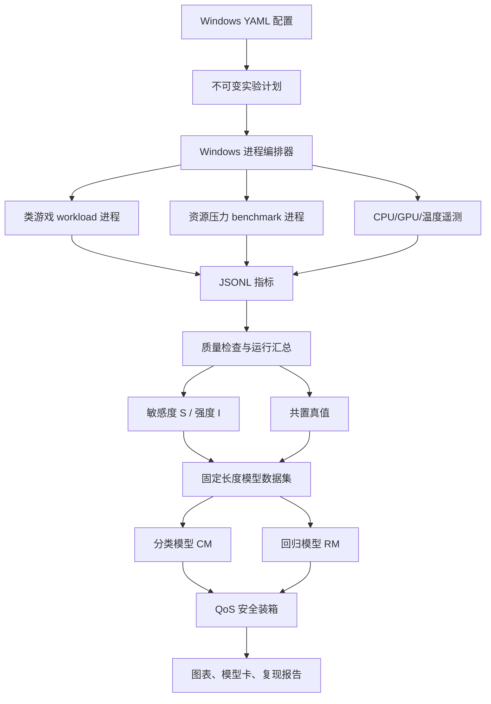

# GAugur-Lite-Windows

在本地 Windows + Conda 环境中，对南开大学—百度联合实验室论文 GAugur 的核心方法进行轻量级、可重复复现：构造具有不同 CPU/GPU 行为的类游戏 workload，测量资源敏感度与干扰强度，训练 QoS 分类模型和性能回归模型，并用模型完成干扰感知调度 replay。

## 项目状态

| 模块                  | 状态   | 产物                                                    |
| --------------------- | ------ | ------------------------------------------------------- |
| 原论文归档            | 已完成 | [GAugur_HPDC_2019.pdf](docs/papers/GAugur_HPDC_2019.pdf) |
| 论文中文解读          | 已完成 | [GAugur 中文解读](docs/papers/GAugur_中文解读.md)        |
| Windows-only 实现方案 | 已完成 | 本 README                                               |
| Python 实现           | 待实现 | 计划放在`gaugur_lite/`                                |
| 实验数据、模型与报告  | 待生成 | 计划放在`data/` 与 `artifacts/`                     |

本文档是后续实现规格。标记为“计划命令”的 CLI 在相应阶段实现前尚不可执行。

## 1. 复现目标与边界

### 1.1 核心研究问题

> 在单机 Windows 环境中，使用目标 workload 的资源敏感度曲线与邻居 workload 的干扰强度，能否比“只看共置数量”“只看资源利用率”或“线性相加强度”的基线，更准确地预测共置后的性能保留率与 QoS？

### 1.2 复现论文的哪些部分

保留 GAugur 的核心链路：

```text
可调资源压力 benchmark
→ 单 workload 敏感度 S 与强度 I
→ 少量真实共置实验
→ 分类模型 CM / 回归模型 RM
→ QoS 安全装箱与最大化性能调度
```

具体保留：

- 敏感度和干扰强度分开测量；
- 使用完整压力曲线表达非线性；
- 多邻居使用“数量 + 各资源强度均值/方差”表示；
- CM 预测是否满足 QoS；
- RM 预测性能保留率；
- 与 Sigmoid/count-only、VBP-like、linear-additive 基线比较；
- 按共置大小报告误差；
- 实现论文两个调度任务的离线 replay。

### 1.3 与原论文的差异

| 项目       | 原论文                    | 本项目                            |
| ---------- | ------------------------- | --------------------------------- |
| workload   | 100 款真实游戏            | MVP 4 个可控类游戏合成 workload   |
| 平台       | Windows 10 + ASTER 多座席 | 单机 Windows + Conda + 多独立进程 |
| 共享资源   | 7 类 CPU/GPU 资源         | MVP 4 个代理维度                  |
| 压力档位   | 11 档，$k=10$           | MVP 5 档，推荐版扩到 11 档        |
| 共置组合   | 700 个二/三/四游戏组合    | 全部二实例 + 选择性三实例组合     |
| 性能指标   | 真实游戏 FPS              | 合成 frame-loop FPS/吞吐          |
| 云游戏串流 | 论文主要实验未纳入        | 不实现                            |
| 在线集群   | 请求级调度                | 基于实测组合表的离线 replay       |

因此本项目应称为“GAugur 方法的轻量复现”或“GAugur-Lite”，不能称为原论文数值级完整复现。

### 1.4 首版不做

- 不运行 GameLab server/client；
- 不使用 WebRTC、视频编码、屏幕采集或键鼠注入；
- 不安装 WSL；
- 不自动控制商业游戏；
- 不声称代理压力等同于严格隔离的 LLC、GPU-L2 或 PCIe benchmark；
- 不把 workload ID 输入主模型；
- 不把模型预测值当作调度 ground truth；
- 不引入强化学习。

## 3. 指标与术语

### 3.1 性能保留率

原论文把下式称为 performance degradation，但该值越大越好：

$$
\delta_{A\mid G}=\frac{FPS_{A,\,colocated\ with\ G}}{FPS_{A,\,solo}}
$$

本项目统一使用：

```text
retention_ratio = colocated_fps / solo_fps
loss_ratio      = 1 - retention_ratio
```

- `retention_ratio=1.0`：没有性能损失；
- `retention_ratio=0.8`：保留 80% 独占性能；
- `loss_ratio=0.2`：性能损失 20%。

### 3.2 Workload FPS

每个合成 workload 反复执行一个“更新状态 → CPU/GPU 计算 → 完成一帧”的确定性循环。每完成一次循环记为一帧：

$$
workload\_fps=\frac{completed\_frames}{measurement\_seconds}
$$

它用于模拟游戏渲染吞吐，但不是商业游戏的真实 Present FPS。文档和结果中统一称为 `workload_fps` 或“类游戏 workload FPS”。

GPU 操作是异步的。每帧计数前必须通过 CUDA event 或 `torch.cuda.synchronize()` 确认 GPU 工作完成，否则 FPS 会被严重高估。

### 3.3 QoS 标签

对目标 workload $A$、邻居集合 $G$ 和阈值 $Q$：

$$
y_{qos}=\mathbb{1}[FPS_{A\mid G}\ge Q]
$$

QoS 阈值不直接照搬 60 FPS，而按每个 workload 的独占性能定义相对档位：

```text
qos_ratio ∈ {0.70, 0.80, 0.90}
qos_threshold = qos_ratio × solo_fps
```

这样能避免某个合成 workload 独占时本来就达不到 60 FPS。

### 3.4 平均值与低分位数

每次正式采样同时记录：

- `fps_mean`：对齐论文主指标；
- `fps_p05`：5% 分位 FPS，用于观察短时 QoS；
- `fps_min`：只用于诊断，不作为稳定主标签；
- `frame_time_p95_ms`：观察卡顿尾部。

## 4. 总体架构



## 5. 计划目录结构

```text
GameLab-RLCG/
├─ README.md
├─ docs/
│  └─ papers/
│     ├─ GAugur_HPDC_2019.pdf
│     └─ GAugur_中文解读.md
├─ ai-testbed/                     # 仅保留，不参与实验
│  └─ UPSTREAM.md
├─ gaugur_lite/
│  ├─ __init__.py
│  ├─ __main__.py
│  ├─ cli.py                       # 统一 CLI
│  ├─ config.py                    # YAML、路径、配置哈希
│  ├─ schema.py                    # Run/Metric/Profile/Sample schema
│  ├─ workloads/
│  │  ├─ base.py
│  │  ├─ synthetic.py              # 四类 frame-loop workload
│  │  └─ registry.py
│  ├─ benchmarks/
│  │  ├─ base.py
│  │  ├─ duty_cycle.py
│  │  ├─ cpu_compute.py
│  │  ├─ memory_bandwidth.py
│  │  ├─ gpu_compute.py
│  │  ├─ gpu_memory.py
│  │  └─ calibration.py
│  ├─ metrics/
│  │  ├─ writer.py
│  │  ├─ system_sampler.py
│  │  └─ summarize.py
│  ├─ orchestration/
│  │  ├─ plan.py
│  │  ├─ process.py                # Windows PID/进程树管理
│  │  ├─ lifecycle.py
│  │  └─ runner.py
│  ├─ features/
│  │  ├─ sensitivity.py
│  │  ├─ intensity.py
│  │  ├─ aggregate.py
│  │  └─ dataset.py
│  ├─ models/
│  │  ├─ split.py
│  │  ├─ classification.py
│  │  ├─ regression.py
│  │  ├─ baselines.py
│  │  └─ evaluate.py
│  ├─ scheduler/
│  │  ├─ feasible.py
│  │  ├─ pack.py
│  │  ├─ maximize_fps.py
│  │  └─ replay.py
│  └─ reporting/
│     ├─ plots.py
│     └─ report.py
├─ configs/
│  ├─ local.example.yaml
│  ├─ workloads.yaml
│  ├─ experiments/
│  │  ├─ smoke.yaml
│  │  ├─ mvp.yaml
│  │  ├─ full.yaml
│  │  └─ ablations.yaml
│  └─ requests/
│     └─ synthetic.yaml
├─ tests/
│  ├─ unit/
│  ├─ integration/
│  └─ fixtures/
├─ data/
│  ├─ raw/
│  ├─ interim/
│  └─ processed/
├─ artifacts/
│  ├─ environment/
│  ├─ calibration/
│  ├─ plans/
│  ├─ models/
│  └─ reports/
├─ environment.yml
├─ requirements-windows.txt
└─ pyproject.toml
```

## 6. Windows Conda 环境

### 6.1 基础环境

推荐新建独立环境，不修改现有项目环境：

```powershell
conda create -n gaugur-lite python=3.10 pip -y
conda activate gaugur-lite
```

基础依赖计划固定在 `requirements-windows.txt`：

```text
numpy
pandas
pyarrow
scipy
scikit-learn
psutil
nvidia-ml-py
PyYAML
pydantic
typer
joblib
matplotlib
seaborn
pytest
```

安装：

```powershell
python -m pip install -r requirements-windows.txt
```

### 6.2 PyTorch CUDA

使用与本机 NVIDIA 驱动兼容的 Windows CUDA wheel。首版可以沿用已知兼容组合：

```powershell
python -m pip install `
  torch==2.4.0 `
  --index-url https://download.pytorch.org/whl/cu121
```

验收：

```powershell
python -c "import torch; print(torch.__version__); print(torch.cuda.is_available()); print(torch.cuda.get_device_name(0))"
nvidia-smi
```

若 `torch.cuda.is_available()` 为 `False`，停止后续 GPU 实验，先修复 PyTorch/驱动环境。

### 6.3 环境记录

正式实验前记录：

```powershell
New-Item -ItemType Directory -Force artifacts\environment
python --version | Out-File artifacts\environment\python-version.txt
python -m pip freeze | Out-File artifacts\environment\pip-freeze.txt
nvidia-smi | Out-File artifacts\environment\nvidia-smi.txt
Get-ComputerInfo | Out-File artifacts\environment\computer-info.txt
```

环境记录包含根仓库 commit、Windows build、CPU、内存、GPU、驱动、Conda 和 Python 版本。

## 7. Workload 设计

### 7.1 设计目标

合成 workload 不是随机压测脚本，而是具有稳定 frame-loop、可控场景和不同资源行为的实验对象。每种 workload 必须：

- 支持固定 seed；
- 独立进程运行；
- 有 ready 信号和进度心跳；
- 每帧输出 frame time；
- 可固定规模/虚拟分辨率；
- 正常响应停止事件；
- 不随运行时间无限增加内存；
- 独占重复实验方差可接受。

### 7.2 MVP 四类 workload

| ID                 | 每帧主要操作                           | 预期资源行为           |
| ------------------ | -------------------------------------- | ---------------------- |
| `wl_cpu`         | NumPy/纯 CPU 状态更新、碰撞式计算      | CPU 执行敏感，GPU 很轻 |
| `wl_memory`      | 大数组读取、更新与聚合                 | 主存带宽敏感           |
| `wl_gpu_compute` | CUDA matmul/卷积式计算                 | GPU 计算敏感           |
| `wl_mixed`       | CPU 状态更新 + CUDA 计算 + tensor copy | CPU/GPU 混合           |

可选第五类：

| ID                | 每帧主要操作                        | 用途                                |
| ----------------- | ----------------------------------- | ----------------------------------- |
| `wl_gpu_memory` | GPU tensor copy、elementwise 与重排 | 区分 GPU compute 与 GPU memory 行为 |

### 7.3 虚拟分辨率

使用 `width × height` 控制每帧数据规模：

- MVP：`1280×720`；
- 推荐：增加 `1920×1080`；
- workload 根据像素数调整数组/tensor 大小；
- 不实际显示画面，避免 Windows Desktop Window Manager 干扰；
- 结果称为“虚拟分辨率 workload”，不称为真实游戏画质。

### 7.4 帧循环

伪代码：

```python
while not stop_requested:
    begin = perf_counter_ns()
    update_cpu_state()
    run_gpu_or_memory_work()
    synchronize_if_cuda()
    end = perf_counter_ns()
    write_frame_metric(frame_id, end - begin)
```

指标 writer 在独立缓冲区中批量 flush，避免每帧磁盘写入反过来成为主要瓶颈。

## 8. 压力 benchmark 设计

### 8.1 MVP 四个代理维度

| 名称                 | 核心实现                         | observed pressure                 |
| -------------------- | -------------------------------- | --------------------------------- |
| `cpu_compute`      | 多进程整数/浮点计算 + duty cycle | benchmark 吞吐、CPU 利用率        |
| `memory_bandwidth` | NumPy 顺序 copy/read/write       | 实测 GB/s、内存吞吐代理           |
| `gpu_compute`      | CUDA matmul/卷积 + duty cycle    | CUDA event 吞吐、GPU 利用率       |
| `gpu_memory`       | CUDA tensor copy/elementwise     | 实测 GB/s、GPU memory utilization |

这些维度分别近似 CPU-CE、MEM-BW、GPU-CE、GPU-BW。MVP 不声称隔离 LLC、GPU-L2 或 PCIe-BW。

### 8.2 Benchmark 原则

1. 压力可从 0 单调增加到最大稳定压力；
2. 每档记录 requested 和 observed pressure；
3. 测量 benchmark 自身吞吐，不能只读系统利用率；
4. GPU 计时必须同步；
5. 预分配数组/tensor，正式测量期间不反复申请大内存；
6. 每个 benchmark 独立进程运行；
7. workload 和 benchmark 使用不同输出文件；
8. benchmark 停止后资源利用率应恢复到空载区间。

### 8.3 压力档位

MVP：

```text
0.00, 0.25, 0.50, 0.75, 1.00
```

推荐版：

```text
0.0, 0.1, 0.2, ..., 1.0
```

压力 0 仍执行完整实验流程，用于验证 profiling 与独占结果一致。

### 8.4 校准

校准不能把 duty cycle 直接当成实际压力。对每个控制参数 $u$，测量 benchmark 吞吐 $B(u)$，归一化：

$$
p_{observed}(u)=\frac{B(u)-B_{idle}}{B_{max}-B_{idle}}
$$

为每个目标压力选择 observed 误差最小且方差可接受的控制参数。校准绑定：

- 主机 ID；
- CPU/GPU；
- Windows 电源模式；
- 驱动；
- benchmark 版本；
- 数组/tensor 大小。

环境变化后必须重新校准。

## 9. 配置设计

### 9.1 主机配置

计划文件：`configs/local.example.yaml`

```yaml
schema_version: 1

host:
  id: "windows-rtx4060"
  platform: "windows"
  gpu_index: 0
  cpu_affinity: null
  cooldown_s: 20
  max_gpu_temp_c: 82

measurement:
  warmup_s: 20
  duration_s: 60
  sample_interval_s: 1.0
  repeats: 3
  qos_ratios: [0.70, 0.80, 0.90]
  random_seed: 20260811

paths:
  raw: "data/raw"
  interim: "data/interim"
  processed: "data/processed"
  artifacts: "artifacts"
```

### 9.2 Workload 配置

计划文件：`configs/workloads.yaml`

```yaml
schema_version: 1

workloads:
  - id: "wl_cpu"
    driver: "synthetic"
    profile: "cpu"
    seed: 1001
    resolution: [1280, 720]
    parameters:
      state_size: 200000
      update_rounds: 8

  - id: "wl_gpu_compute"
    driver: "synthetic"
    profile: "gpu_compute"
    seed: 1002
    resolution: [1280, 720]
    parameters:
      matrix_size: 1536
      rounds_per_frame: 2
```

### 9.3 MVP 实验配置

计划文件：`configs/experiments/mvp.yaml`

```yaml
schema_version: 1
name: "mvp-v1"
workload_ids: ["wl_cpu", "wl_memory", "wl_gpu_compute", "wl_mixed"]
resources: ["cpu_compute", "memory_bandwidth", "gpu_compute", "gpu_memory"]
pressure_levels: [0.0, 0.25, 0.5, 0.75, 1.0]
colocation_sizes: [2, 3]
repeats: 3
randomize_order: true
```

配置加载后进行 schema 校验和稳定序列化，并计算 SHA-256。每个 run 保存展开后的配置副本。

## 10. 数据契约

### 10.1 原始运行目录

```text
data/raw/<experiment_id>/<run_id>/
├─ manifest.json
├─ workload_<id>.jsonl
├─ benchmark.jsonl
├─ system_metrics.jsonl
├─ stdout.log
├─ stderr.log
└─ status.json
```

### 10.2 Manifest

```json
{
  "schema_version": 1,
  "run_id": "mvp-v1__profile__wl_gpu_compute__gpu_compute__p050__r01",
  "experiment_id": "mvp-v1",
  "mode": "pressure_profile",
  "target_id": "wl_gpu_compute",
  "neighbor_ids": [],
  "resource": "gpu_compute",
  "pressure_requested": 0.5,
  "repeat": 1,
  "seed": 20260811,
  "warmup_s": 20,
  "duration_s": 60,
  "host_id": "windows-rtx4060",
  "config_sha256": "...",
  "root_commit": "..."
}
```

### 10.3 时序指标

公共字段：

```text
schema_version,run_id,source,wall_time_ns,monotonic_time_ns
```

Workload：

```text
workload_id,frame_id,frame_time_ms,completed_frames,
window_fps,heartbeat,progress
```

Benchmark：

```text
resource,pressure_requested,pressure_observed,
iterations,iteration_time_ms,throughput,heartbeat
```

系统：

```text
cpu_util_pct,cpu_freq_mhz,ram_used_bytes,
gpu_util_pct,gpu_mem_util_pct,gpu_mem_used_bytes,
gpu_clock_mhz,gpu_power_w,gpu_temp_c
```

### 10.4 运行汇总

`data/interim/run_summary.parquet` 每个 run/目标一行：

```text
run_id,colocation_id,mode,target_id,neighbor_ids,
fps_mean,fps_p05,fps_min,frame_time_p95_ms,
pressure_requested,pressure_observed,
cpu_util_mean,gpu_util_mean,gpu_temp_max,
valid,invalid_reason
```

### 10.5 Profiles

`data/interim/profiles.parquet`：

```text
workload_id,resource,pressure_level,
solo_fps,fps_under_pressure,retention_ratio,
benchmark_throughput_solo,benchmark_throughput_colocated,
intensity_slowdown,repeat_count,retention_std,intensity_std
```

### 10.6 模型样本

```text
data/processed/<experiment_id>/
├─ base_samples.parquet
├─ rm_samples.parquet
├─ cm_samples.parquet
└─ feature_manifest.json
```

公共字段：

```text
colocation_id,run_id,target_id,solo_fps,neighbor_count,
sensitivity_<resource>_p000 ... sensitivity_<resource>_p100,
intensity_mean_<resource>,intensity_var_<resource>,
retention_ratio,loss_ratio
```

CM 额外包含：

```text
qos_ratio,qos_threshold,qos_satisfied
```

`target_id` 用于分组和审计，默认不进入主模型。

## 11. Windows 进程管理约束

### 11.1 启动

编排器使用参数数组和绝对可执行路径：

```python
subprocess.Popen(
    argv,
    cwd=run_dir,
    creationflags=subprocess.CREATE_NEW_PROCESS_GROUP,
)
```

禁止把 YAML 中的命令直接拼接为 `shell=True` 字符串。

### 11.2 Ready barrier

共置实验必须等待所有 workload：

1. 进程存在；
2. CUDA/数组初始化完成；
3. 写出 `READY` 事件；
4. 心跳正常；
5. 到达统一 barrier。

然后才开始 warmup 和正式测量。

### 11.3 停止与清理

1. 发送本次 run 专属停止事件；
2. 等待有限宽限时间；
3. 使用 `psutil.Process(pid).children(recursive=True)` 枚举本次进程树；
4. 核对 PID、创建时间和 run ID；
5. 先 terminate；
6. 超时后只处理已核对的本次进程；
7. 禁止按进程名杀死全部 Python。

任一目标崩溃会使整次共置 run 无效。

## 12. 逐步实现过程

### Step 0：建立 Windows 环境基线

#### 实现

1. 创建 `gaugur-lite` Conda 环境；
2. 安装基础依赖和 CUDA PyTorch；
3. 记录环境清单；
4. 检查 GPU、NVML、CPU 核数与可用内存；
5. 运行 60 秒空载遥测；
6. 关闭浏览器 GPU 页面、游戏启动器和不必要后台程序；
7. 固定 Windows 电源模式并记录，不由程序自动修改系统设置。

#### 验收

```powershell
python -c "import torch, psutil; print(torch.cuda.is_available()); print(psutil.cpu_count())"
python -c "from pynvml import *; nvmlInit(); print(nvmlDeviceGetName(nvmlDeviceGetHandleByIndex(0)))"
```

- CUDA 可用；
- NVML 初始化成功；
- 空载 GPU 利用率和温度合理；
- 没有 WSL 或 GameLab 依赖。

### Step 1：建立 Python 包、schema 和 CLI

#### 新建

```text
pyproject.toml
requirements-windows.txt
gaugur_lite/__init__.py
gaugur_lite/__main__.py
gaugur_lite/cli.py
gaugur_lite/config.py
gaugur_lite/schema.py
tests/unit/test_config.py
tests/unit/test_schema.py
```

#### 实现

1. 定义 `HostSpec`、`WorkloadSpec`、`RunSpec`、`MetricEvent`、`RunStatus`；
2. 校验 Windows 路径、压力范围、持续时间和重复次数；
3. 生成稳定 `experiment_id/run_id/colocation_id`；
4. 稳定 JSON 序列化并计算配置 SHA-256；
5. 创建 Typer CLI；
6. 所有实验命令支持 `--dry-run`；
7. 实现只读 `doctor` 环境检查。

#### 计划命令

```powershell
python -m gaugur_lite --help
python -m gaugur_lite doctor --config configs\local.example.yaml
```

#### 验收

- 相同配置产生相同哈希；
- 非法路径/压力/重复数明确报错；
- `doctor` 不启动 workload；
- 单元测试不需要 GPU。

### Step 2：实现结构化指标与系统采样

#### 实现

1. JSONL writer 批量 flush；
2. 同时记录 wall-clock 和 monotonic 时间；
3. 使用 `psutil` 采 CPU、内存和进程指标；
4. 使用 NVML 采 GPU、显存、时钟、功耗与温度；
5. 生成 `status.json`；
6. 异常退出时保留已有原始数据；
7. 人类日志和机器指标分离。

#### 计划命令

```powershell
python -m gaugur_lite telemetry probe --duration 60
python -m gaugur_lite telemetry overhead --duration 120
```

#### 验收

- JSONL 每行可独立解析；
- 时间戳不倒退；
- 采样间隔符合容差；
- 采样器本身对 workload FPS 的影响可忽略或被量化。

### Step 3：实现四类合成 workload

#### 实现顺序

1. 先实现 `wl_cpu`，验证 frame-loop、ready、heartbeat、stop；
2. 实现 `wl_memory` 并预分配数组；
3. 实现 `wl_gpu_compute`，使用 CUDA event/同步；
4. 实现 `wl_mixed`；
5. 每个 workload 支持 seed、虚拟分辨率和规模参数；
6. 每次运行输出 frame-time JSONL；
7. 增加 `--max-frames`，用于单元/烟雾测试；
8. 增加 watchdog 检测无进度。

#### 计划命令

```powershell
python -m gaugur_lite workload list
python -m gaugur_lite workload smoke wl_cpu --duration 30 --seed 1001
python -m gaugur_lite workload smoke wl_gpu_compute --duration 30 --seed 1002
```

#### 验收

- 四个 workload 均可独立运行；
- 相同 seed 与配置的执行路径一致；
- 三次独占 FPS 变异系数目标小于 5%；
- 超过 5% 时保留结果并排查温度、后台任务和参数规模；
- CUDA workload 不出现未同步的虚假高 FPS。

### Step 4：实现压力 benchmark 与校准

#### 实现顺序

1. `cpu_compute`；
2. `memory_bandwidth`；
3. `gpu_compute`；
4. `gpu_memory`；
5. duty-cycle 控制；
6. benchmark 独占吞吐测量；
7. requested → observed 校准曲线；
8. 校准结果绑定环境哈希。

#### 计划命令

```powershell
python -m gaugur_lite benchmark calibrate `
  --config configs\local.example.yaml `
  --resources cpu_compute,memory_bandwidth,gpu_compute,gpu_memory `
  --levels 0,0.25,0.5,0.75,1.0 `
  --repeats 3

python -m gaugur_lite benchmark verify `
  --calibration artifacts\calibration\windows-rtx4060.json
```

#### 验收

- observed pressure 总体单调；
- 每档有均值与标准差；
- 目标误差建议不超过绝对 0.05；
- benchmark 停止后资源回到空载；
- GPU 显存使用不随运行时间增长。

### Step 5：实现实验计划与 Windows Runner

#### 状态机

```text
PENDING
→ PREPARING
→ STARTING
→ READY
→ WARMUP
→ MEASURING
→ STOPPING
→ COMPLETED / INVALID / FAILED
```

#### 实现

1. 展开配置为不可变 CSV/Parquet plan；
2. 随机化执行顺序并保存最终顺序；
3. 按 run 创建独立目录；
4. 启动系统采样器；
5. 启动 workload/benchmark；
6. ready barrier；
7. warmup 后清零正式统计窗口；
8. 正式采样；
9. 精确停止本次进程树；
10. cooldown/温度恢复；
11. 写最终状态；
12. 支持安全 `--resume`。

#### Resume 规则

仅当以下条件全部满足时跳过：

- `status=completed`；
- `valid=true`；
- 配置哈希一致；
- 原始文件存在且通过 schema；
- 正式采样覆盖率达标。

#### 计划命令

```powershell
python -m gaugur_lite plan `
  --experiment configs\experiments\smoke.yaml `
  --stage all `
  --out artifacts\plans\smoke.csv

python -m gaugur_lite run `
  --plan artifacts\plans\smoke.csv `
  --resume
```

#### 验收

- 一次失败不会破坏其他 run；
- 退出后无本项目遗留 Python 子进程；
- 重复 `--resume` 不覆盖有效数据；
- 不使用全局 kill 命令。

### Step 6：采集独占基线

#### 流程

1. 展开 workload × repeat；
2. 随机运行顺序；
3. warmup；
4. 正式测 FPS/frame time；
5. 记录 CPU/GPU/温度；
6. cooldown；
7. 汇总 mean/p05/min；
8. 检查重复方差。

#### 计划命令

```powershell
python -m gaugur_lite plan `
  --experiment configs\experiments\mvp.yaml `
  --stage solo `
  --out artifacts\plans\mvp-solo.csv

python -m gaugur_lite run --plan artifacts\plans\mvp-solo.csv --resume
python -m gaugur_lite summarize --experiment mvp-v1 --stage solo
```

#### 验收

- 每个 workload 至少 3 个有效独占重复；
- 独占期间没有 benchmark 或邻居；
- 所有后续 retention 都能精确匹配同配置 solo 基线；
- 不稳定 workload 在继续实验前调整参数或标记。

### Step 7：采集敏感度与强度 profile

#### 敏感度

对 workload $A$、资源 $r$、压力 $x$：

$$
S_A^r(x)=\frac{FPS_A^r(x)}{FPS_{A,solo}}
$$

MVP 曲线：

$$
S_A^r=[S_A^r(0),S_A^r(0.25),S_A^r(0.5),S_A^r(0.75),S_A^r(1)]
$$

#### 强度

同一次 workload + benchmark 共置中测 benchmark slowdown：

令 $P^+$ 为所有非零压力档位。压力 0 时 benchmark 不执行有效工作，吞吐 slowdown 没有定义，因此强度只在 $P^+$ 上求平均：

$$
I_A^r=mean_{x\in P^+}\left(\frac{T_{benchmark\mid A}^r(x)}{T_{benchmark,solo}^r(x)}\right)
$$

若 benchmark 输出吞吐：

$$
slowdown=\frac{throughput_{solo}}{throughput_{colocated}}
$$

#### 执行

1. 每个 workload 与每种 benchmark 在各压力档共置；
2. workload 先 ready/预热；
3. benchmark ready 后进入统一正式窗口；
4. 同时记录 workload FPS 与 benchmark throughput；
5. 压力顺序随机；
6. 每档重复至少 3 次；
7. 输出曲线、误差条和强度表。

#### 计划命令

```powershell
python -m gaugur_lite plan `
  --experiment configs\experiments\mvp.yaml `
  --stage profile `
  --out artifacts\plans\mvp-profile.csv

python -m gaugur_lite run --plan artifacts\plans\mvp-profile.csv --resume

python -m gaugur_lite features build-profiles `
  --experiment mvp-v1 `
  --out data\interim\profiles.parquet
```

#### 验收

- 压力 0 的 retention 接近 1；
- 所有曲线覆盖计划压力档；
- requested 与 observed pressure 同时保留；
- 敏感度和强度不混为同一指标；
- 至少验证“非线性”或“敏感度与强度不相关”中的一项。

### Step 8：采集真实共置组合

#### 组合

MVP：

- 4 个 workload 的全部无序二实例组合：$C(4,2)=6$；
- 4 个 workload 的全部无序三实例组合：$C(4,3)=4$；
- 每个组合重复 3 次；
- 相同 workload 的多副本作为可选扩展，不进入首版主结果。

#### 同步

1. 每个 workload 独立进程；
2. 全部 ready 后进入 barrier；
3. 使用同一 measurement 开始事件；
4. 采样窗口必须有至少 95% 重叠；
5. 任一进程崩溃则整次组合无效；
6. 每个进程有独立 JSONL；
7. 组合 ID 使用排序后的 workload ID，避免 A+B 与 B+A 重复。

#### 计划命令

```powershell
python -m gaugur_lite plan `
  --experiment configs\experiments\mvp.yaml `
  --stage colocation `
  --sizes 2,3 `
  --out artifacts\plans\mvp-colocation.csv

python -m gaugur_lite run `
  --plan artifacts\plans\mvp-colocation.csv `
  --resume
```

#### 验收

- 每个组合有 3 次有效重复；
- 各 workload 正式窗口同步；
- 同次组合拆出的目标样本共享同一个 `colocation_id`；
- 进程停止后 CPU/GPU 回到空载。

### Step 9：构建模型数据集

#### 邻居聚合

对目标 $A$ 的邻居集合 $G$，每个资源 $r$：

$$
mean_r^G=\frac{1}{|G|}\sum_{g\in G}I_r^g
$$

$$
var_r^G=\frac{1}{|G|}\sum_{g\in G}(I_r^g-mean_r^G)^2
$$

固定长度向量：

$$
I^G=[|G|,(mean_1^G,var_1^G),\dots,(mean_R^G,var_R^G)]
$$

#### 构建流程

1. 将一次 $k$ workload 共置拆成 $k$ 个目标样本；
2. 匹配每个目标独占 FPS；
3. 计算 retention/loss；
4. 拼接目标敏感度曲线；
5. 聚合邻居强度；
6. RM 每个目标/run 一行；
7. CM 按 QoS ratio 展开；
8. 保存 feature manifest；
9. 审计缺失、重复、异常值和标签分布。

共置后可能因噪声、频率变化或缓存效应出现 `retention_ratio > 1`。这类样本不得被静默裁剪到 1，应保留并在质量报告中单独统计。

#### 计划命令

```powershell
python -m gaugur_lite features build-dataset `
  --experiment mvp-v1 `
  --profiles data\interim\profiles.parquet `
  --out-dir data\processed\mvp-v1

python -m gaugur_lite features audit `
  --dataset-dir data\processed\mvp-v1
```

#### 验收

- 一次 $k$ 实例共置生成 $k$ 个 RM 样本；
- CM 再按 QoS ratios 展开；
- 无重复主键；
- `target_id` 不进入主特征；
- 数据审计报告包含组合大小、标签、缺失和异常分布。

### Step 10：训练 CM、RM 与基线

#### 防止数据泄漏

主切分：

```python
GroupShuffleSplit(groups=colocation_id)
```

同一次共置拆出的目标样本不能分散到训练与测试集。

补充切分：

```python
GroupKFold(groups=target_id)
```

用于测试未见 workload 泛化，结果与主切分分开报告。

所有标准化、填充和选择必须放在 sklearn Pipeline 内，只在训练折拟合。

#### CM 候选

- DecisionTreeClassifier；
- RandomForestClassifier；
- GradientBoostingClassifier；
- SVC。

指标：Accuracy、Precision、Recall、F1、false-positive rate、混淆矩阵。

#### RM 候选

- DecisionTreeRegressor；
- RandomForestRegressor；
- GradientBoostingRegressor；
- SVR。

指标：

$$
MAPE_\delta=mean\left(\frac{|\widehat\delta-\delta|}{max(|\delta|,\epsilon)}\right)
$$

同时报告 retention MAE、FPS MAE、R²、误差 CDF和按共置大小误差。

#### 基线

1. `sigmoid_count`：仅根据共置数量拟合 workload FPS；
2. `vbp_like`：使用 CPU/GPU/内存利用率和；
3. `linear_additive`：最大压力敏感度 × 邻居强度之和；
4. `solo_only`：只用独占 FPS 和 QoS；
5. `no_profile_tree`：树模型只用普通资源指标。

Sigmoid：

$$
\widehat{FPS}_A(n)=\frac{\alpha_{A,1}}{1+\exp(-\alpha_{A,2}n+\alpha_{A,3})}
$$

Linear-additive：

$$
\widehat\delta_{A\mid G}=c_0+\sum_{r=1}^{R}c_r S_A^r(1)\left(\sum_{g\in G}I_g^r\right)
$$

#### 计划命令

```powershell
python -m gaugur_lite train `
  --dataset-dir data\processed\mvp-v1 `
  --task both `
  --group colocation_id `
  --seed 20260811 `
  --out artifacts\models\mvp-v1

python -m gaugur_lite evaluate `
  --model-dir artifacts\models\mvp-v1 `
  --out artifacts\reports\mvp-v1\evaluation
```

#### 验收

- group split 交集为零；
- 模型保存/加载预测一致；
- 主模型和基线使用相同测试集；
- 指标带 bootstrap 置信区间；
- 结果不及基线时仍保留并解释。

### Step 11：实现消融实验

必须包含：

1. 去掉敏感度；
2. 去掉强度；
3. 强度求和替换均值/方差；
4. 最大压力点替换完整曲线；
5. 去掉普通资源利用率；
6. mean FPS 与 p05 FPS 标签对比；
7. 5 档与 11 档敏感度曲线对比；
8. 二实例训练、三实例测试的外推实验。

计划命令：

```powershell
python -m gaugur_lite ablate `
  --dataset-dir data\processed\mvp-v1 `
  --spec configs\experiments\ablations.yaml `
  --out artifacts\reports\mvp-v1\ablations
```

### Step 12：实现 QoS 安全装箱 replay

对候选组合 $C$ 中每个目标 $A$：

1. 邻居为 $C\setminus\{A\}$；
2. CM 预测是否满足 QoS；
3. 全部目标通过才判为可行组合；
4. 使用最大可行组合优先的贪心装箱；
5. 无可行组合时回退到单实例；
6. 组合实际结果从实测 truth table 查找。

评价：

- 使用“服务器槽位”数量；
- 平均实例数/槽位；
- 实测 QoS 违约率；
- 组合 precision/recall；
- 与 no-colocation 和各基线比较。

这里的“服务器”是本地 replay 中的抽象同构节点，不代表真的部署多台云服务器。

计划命令：

```powershell
python -m gaugur_lite replay pack `
  --model artifacts\models\mvp-v1\cm.joblib `
  --requests configs\requests\synthetic.yaml `
  --ground-truth data\interim\colocation_truth.parquet `
  --qos-ratio 0.80 `
  --out artifacts\reports\mvp-v1\packing
```

### Step 13：实现固定槽位最大化 FPS replay

逐请求：

1. 枚举放入每个已有槽位后的候选组合；
2. RM 预测槽位中所有 workload 的 retention；
3. 转换为预测 FPS；
4. 选择预测平均 FPS 最高的槽位；
5. 用实测组合表回放实际 FPS；
6. 与 Sigmoid、linear-additive、VBP-like 比较。

计划命令：

```powershell
python -m gaugur_lite replay maximize-fps `
  --model artifacts\models\mvp-v1\rm.joblib `
  --requests configs\requests\synthetic.yaml `
  --slots 10,20,30 `
  --ground-truth data\interim\colocation_truth.parquet `
  --out artifacts\reports\mvp-v1\maximize-fps
```

### Step 14：生成复现报告

必须生成：

1. 四类 workload 独占性能与重复误差；
2. 各资源敏感度曲线；
3. 敏感度—强度散点图；
4. 实测聚合强度与个体强度之和对比；
5. CM 学习曲线与混淆矩阵；
6. RM 学习曲线与误差 CDF；
7. 按二/三实例拆分误差；
8. 主模型与基线对比；
9. 消融结果；
10. 槽位数—QoS 违约率；
11. 固定槽位—平均 FPS；
12. 失败运行和失败案例分析。

报告目录：

```text
artifacts/reports/<experiment_id>/
├─ report.md
├─ figures/
├─ tables/
├─ run_quality.json
├─ dataset_card.md
├─ cm_model_card.md
├─ rm_model_card.md
└─ reproduction_manifest.json
```

计划命令：

```powershell
python -m gaugur_lite report `
  --experiment mvp-v1 `
  --model-dir artifacts\models\mvp-v1 `
  --out artifacts\reports\mvp-v1

python -m gaugur_lite verify `
  --report artifacts\reports\mvp-v1\report.md
```

## 13. MVP 实验规模与时间

建议：

- workload $W=4$；
- 资源代理 $R=4$；
- 压力档位 $P=5$；
- 重复 $K=3$；
- 一种虚拟分辨率；
- 全部二/三实例组合。

Run 数：

```text
solo       = W × K                 = 12
profile    = W × R × P × K         = 240
pairs      = C(W,2) × K            = 18
triples    = C(W,3) × K            = 12
total                              = 282
```

如果每次 20 秒预热、60 秒测量、20 秒冷却，纯实验时间约 7.8 小时。加上启动、校准、失败重试和汇总，建议预留 10–14 小时。

先执行 smoke 子集：

```text
2 workloads
2 resources
3 pressure levels
1 repeat
只测 pair
```

Smoke 完成且数据稳定后才生成 282-run MVP 计划。

## 14. 最终一键流程

当实现完成后：

```powershell
conda activate gaugur-lite

python -m gaugur_lite doctor --config configs\local.yaml
python -m pytest tests\unit -q

python -m gaugur_lite benchmark calibrate `
  --config configs\local.yaml `
  --experiment configs\experiments\mvp.yaml

python -m gaugur_lite plan `
  --experiment configs\experiments\mvp.yaml `
  --stage all `
  --out artifacts\plans\mvp-all.csv

python -m gaugur_lite run --plan artifacts\plans\mvp-all.csv --resume
python -m gaugur_lite summarize --experiment mvp-v1
python -m gaugur_lite features build-profiles --experiment mvp-v1
python -m gaugur_lite features build-dataset --experiment mvp-v1 --out-dir data\processed\mvp-v1
python -m gaugur_lite features audit --dataset-dir data\processed\mvp-v1
python -m gaugur_lite train --dataset-dir data\processed\mvp-v1 --task both
python -m gaugur_lite evaluate --model-dir artifacts\models\mvp-v1
python -m gaugur_lite ablate --dataset-dir data\processed\mvp-v1
python -m gaugur_lite replay all --experiment mvp-v1
python -m gaugur_lite report --experiment mvp-v1
python -m gaugur_lite verify --report artifacts\reports\mvp-v1\report.md
```

所有命令必须幂等或安全支持 `--resume`，不得覆盖配置哈希不一致的已有数据。

## 15. 测试策略

### 15.1 无 GPU 单元测试

- schema 和配置哈希；
- run/组合 ID；
- 敏感度与强度公式；
- 空邻居、均值与方差；
- CM/RM 样本数量；
- Group split 无交集；
- Sigmoid/linear baseline；
- 调度 fallback 与终止；
- 模型保存/加载；
- manifest 验证。

### 15.2 GPU 集成测试

- CUDA workload 10 秒；
- GPU benchmark 三档压力；
- GPU 内存不泄漏；
- 两个 CUDA 进程共置；
- workload 崩溃时 runner 精确清理；
- solo/profile/pair 的完整状态机。

### 15.3 合成数据端到端测试

生成一个已知非线性、不可加关系的数据集，验证：

- 完整曲线模型能学习关系；
- linear-additive 在非线性样本上表现更差；
- Group split 不泄漏；
- 调度器不选择已知不可行组合。

该数据只测试代码，不进入论文复现结果。

统一命令：

```powershell
python -m pytest tests\unit -q
python -m pytest tests\integration -q -m gpu
python -m pytest -q
```

## 16. 数据质量规则

Run 进入模型前必须满足：

- 配置和代码 commit 完整；
- 所有目标通过 ready barrier；
- 正式采样时长达到计划的 95%；
- FPS 覆盖率达到 95%；
- benchmark observed pressure 有效；
- 无 OOM、进程崩溃或 watchdog 超时；
- GPU 温度未超过阈值；
- 共置实例窗口重叠达到 95%；
- solo 与共置 workload 版本/配置一致；
- schema 与配置哈希通过；
- 子进程全部退出。

无效 run 不物理删除，在 `status.json` 中记录原因。训练默认排除无效 run，报告必须展示失败率和原因分布。

## 17. 基线、消融与统计要求

### 17.1 公平比较

- 主模型和基线使用同一训练/测试划分；
- 同一测试样本；
- 相同 QoS ratio；
- 相同随机种子；
- 测试集只评估，不用于调参；
- 预处理只在训练折拟合。

### 17.2 统计

- 每个物理配置至少 3 次重复；
- 图中展示误差条或置信区间；
- 模型指标使用组合级 bootstrap；
- 报告样本数而不只报告百分比；
- 小样本下避免过度解释微小差异；
- 对失败假设保留负面结果。

## 18. 主要风险

| 风险                          | 表现                              | 处理                                    |
| ----------------------------- | --------------------------------- | --------------------------------------- |
| 合成 FPS 被误写成真实游戏 FPS | 结论夸大                          | 统一称 workload FPS/类游戏吞吐          |
| GPU 异步计时错误              | FPS 异常高                        | CUDA event/synchronize                  |
| Windows spawn 错误            | 子进程递归启动                    | `__main__` 保护、subprocess 独立入口  |
| 粗暴清理进程                  | 杀死用户其他 Python               | PID + 创建时间 + run ID 精确清理        |
| benchmark 不隔离              | 资源维度高度相关                  | 使用 proxy 命名并记录所有 observed 指标 |
| 热降频                        | 后运行配置性能下降                | 随机顺序、cooldown、温度/时钟记录       |
| Windows 后台 GPU 干扰         | 结果波动                          | 关闭 GPU 应用、空载检查、重复实验       |
| 数据泄漏                      | 测试分数虚高                      | `colocation_id` Group split           |
| 组合数量太少                  | 模型不稳定                        | 学习曲线、bootstrap、增加重复/组合      |
| 类别不平衡                    | accuracy 高但 precision/recall 差 | 多指标和混淆矩阵                        |
| 未实测组合没有真值            | 调度自证                          | 限制 replay 组合域或补测                |
| workload 参数过重             | 独占就 OOM                        | doctor 预检、显存预算和小规模 smoke     |

## 19. 里程碑

### M0：Windows 环境

- [ ] Conda 环境创建；
- [ ] CUDA/NVML 可用；
- [ ] 环境清单生成；
- [ ] 无 GameLab/WSL 依赖。

### M1：可重复 workload

- [ ] 四类合成 workload；
- [ ] JSONL 遥测；
- [ ] Windows Runner；
- [ ] 三次独占重复稳定。

### M2：GAugur 特征

- [ ] 四类 benchmark；
- [ ] 压力校准；
- [ ] 敏感度曲线；
- [ ] 强度 slowdown；
- [ ] 至少验证一个关键观察。

### M3：共置与模型

- [ ] 全部二/三实例组合；
- [ ] 无泄漏数据集；
- [ ] CM/RM；
- [ ] 五个基线；
- [ ] 学习曲线、CDF、消融。

### M4：调度与报告

- [ ] QoS 安全装箱；
- [ ] 最大化 FPS replay；
- [ ] 实测 truth table；
- [ ] 数据卡、模型卡与最终报告；
- [ ] 一键重建流程。

## 20. 完成与成功标准

不要求复现原论文 95% 分类准确率或 7.9% 回归误差。合理标准是：

1. Windows 环境下一键可重复；
2. 数据、配置和代码可追溯；
3. 敏感度/强度计算正确；
4. 同次共置样本不泄漏；
5. 主模型与基线公平比较；
6. 至少解释一项论文关键观察；
7. 调度 replay 使用实测真值；
8. 能说明合成 workload 与真实游戏的差距；
9. 负面结果和失败配置不被隐藏。

## 21. 推免材料中的表述

推荐：

> 在 Windows Conda 环境中对南开大学—百度联合实验室 HPDC 2019 工作 GAugur 进行轻量复现，构建多维 CPU/GPU 类游戏 workload 和资源压力基准，实现敏感度/强度 profiling、分类/回归干扰预测、基线消融与 QoS 感知调度 replay。

不应写：

- “完整复现 100 款真实游戏”；
- “实现了端到端云游戏平台”；
- “复现达到论文 7.9% 误差”，除非实际结果支持；
- “合成 workload 就是真实游戏”；
- “使用了论文官方代码”；
- 把论文结果直接作为本项目结果。

最有价值的展示：

- 一张多资源敏感度曲线；
- 一张敏感度与强度不相关的案例；
- 一张聚合强度不可加的案例；
- 一张主模型与基线的误差 CDF；
- 一张 QoS 违约率—槽位数权衡图；
- 一个模型失败案例；
- 一键复现实验和完整环境清单。

## 22. 后续可选扩展

核心版本完成后可以：

- 增加 11 档压力；
- 增加 `gpu_memory`/PCIe proxy；
- 用 PresentMon 接入少量可自动化真实游戏；
- 增加 1080p 虚拟分辨率；
- 增加四实例组合；
- 主动学习选择补测组合；
- 跨 GPU 迁移实验；
- 最后再考虑强化学习调度。

GameLab 也可以作为远期端到端扩展重新引入，但不属于当前复现路线。

## 23. 参考资料

- [GAugur 原论文 PDF](docs/papers/GAugur_HPDC_2019.pdf)
- [GAugur 中文详细解读](docs/papers/GAugur_中文解读.md)
- [ai-testbed 上游来源记录](ai-testbed/UPSTREAM.md)
