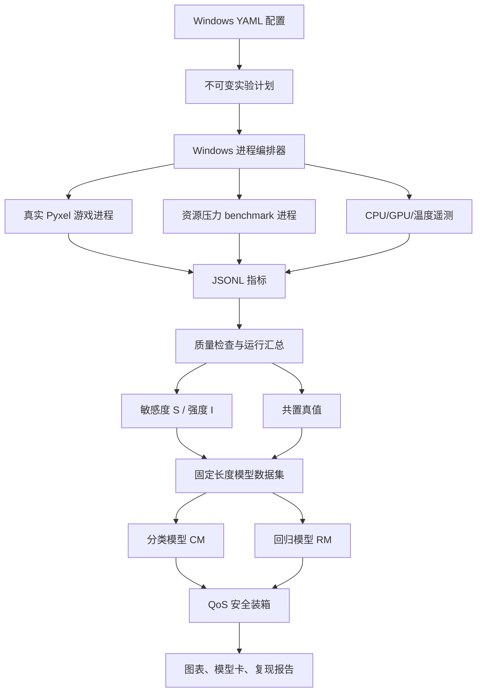
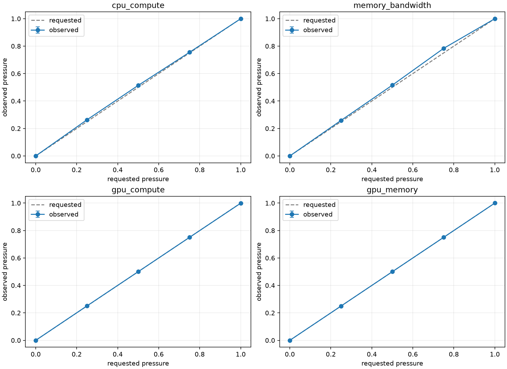
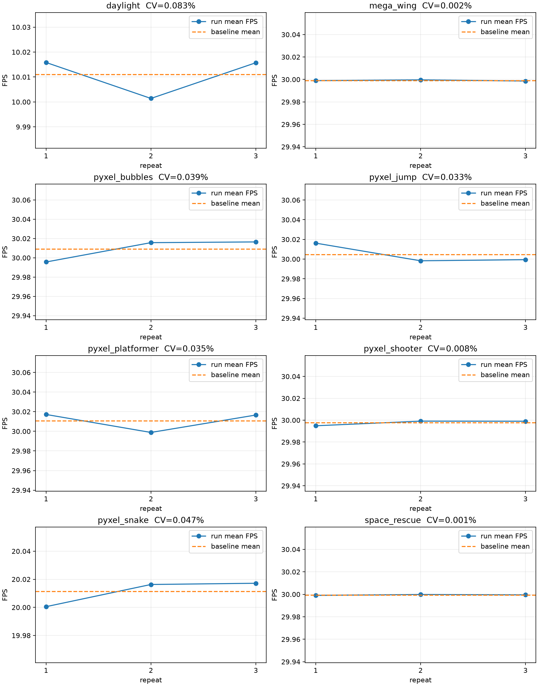

# GAugur-Lite-Windows

在本地 Windows + Conda 环境中，对南开大学—百度联合实验室论文 GAugur 的核心方法进行轻量级、可重复复现：运行八个真实可玩的开源小游戏，测量其资源敏感度与干扰强度，训练 QoS 分类模型和性能回归模型，并用模型完成干扰感知调度 replay。

## 项目状态

| 模块                     | 状态         | 产物                                                         |
| ------------------------ | ------------ | ------------------------------------------------------------ |
| 原论文归档               | 已完成       | [GAugur_HPDC_2019.pdf](docs/papers/GAugur_HPDC_2019.pdf)      |
| 论文中文解读             | 已完成       | [GAugur 中文解读](docs/papers/GAugur_中文解读.md)             |
| 八个真实小游戏           | 已下载       | [游戏清单与试玩方法](games/README.md)                         |
| Windows-only 实现方案    | 已完成       | 本 README                                                    |
| Step 0 环境基线          | 已完成       | [真实验收记录](artifacts/environment/step0/idle-summary.json) |
| Step 1 schema/config/CLI | 已完成       | [`gaugur_lite/`](gaugur_lite)、[`configs/`](configs)、[`tests/unit/`](tests/unit) |
| Step 2 指标与系统采样    | 已完成       | [60 秒探针](artifacts/telemetry/step2/formal-probe/summary.json)、[120 秒开销实验](artifacts/telemetry/step2/formal-overhead.json) |
| Step 3 真实 Pyxel workload | 已完成     | [24 run 验收汇总](artifacts/workloads/step3/acceptance.json)、[上游校验](artifacts/workloads/step3/upstream-verification.json) |
| Step 4 压力 benchmark 与校准 | 已完成   | [60 cell 校准](artifacts/calibration/step4/formal-calibration.json)、[校准曲线](artifacts/calibration/step4/formal-calibration-curves.png)、[独立校验](artifacts/calibration/step4/formal-calibration-verification.json) |
| Step 5 实验计划与 Windows Runner | 已完成 | [720-row 正式计划](artifacts/runner/step5/formal-plan.csv)、[四窗口 run](artifacts/runner/step5/recovery-run.json)、[31 项独立校验](artifacts/runner/step5/formal-acceptance-verification.json) |
| Step 6 正式独占基线      | 已完成       | [8 workload 基线](data/interim/formal-v1/solo-baselines.json)、[稳定性图](artifacts/baselines/step6/formal-solo-baselines.png)、[独立校验](artifacts/baselines/step6/formal-solo-verification.json) |
| Step 7 敏感度/强度 profile | 已完成 | [480-run 原始记录](data/interim/formal-v1/safety-v2/profile-runs.jsonl)、[160-row profile](data/interim/formal-v1/safety-v2/profiles.parquet)、[12/12 独立复核](artifacts/profiles/step7/safety-v2/formal-profile-verification.json) |
| Python 实现              | 分阶段实现中 | Step 0–7 已完成；pooled 数据审计、线程合同与自动验收已落实，98 项单测和 Safety-v2 全部质量门通过 |
| 正式实验数据、模型与报告 | 分阶段生成中 | 24 个正式 solo run 与 480 个正式 profile run 已生成；60 个主组合、额外测试、模型与报告待生成 |

本文档是后续实现规格。标记为“计划命令”的 CLI 在相应阶段实现前尚不可执行。

## 1. 复现目标与边界

### 1.1 核心研究问题

> 在单机 Windows 环境中，使用目标 workload 的资源敏感度曲线与邻居 workload 的干扰强度，能否比“只看共置数量”“只看资源利用率”或“线性相加强度”的基线，更准确地预测共置后的性能保留率与 QoS？

### 1.2 复现论文的哪些部分

保留 GAugur 的核心链路：

```text
可调资源压力 benchmark
→ 单 workload 敏感度 S 与强度 I
→ 60 个独立二/三 workload 共置组合
→ 分类模型 CM / 回归模型 RM
→ QoS 安全装箱与最大化性能调度
```

具体保留：

- 敏感度和干扰强度分开测量；
- 使用完整压力曲线表达非线性；
- 多邻居使用“数量 + 各资源强度均值/方差”表示；
- CM 预测是否满足 QoS；
- RM 预测性能保留率；
- 与 Sigmoid/count-only、VBP-like、linear-additive 基线比较；
- 按共置大小报告误差；
- 实现论文两个调度任务的离线 replay。

这里的 profile 是对真实游戏测量得到的“资源敏感度/干扰强度描述”，不是用 profile 生成或代替游戏。独占、压力和共置阶段实际启动的都是 `games/pyxel/` 中的游戏代码。

### 1.3 与原论文的差异

| 项目       | 原论文                    | 本项目                                            |
| ---------- | ------------------------- | ------------------------------------------------- |
| workload   | 100 款真实游戏            | 8 个固定的 MIT 许可 Pyxel 小游戏                  |
| 平台       | Windows 10 + ASTER 多座席 | 单机 Windows + Conda + 多独立进程                 |
| 共享资源   | 7 类 CPU/GPU 资源         | 4 个代理维度                                      |
| 压力档位   | 11 档，$k=10$           | 主实验 5 档，11 档作为曲线消融                    |
| 共置组合   | 700 个二/三/四游戏组合    | 主数据集 60 个二/三元组合，另设 12 个四元外推组合 |
| 性能指标   | 真实游戏 FPS              | Pyxel 引擎实际交付帧率                            |
| 云游戏串流 | 论文主要实验未纳入        | 不实现                                            |
| 在线集群   | 请求级调度                | 基于实测组合表的离线 replay                       |

因此本项目应称为“GAugur 方法的轻量复现”或“GAugur-Lite”，不能称为原论文数值级完整复现。

### 1.4 当前版本不做

- 不运行 GameLab server/client；
- 不使用 WebRTC、视频编码、屏幕采集或键鼠注入；
- 不安装 WSL；
- 不自动控制商业游戏；
- 不声称代理压力等同于严格隔离的 LLC、GPU-L2 或 PCIe benchmark；
- 不把 workload ID 输入主模型；
- 不把模型预测值当作调度 ground truth；
- 不引入强化学习。

## 3. 指标与术语

### 3.1 性能保留率

原论文把下式称为 performance degradation，但该值越大越好：

$$
\delta_{A\mid G}=\frac{FPS_{A,\,colocated\ with\ G}}{FPS_{A,\,solo}}
$$

本项目统一使用：

```text
retention_ratio = colocated_fps / solo_fps
loss_ratio      = 1 - retention_ratio
```

- `retention_ratio=1.0`：没有性能损失；
- `retention_ratio=0.8`：保留 80% 独占性能；
- `loss_ratio=0.2`：性能损失 20%。

### 3.2 游戏 FPS

八个小游戏都有真实的 Pyxel `update/draw` 循环。适配器在不修改上游游戏逻辑的前提下包装 `pyxel.run`，以每次完成的 draw callback 作为一帧，并用相邻 draw 开始时间计算完整交付间隔：

$$
game\_fps=\frac{completed\_draw\_callbacks}{measurement\_seconds}
$$

这是实际游戏逻辑与绘制循环的引擎级交付帧率，不是合成吞吐；但它也不是 Windows compositor/显示器层的 PresentMon FPS。文档统一称为 `game_fps`。若后续引入 PresentMon，必须作为独立指标报告，不能与引擎帧率混用。

Pyxel 游戏有自身目标帧率上限。无干扰时 FPS 可能稳定在上限，资源争用首先表现为 deadline miss、帧间隔尾延迟和实际交付帧率下降，因此必须同时记录 draw 间隔和 missed-deadline 数。

### 3.3 QoS 标签

对目标 workload $A$、邻居集合 $G$ 和阈值 $Q$：

$$
y_{qos}=\mathbb{1}[FPS_{A\mid G}\ge Q]
$$

QoS 阈值不直接照搬 60 FPS，而按每个 workload 的独占性能定义相对档位：

```text
qos_ratio ∈ {0.70, 0.80, 0.90}
qos_threshold = qos_ratio × solo_fps
```

这样能适配不同小游戏的原生目标帧率，避免直接套用 60 FPS。

### 3.4 平均值与低分位数

每次正式采样同时记录：

- `fps_mean`：对齐论文主指标；
- `fps_p05`：5% 分位 FPS，用于观察短时 QoS；
- `fps_min`：只用于诊断，不作为稳定主标签；
- `frame_time_p95_ms`：观察卡顿尾部。

## 4. 总体架构



## 5. 计划目录结构

```text
GameLab-RLCG/
├─ README.md
├─ docs/
│  └─ papers/
│     ├─ GAugur_HPDC_2019.pdf
│     └─ GAugur_中文解读.md
├─ ai-testbed/                     # 仅保留，不参与实验
│  └─ UPSTREAM.md
├─ games/
│  ├─ README.md                    # 八个游戏清单与试玩命令
│  └─ pyxel/                       # 上游原始源码、资源、许可证与校验值
│     ├─ apps/                     # 可直接 pyxel play 的原始 app
│     ├─ apps-src/                 # app 原样解包源码，供适配器加载
│     ├─ assets/
│     ├─ LICENSE
│     └─ UPSTREAM.md
├─ gaugur_lite/
│  ├─ __init__.py
│  ├─ __main__.py
│  ├─ cli.py                       # 统一 CLI
│  ├─ config.py                    # YAML、路径、配置哈希
│  ├─ schema.py                    # Run/Metric/Profile/Sample schema
│  ├─ workloads/
│  │  ├─ base.py
│  │  ├─ pyxel_game.py             # Pyxel 生命周期、帧计时与退出适配器
│  │  ├─ controllers.py            # 固定 seed 的引擎级自动输入
│  │  └─ registry.py
│  ├─ benchmarks/
│  │  ├─ base.py
│  │  ├─ duty_cycle.py
│  │  ├─ cpu_compute.py
│  │  ├─ memory_bandwidth.py
│  │  ├─ gpu_compute.py
│  │  ├─ gpu_memory.py
│  │  └─ calibration.py
│  ├─ metrics/
│  │  ├─ writer.py
│  │  ├─ system_sampler.py
│  │  └─ summarize.py
│  ├─ runner/
│  │  ├─ plan.py
│  │  ├─ runner.py                 # Windows PID/进程树与生命周期
│  │  └─ window_layout.py
│  ├─ baselines.py
│  ├─ profiles.py
│  ├─ features/                    # Step 8 后构建组合模型样本
│  │  └─ dataset.py
│  ├─ models/
│  │  ├─ split.py
│  │  ├─ classification.py
│  │  ├─ regression.py
│  │  ├─ baselines.py
│  │  └─ evaluate.py
│  ├─ scheduler/
│  │  ├─ feasible.py
│  │  ├─ pack.py
│  │  ├─ maximize_fps.py
│  │  └─ replay.py
│  └─ reporting/
│     ├─ plots.py
│     └─ report.py
├─ configs/
│  ├─ local.example.yaml
│  ├─ workloads.yaml
│  ├─ experiments/
│  │  ├─ smoke.yaml                # 只验证代码链路，不产生正式结果
│  │  ├─ formal.yaml               # 正式 8-workload 实验
│  │  └─ ablations.yaml
│  └─ requests/
│     └─ formal.yaml               # 调度 replay 的到达序列
├─ tests/
│  ├─ unit/
│  ├─ integration/
│  └─ fixtures/
├─ data/
│  ├─ raw/
│  ├─ interim/
│  └─ processed/
├─ artifacts/
│  ├─ environment/
│  ├─ calibration/
│  ├─ plans/
│  ├─ models/
│  └─ reports/
├─ environment.yml
├─ requirements-windows.txt
└─ pyproject.toml
```

## 6. Windows Conda 环境

### 6.1 基础环境

推荐新建独立环境，不修改现有项目环境：

```powershell
conda create -n gaugur-lite python=3.11 pip -y
conda activate gaugur-lite
```

基础依赖计划固定在 `requirements-windows.txt`：

```text
numpy
pandas
pyarrow
scipy
scikit-learn
psutil
nvidia-ml-py
PyYAML
pydantic
typer
joblib
matplotlib
seaborn
pytest
pyxel==2.9.8
```

安装：

```powershell
python -m pip install -r requirements-windows.txt
```

### 6.2 游戏运行时与 GPU 压力基准

Pyxel 2.9.8 要求 Python 3.11+，负责八个真实小游戏的窗口、输入、更新、绘制和音频。先验证游戏运行时：

```powershell
python -c "import importlib.metadata; print(importlib.metadata.version('pyxel'))"
```

PyTorch 不再生成游戏 workload，只用于 `gpu_compute` 和 `gpu_memory` 压力 benchmark。使用与本机 NVIDIA 驱动兼容的 Windows CUDA wheel：

```powershell
python -m pip install -r requirements-torch-cu121.txt
```

验收：

```powershell
python -c "import torch; print(torch.__version__); print(torch.cuda.is_available()); print(torch.cuda.get_device_name(0))"
nvidia-smi
```

若 Pyxel 无法打开任一游戏窗口，先修复图形/音频运行时；若 `torch.cuda.is_available()` 为 `False`，停止 GPU 压力实验并修复 PyTorch/驱动环境。

### 6.3 环境记录

正式实验前记录：

```powershell
New-Item -ItemType Directory -Force artifacts\environment
python --version | Out-File artifacts\environment\python-version.txt
python -m pip freeze | Out-File artifacts\environment\pip-freeze.txt
nvidia-smi | Out-File artifacts\environment\nvidia-smi.txt
Get-ComputerInfo | Out-File artifacts\environment\computer-info.txt
```

环境记录包含根仓库 commit、Windows build、CPU、内存、GPU、驱动、Conda 和 Python 版本。

## 7. Workload 设计

### 7.1 设计目标

正式 workload 是仓库中八个上游 MIT 许可小游戏。实验适配器必须在保持原游戏规则和绘制路径的同时，使每次运行可比较：

- 支持固定 seed；
- 独立进程运行；
- 有 ready 信号和进度心跳；
- 每帧输出 frame time；
- 使用固定窗口缩放、固定音频策略和固定自动输入轨迹；
- 正常响应停止事件；
- 不随运行时间无限增加内存；
- 独占重复实验方差可接受。

### 7.2 正式实验的八个真实小游戏

游戏文件已经下载到 [`games/pyxel/`](games/pyxel/)，来源、commit、许可证和校验值见 [`games/README.md`](games/README.md)。八个 ID 固定，不在 profiling 或共置结果出来后增删游戏。

| ID                   | 游戏                   | 类型/主要场景              | 实验入口                                                 |
| -------------------- | ---------------------- | -------------------------- | -------------------------------------------------------- |
| `pyxel_jump`       | Pyxel Jump             | 跳跃、障碍与 sprite 绘制   | `games/pyxel/02_jump_game.py`                          |
| `pyxel_bubbles`    | Pyxel Bubbles          | 大量移动圆形与点击判定     | `games/pyxel/06_click_game.py`                         |
| `pyxel_snake`      | Snake!                 | 网格移动、碰撞与音频       | `games/pyxel/07_snake.py`                              |
| `pyxel_shooter`    | Pyxel Shooter          | 星空、敌机、子弹与爆炸     | `games/pyxel/09_shooter.py`                            |
| `pyxel_platformer` | Pyxel Platformer       | tilemap、滚屏、物理与碰撞  | `games/pyxel/10_platformer.py`                         |
| `daylight`         | 30 Seconds of Daylight | Roguelike 地图、敌人和战斗 | `games/pyxel/apps-src/30SecondsOfDaylight/src/main.py` |
| `mega_wing`        | Mega Wing              | 多弹幕、多对象与音频       | `games/pyxel/apps-src/mega_wing/mega_wing.py`          |
| `space_rescue`     | Space Rescue           | 单键飞行、对象生成与救援   | `games/pyxel/apps-src/space_rescue/space_rescue.py`    |

这里的“强/弱资源行为”不再由人为 profile 参数预设，而由后续敏感度/强度实验实际测出。八个游戏共享 Pyxel 引擎，因此框架差异较小、资源负载也比 3A 游戏轻；这是复现有效性限制，必须在报告中说明，不能通过给某个游戏附加隐藏矩阵计算来人为制造差异。

### 7.3 原生分辨率与窗口策略

- 保持每个游戏源码声明的内部画布和目标 FPS；
- 主实验统一使用窗口模式、固定显示缩放和相同 Windows DPI 设置；
- 不修改游戏内部对象数量、地图、贴图或绘制质量；
- 每个 run 记录内部画布、实际客户区大小、目标 FPS、DPI scale 和显示器；
- 实验窗口不能最小化、被遮挡或切到后台节流状态；
- 不再使用“虚拟 720p/1080p workload”概念。

### 7.4 Pyxel 适配与帧循环

上游游戏文件保持不变。适配器先包装 Pyxel API，再通过 `runpy` 加载游戏入口：

```python
original_run = pyxel.run

def instrumented_run(update, draw):
    def measured_update():
        apply_deterministic_input(pyxel.frame_count)
        update()

    def measured_draw():
        record_draw_interval(perf_counter_ns())
        draw()
        stop_at_planned_deadline()

    original_run(measured_update, measured_draw)

run_game_with_runpy(entrypoint, working_directory)
```

自动输入在 `pyxel.btn/btnp/mouse_x/mouse_y` API 层提供固定轨迹，不调用 Windows `SendInput`，不抢占用户真实键鼠。指标 writer 在独立缓冲区批量 flush，避免每帧磁盘写入反过来成为主要瓶颈。适配器还必须保留游戏异常栈、完成统一 ready barrier，并在实验截止时调用 `pyxel.quit()` 正常退出。

## 8. 压力 benchmark 设计

### 8.1 四个代理维度

| 名称                 | Lite 核心实现                                      | `pressure_observed`                    | 同步记录的硬件信号 |
| -------------------- | -------------------------------------------------- | -------------------------------------- | ------------------ |
| `cpu_compute`        | 8 线程 NumPy `float32` 256×256 矩阵乘法 + duty cycle | worker 实测 active time / elapsed time | 系统 CPU 利用率    |
| `memory_bandwidth`   | 8 个 64 MiB NumPy buffer 原地读改写 + duty cycle  | worker 实测 active time / elapsed time | 系统 CPU 利用率    |
| `gpu_compute`        | PyTorch CUDA `float32` 1024×1024 矩阵乘法 + duty cycle | worker 实测 active time / elapsed time | NVML GPU 利用率    |
| `gpu_memory`         | 预分配并原地更新最大 1 GiB CUDA tensor             | allocated bytes / 1 GiB                | NVML 已用显存      |

这些维度分别近似 CPU-CE、MEM-BW、GPU-CE、GPU-BW。本项目不声称隔离 LLC、GPU-L2 或 PCIe-BW。

### 8.2 Benchmark 原则

1. 压力可从 0 单调增加到最大稳定压力；
2. 每档记录 requested 和 observed pressure；
3. worker 必须记录 operation count、active time、elapsed time 和实际分配字节，不能只读系统利用率；
4. GPU 计时必须同步；
5. 预分配数组/tensor，正式测量期间不反复申请大内存；
6. 每个 benchmark 独立进程运行；
7. workload 和 benchmark 使用不同输出文件；
8. benchmark 停止后资源利用率应恢复到空载区间。

### 8.3 压力档位

正式主实验：

```text
0.00, 0.25, 0.50, 0.75, 1.00
```

11 档曲线消融：

```text
0.0, 0.1, 0.2, ..., 1.0
```

压力 0 仍执行完整实验流程，用于验证 profiling 与独占结果一致。

### 8.4 校准

GAugur-Lite 的本地 Windows 校准分为“送达的执行器压力”和“外部硬件响应”两层。对于前三类 duty-cycle benchmark，不直接把请求值当成实际值，而是由子进程实测：

$$
p_{observed}=\frac{t_{active}}{t_{elapsed}}
$$

对于 `gpu_memory`：

$$
p_{observed}=\frac{bytes_{allocated}}{bytes_{capacity}}
$$

CPU 利用率、GPU 利用率和 NVML 已用显存作为独立的 `hardware_signal` 保存，用于证明压力确实改变了硬件状态，但不冒充 `pressure_observed`。这是 Lite 复现的执行器校准；若后续要研究“单位时间吞吐相对满载吞吐”的非线性，需要在当前原始 `operations` 数据之上另做吞吐归一化，不能用本阶段接近对角线的曲线代替。

质量门槛为每档 3 次重复、observed 单调、最大绝对误差不超过 0.05、硬件信号存在。校准产物绑定：

- 完整实验配置 SHA-256（含主机 ID）；
- Python、PyTorch、CUDA runtime、CPU 数量、RAM、GPU 型号组成的环境指纹 SHA-256；
- CPU worker 数、buffer 大小、CUDA matrix 大小和显存容量参数；
- 原始 JSONL 与曲线图各自的 SHA-256。

当前环境指纹不采集 Windows 电源模式和 NVIDIA 驱动版本；正式复现实验还应与 Step 0 环境清单和 Git commit 一并归档。环境或 benchmark 代码变化后必须重新校准。

## 9. 配置设计

### 9.1 主机配置

计划文件：`configs/local.example.yaml`

```yaml
schema_version: 1

host:
  id: "windows-rtx4060"
  platform: "windows"
  gpu_index: 0
  display_index: 0
  dpi_awareness: "per_monitor_v2"
  window_layout: "grid_2x2"
  require_visible_windows: true
  cpu_affinity: null
  cooldown_s: 20
  max_gpu_temp_c: 82

measurement:
  warmup_s: 20
  duration_s: 60
  sample_interval_s: 1.0
  repeats: 3
  qos_ratios: [0.70, 0.80, 0.90]
  random_seed: 20260811

paths:
  raw: "data/raw"
  interim: "data/interim"
  processed: "data/processed"
  artifacts: "artifacts"
```

### 9.2 Workload 配置

计划文件：`configs/workloads.yaml`

```yaml
schema_version: 1

workloads:
  - id: "pyxel_jump"
    driver: "pyxel_game"
    entrypoint: "games/pyxel/02_jump_game.py"
    working_directory: "games/pyxel"
    controller: "jump_v1"
    seed: 1001
    display_scale: 2
  - id: "pyxel_bubbles"
    driver: "pyxel_game"
    entrypoint: "games/pyxel/06_click_game.py"
    working_directory: "games/pyxel"
    controller: "bubbles_v1"
    seed: 1002
    display_scale: 2
  - id: "pyxel_snake"
    driver: "pyxel_game"
    entrypoint: "games/pyxel/07_snake.py"
    working_directory: "games/pyxel"
    controller: "snake_cycle_v1"
    seed: 1003
    display_scale: 2
  - id: "pyxel_shooter"
    driver: "pyxel_game"
    entrypoint: "games/pyxel/09_shooter.py"
    working_directory: "games/pyxel"
    controller: "shooter_patrol_v1"
    seed: 1004
    display_scale: 2
  - id: "pyxel_platformer"
    driver: "pyxel_game"
    entrypoint: "games/pyxel/10_platformer.py"
    working_directory: "games/pyxel"
    controller: "platformer_right_jump_v1"
    seed: 1005
    display_scale: 2
  - id: "daylight"
    driver: "pyxel_game"
    entrypoint: "games/pyxel/apps-src/30SecondsOfDaylight/src/main.py"
    working_directory: "games/pyxel/apps-src/30SecondsOfDaylight/src"
    controller: "daylight_patrol_v1"
    seed: 1006
    display_scale: 2
  - id: "mega_wing"
    driver: "pyxel_game"
    entrypoint: "games/pyxel/apps-src/mega_wing/mega_wing.py"
    working_directory: "games/pyxel/apps-src/mega_wing"
    controller: "mega_wing_patrol_v1"
    seed: 1007
    display_scale: 2
  - id: "space_rescue"
    driver: "pyxel_game"
    entrypoint: "games/pyxel/apps-src/space_rescue/space_rescue.py"
    working_directory: "games/pyxel/apps-src/space_rescue"
    controller: "space_rescue_pulse_v1"
    seed: 1008
    display_scale: 2

defaults:
  audio_mode: "muted"
  input_mode: "deterministic_engine_api"
  preserve_game_logic: true
```

### 9.3 正式实验配置

计划文件：`configs/experiments/formal.yaml`

```yaml
schema_version: 1
name: "formal-v1"
workload_ids:
  - "pyxel_jump"
  - "pyxel_bubbles"
  - "pyxel_snake"
  - "pyxel_shooter"
  - "pyxel_platformer"
  - "daylight"
  - "mega_wing"
  - "space_rescue"
resources: ["cpu_compute", "memory_bandwidth", "gpu_compute", "gpu_memory"]
pressure_levels: [0.0, 0.25, 0.5, 0.75, 1.0]
repeats: 3
randomize_order: true

main_combinations:
  pairs: {mode: "all", expected_count: 28}
  triples:
    mode: "balanced_subset_v1"
    expected_count: 32
    seed: 20260811

extra_test:
  size: 4
  mode: "balanced_binary_design_v1"
  expected_count: 12
  trainable: false

split:
  group_by: "combination_key"
  seed: 20260811
  train_groups: 36
  validation_groups: 12
  test_groups: 12
```

配置加载后进行 schema 校验和稳定序列化，并计算 SHA-256。组合选择结果写入不可变 manifest，每个 run 保存展开后的配置副本。

## 10. 数据契约

### 10.1 原始运行目录

```text
data/raw/<experiment_id>/<run_id>/
├─ manifest.json
├─ workload_<id>.jsonl
├─ benchmark.jsonl
├─ system_metrics.jsonl
├─ stdout.log
├─ stderr.log
└─ status.json
```

### 10.2 Manifest

```json
{
  "schema_version": 1,
  "run_id": "formal-v1__profile__pyxel_shooter__gpu_compute__p050__r01",
  "experiment_id": "formal-v1",
  "mode": "pressure_profile",
  "target_id": "pyxel_shooter",
  "neighbor_ids": [],
  "game_entrypoint": "games/pyxel/09_shooter.py",
  "game_sha256": "0F53E415...",
  "controller": "shooter_patrol_v1",
  "resource": "gpu_compute",
  "pressure_requested": 0.5,
  "repeat": 1,
  "seed": 20260811,
  "warmup_s": 20,
  "duration_s": 60,
  "host_id": "windows-rtx4060",
  "config_sha256": "...",
  "root_commit": "..."
}
```

### 10.3 时序指标

公共字段：

```text
schema_version,run_id,source,wall_time_ns,monotonic_time_ns
```

Workload：

```text
workload_id,frame_id,target_fps,draw_interval_ms,
update_time_ms,draw_time_ms,completed_frames,window_fps,
missed_deadline,game_state,heartbeat,progress
```

Benchmark：

```text
resource,pressure_requested,pressure_observed,
iterations,iteration_time_ms,throughput,heartbeat
```

系统：

```text
cpu_util_pct,cpu_freq_mhz,ram_used_bytes,
gpu_util_pct,gpu_mem_util_pct,gpu_mem_used_bytes,
gpu_clock_mhz,gpu_power_w,gpu_temp_c
```

### 10.4 运行汇总

`data/interim/run_summary.parquet` 每个 run/目标一行：

```text
run_id,combination_key,colocation_id,split,mode,target_id,neighbor_ids,
fps_mean,fps_p05,fps_min,frame_time_p95_ms,missed_deadline_ratio,
pressure_requested,pressure_observed,
cpu_util_mean,gpu_util_mean,gpu_temp_max,
valid,invalid_reason
```

### 10.5 Profiles

`data/interim/profiles.parquet`：

```text
workload_id,resource,pressure_level,
solo_fps,fps_under_pressure,retention_ratio,
benchmark_throughput_solo,benchmark_throughput_colocated,
intensity_slowdown,repeat_count,retention_std,intensity_std
```

### 10.6 模型样本

```text
data/processed/<experiment_id>/
├─ base_samples.parquet
├─ rm_samples.parquet
├─ cm_samples.parquet
├─ extra_rm_samples.parquet
├─ extra_cm_samples.parquet
├─ combination_manifest.json
├─ split_manifest.json
└─ feature_manifest.json
```

公共字段：

```text
combination_key,colocation_id,run_id,split,target_id,solo_fps,neighbor_count,
sensitivity_<resource>_p000 ... sensitivity_<resource>_p100,
intensity_mean_<resource>,intensity_var_<resource>,
retention_ratio,loss_ratio
```

CM 额外包含：

```text
qos_ratio,qos_threshold,qos_satisfied
```

`target_id` 用于审计和 Leave-One-Workload-Out 补充实验，默认不进入主模型。`combination_key` 是排序后 workload ID 的稳定连接结果；同一物理组合的所有重复、目标行和 QoS 行必须共享同一 split。

## 11. Windows 进程管理约束

### 11.1 启动

编排器使用参数数组和绝对可执行路径：

```python
subprocess.Popen(
    argv,
    cwd=run_dir,
    creationflags=subprocess.CREATE_NEW_PROCESS_GROUP,
)
```

禁止把 YAML 中的命令直接拼接为 `shell=True` 字符串。

### 11.2 Ready barrier

共置实验必须等待所有 workload：

1. 进程存在；
2. Pyxel 窗口、贴图/地图/音频资源与自动控制器初始化完成；
3. 写出 `READY` 事件；
4. 心跳正常；
5. 到达统一 barrier。

然后才开始 warmup 和正式测量。

### 11.3 停止与清理

1. 发送本次 run 专属停止事件；
2. 等待有限宽限时间；
3. 使用 `psutil.Process(pid).children(recursive=True)` 枚举本次进程树；
4. 核对 PID、创建时间和 run ID；
5. 先 terminate；
6. 超时后只处理已核对的本次进程；
7. 禁止按进程名杀死全部 Python。

任一目标崩溃会使整次共置 run 无效。

## 12. 逐步实现过程

### Step 0：建立 Windows 环境基线

#### 实现

1. 创建 `gaugur-lite` Conda 环境；
2. 安装 Pyxel、基础依赖和用于 GPU 压力基准的 CUDA PyTorch；
3. 记录环境清单；
4. 检查 GPU、NVML、CPU 核数与可用内存；
5. 运行 60 秒空载遥测；
6. 关闭浏览器 GPU 页面、游戏启动器和不必要后台程序；
7. 固定 Windows 电源模式并记录，不由程序自动修改系统设置。

#### 验收

以下安装命令耗时较长，由用户在 **Anaconda PowerShell Prompt** 中运行。当前仓库默认 Anaconda 位于 `D:\anaconda3`：

```powershell
Set-Location D:\github\GameLab-RLCG

# 环境不存在时才执行；当前机器已创建，可以跳过。
conda create -n gaugur-lite python=3.11 pip -y
conda activate gaugur-lite

python -m pip install -r requirements-windows.txt
python -m pip install -r requirements-torch-cu121.txt
python -m pip check

New-Item -ItemType Directory -Force artifacts\environment\step0 | Out-Null
$acceptanceOutput = python scripts\verify_step0_environment.py
$acceptanceExitCode = $LASTEXITCODE
$acceptanceOutput | Out-File `
  artifacts\environment\step0\acceptance.json -Encoding utf8
$acceptanceOutput
if ($acceptanceExitCode -ne 0) {
  throw "Step 0 environment verification failed (exit $acceptanceExitCode)"
}
```

> Windows 上不要使用 `torch==2.4.0+cu121`：该版本的官方 wheel 存在已知 DLL 打包回归，
> `fbgemm.dll`/`torch_cpu.dll` 会依赖但未携带 `libomp140.x86_64.dll`。该问题被纳入
> [PyTorch 2.4.1 修复范围](https://github.com/pytorch/pytorch/issues/131662)，本项目因此锁定`torch==2.4.1+cu121`。

若曾经安装本项目旧锁定值 `2.4.0+cu121`，执行下面的官方 wheel 无缓存升级；下载约 2.4 GB：

```powershell
python -m pip install `
  --upgrade `
  --force-reinstall `
  --no-cache-dir `
  -r requirements-torch-cu121.txt

python -m pip check
$acceptanceOutput = python scripts\verify_step0_environment.py
$acceptanceExitCode = $LASTEXITCODE
$acceptanceOutput | Out-File `
  artifacts\environment\step0\acceptance.json -Encoding utf8
$acceptanceOutput
if ($acceptanceExitCode -ne 0) {
  throw "Step 0 environment verification failed (exit $acceptanceExitCode)"
}
```

验证通过后再运行约 60 秒的真实空载基线采集：

```powershell
powershell -NoProfile -ExecutionPolicy Bypass `
  -File scripts\capture_step0_environment.ps1
```

空载质量门槛只用于控制 Windows 后台噪声，不参与 QoS 标签或模型训练：CPU mean `<=15%`、
CPU P95 `<=35%`、GPU mean `<=5%`、GPU P95 `<=20%`、GPU 最高温度 `<=70°C`，且必须得到
60 个样本。任一项失败时脚本保留 `idle-summary.json` 和 CPU 增量最大的 15 个进程，但返回非零状态；
关闭干扰程序、等待系统静稳后重新采集，不得把失败采集写成通过。

#### 真实验收结果

结论：**PASS**。本机 Windows Conda 环境、CUDA/NVML、八个游戏文件和 60 秒空载质量门槛全部通过。

环境验收：

| 检查项                        |                                             实测结果 |   状态 |
| ----------------------------- | ---------------------------------------------------: | -----: |
| Python                        |                                              3.11.15 |   PASS |
| Pyxel                         |                                                2.9.8 |   PASS |
| PyTorch / CUDA runtime        |                                   2.4.1+cu121 / 12.1 |   PASS |
| `torch.cuda.is_available()` |                                             `true` |   PASS |
| Torch / NVML GPU              |                   NVIDIA GeForce RTX 4060 Laptop GPU |   PASS |
| GPU 驱动 / 显存               |                                    560.94 / 8188 MiB |   PASS |
| CPU / 内存                    |                     24 物理核、32 逻辑核 / 31.73 GiB |   PASS |
| `pip check`                 |                    `No broken requirements found.` |   PASS |
| 上游文件 SHA-256              |         11/11 匹配（8 个游戏、2 个资源、1 个许可证） |   PASS |
| Windows 电源方案              | 平衡（GUID`381b4222-f694-41f0-9685-ff5bb260df2e`） | 已记录 |

第二次有效空载采集得到 60 个样本，观测窗口 60.003 秒：

| 指标                     |    Mean |     Min |     Max |     P95 | 门槛结果 |
| ------------------------ | ------: | ------: | ------: | ------: | -------: |
| CPU utilization (%)      |    4.22 |    1.60 |   14.00 |    8.70 |     PASS |
| RAM utilization (%)      |   59.18 |   59.00 |   59.90 |   59.30 |     记录 |
| GPU utilization (%)      |    1.22 |    0.00 |   21.00 |    8.00 |     PASS |
| GPU memory used (MiB)    | 1261.93 | 1213.82 | 1302.60 | 1299.79 |     记录 |
| GPU temperature (°C)    |   48.58 |   48.00 |   50.00 |   50.00 |     PASS |
| GPU power (W)            |    6.10 |    3.95 |   16.42 |   15.82 |     记录 |
| GPU graphics clock (MHz) |  395.00 |  210.00 | 1890.00 | 1890.00 |     记录 |

质量门槛的 6 项检查全部通过：样本数 `60/60`、CPU mean `4.22<=15`、CPU P95
`8.7<=35`、GPU mean `1.22<=5`、GPU P95 `8<=20`、GPU max temperature `50<=70°C`。

首轮采集虽完整生成 60 个样本，但 CPU mean/P95 为 `31.31%/56.8%`、GPU P95 为 `27%`，
且存在多个 Edge/WebView2 进程，因此被如实拒绝；关闭干扰程序并把遥测移到 WMI/依赖枚举之前后，
第二次采集通过。没有把失败采集冒充正式结果。

原始证据：[`acceptance.json`](artifacts/environment/step0/acceptance.json)、
[`idle-summary.json`](artifacts/environment/step0/idle-summary.json)、
[`idle-telemetry.jsonl`](artifacts/environment/step0/idle-telemetry.jsonl)、
[`game-checksums.json`](artifacts/environment/step0/game-checksums.json)、
[`pip-check.txt`](artifacts/environment/step0/pip-check.txt)、
[`pip-freeze.txt`](artifacts/environment/step0/pip-freeze.txt)、
[`gpu-summary.txt`](artifacts/environment/step0/gpu-summary.txt)、
[`power-plan.txt`](artifacts/environment/step0/power-plan.txt) 和
[`computer-info.txt`](artifacts/environment/step0/computer-info.txt)。

### Step 1：建立 Python 包、schema 和 CLI

#### 新建

```text
.gitignore
pyproject.toml
configs/local.example.yaml
configs/workloads.yaml
gaugur_lite/__init__.py
gaugur_lite/__main__.py
gaugur_lite/cli.py
gaugur_lite/config.py
gaugur_lite/doctor.py
gaugur_lite/schema.py
tests/unit/test_cli.py
tests/unit/test_config.py
tests/unit/test_schema.py
```

#### 实现

1. 定义 `HostSpec`、`WorkloadSpec`、`RunSpec`、`MetricEvent`、`RunStatus`；
2. 校验 Windows 路径、压力范围、持续时间和重复次数；
3. 生成稳定 `experiment_id/combination_key/colocation_id/run_id`；
4. 稳定 JSON 序列化并计算配置 SHA-256；
5. 创建 Typer CLI；
6. 所有实验命令支持 `--dry-run`；
7. 实现只读 `doctor` 环境检查。

#### 计划命令

```powershell
python -m gaugur_lite --help
python -m gaugur_lite doctor --config configs\local.example.yaml
```

#### 真实验收结果（2026-08-11）

结论：**PASS**。已创建 `pyproject.toml`、`gaugur_lite/` 包、主机与八 workload YAML、
17 个无 GPU 单元测试用例，并完成真实 CLI/`doctor` 验收。

实现内容：

- `HostSpec`、`WorkloadSpec`、`RunSpec`、`MetricEvent`、`RunStatus` 使用 Pydantic v2 严格模型，
  禁止未知字段并冻结校验后的对象；
- 路径统一规范为仓库相对 POSIX 表示，拒绝 Windows 盘符、绝对路径、空路径和 `..` 逃逸；
- 压力限制为 `[0,1]`，重复数限制为 `>=1`，测量时长必须为正数；
- `combination_key` 对 workload ID 排序且拒绝重复，`colocation_id` 和 `run_id` 由规范化字段生成；
- YAML 拒绝重复键；稳定 JSON 使用排序键、紧凑分隔符、UTF-8 和禁止 NaN，再计算 SHA-256；
- CLI 同时支持 `gaugur-lite` console script 与 `python -m gaugur_lite`；
- 全局和子命令位置均支持 `--dry-run`；`doctor` 只读取配置、包元数据和 `nvidia-smi`。

单元测试真实输出：

```text
.................                                                        [100%]
17 passed in 0.53s
```

测试覆盖相同配置哈希、YAML 重复键、8 个 workload 路径、仓库路径逃逸、非法压力/重复数/时长、
排序无关的组合 ID、显式错误 run ID、CPU affinity、非有限指标以及 CLI 两种 dry-run 位置。
测试中的 `doctor` 注入假的 `nvidia-smi`，因此单元测试本身不需要 GPU。

真实帮助页暴露了预期接口：

```text
Usage: python -m gaugur_lite [OPTIONS] COMMAND [ARGS]...

Options:
  --dry-run   只输出计划或诊断，不执行可变操作。
  --version   显示版本并退出。
  --help

Commands:
  doctor      只读检查配置、依赖和 GPU；不会启动 workload。
```

在 `gaugur-lite` Conda 环境中依次执行普通、全局 dry-run 和后置 dry-run 三种 `doctor` 调用，
均返回退出码 0。关键结果：

| 字段/检查 | 三次实测结果 | 状态 |
|---|---:|---:|
| `status` | `passed` | PASS |
| config SHA-256 | `9c3819e68c7158b9518dc1d5636032710d7a33a090e8515213d850963d5355cc` | 三次一致 |
| platform / Python | windows / 3.11.15 | PASS |
| Pydantic / Typer / PyYAML | 2.13.4 / 0.27.1 / 6.0.3 | PASS |
| Pyxel / Torch | 2.9.8 / 2.4.1+cu121 | PASS |
| GPU / 驱动 / 显存 | RTX 4060 Laptop / 560.94 / 8188 MiB | PASS |
| `read_only` | `true` | PASS |
| `workload_processes_started` | `0` | PASS |
| `mutations_performed` | `[]` | PASS |
| 两种 `--dry-run` 位置 | 均返回 `dry_run: true` | PASS |

`data/raw`、`data/interim`、`data/processed` 当前不存在是预期状态；`doctor` 只验证它们解析后仍位于
仓库内，不会为了检查而创建目录。至此 Step 1 的四项验收条件全部满足。

### Step 2：实现结构化指标与系统采样

#### 实现

1. JSONL writer 批量 flush；
2. 同时记录 wall-clock 和 monotonic 时间；
3. 使用 `psutil` 采 CPU、内存和进程指标；
4. 使用 NVML 采 GPU、显存、时钟、功耗与温度；
5. 生成 `status.json`；
6. 异常退出时保留已有原始数据；
7. 人类日志和机器指标分离。

#### 验收命令

```powershell
conda activate gaugur-lite
Set-Location D:\github\GameLab-RLCG

python -m pytest tests\unit -q -p no:cacheprovider

python -m gaugur_lite telemetry probe `
  --duration 60 `
  --interval 1 `
  --batch-size 10 `
  --gpu-index 0 `
  --output-directory artifacts\telemetry\step2\formal-probe

python -m gaugur_lite telemetry overhead `
  --duration 120 `
  --interval 1 `
  --repeats 4 `
  --work-iterations 20000 `
  --gpu-index 0 `
  --output artifacts\telemetry\step2\formal-overhead.json
```

探针与开销命令使用独占创建模式，不会覆盖同名的既有原始数据。需要重新采集时应改用新的输出目录或文件名，
不得删除失败结果后冒充第一次成功。

#### 真实验收结果（2026-08-13）

结论：**PASS**。结构化指标 writer、CPU/RAM/进程/GPU 采样、状态跟踪、异常数据保留、
时序质量门和合成帧循环开销测试均已实现并通过。新增实现位于 `gaugur_lite/metrics/`，
CLI 入口为 `telemetry probe` 与 `telemetry overhead`。

单元测试真实输出：

```text
..............................                                           [100%]
30 passed in 1.39s
```

60 秒正式探针结果：

| 检查项 | 实测结果 | 门槛 | 结论 |
| ------ | -------- | ---- | ---- |
| 采集时长 | 60.0012 s | `>= 60 s` | PASS |
| JSONL 样本数 | 60 | 60 | PASS |
| sequence | `0..59` 连续 | 必须连续 | PASS |
| wall/monotonic 时间 | 均未倒退 | 不得倒退 | PASS |
| 采样间隔 | mean 0.9995 s，min 0.969 s，max 1.000 s | 请求 1 s | PASS |
| 间隔绝对误差 P95 | 0.000 s | `<= 0.100 s` | PASS |
| 必需字段缺失 | 0 | 0 | PASS |
| status | `completed`，记录 60 行 | 必须与原始行数一致 | PASS |

探针同时真实取得 CPU、内存、进程、GPU、显存、时钟、功耗和温度字段。例如本次采集中，
CPU 利用率 mean/P95 为 4.435%/18.8%，GPU 利用率 mean/P95 为 26.53%/51%，GPU 温度最高 52°C。
这些数值用于验证采样链路，不作为 Step 0 的空载质量门或后续模型标签。

120 秒开销实验将 120 秒平均分成 8 个 15 秒阶段，完成 4 组交替顺序的“不开采样器/开启采样器”
配对测试。开启采样器的阶段共写入 64 条真实系统指标。结果如下：

| repeat | 无采样器 proxy FPS | 有采样器 proxy FPS | 影响 |
| ------ | ------------------: | ------------------: | ---: |
| 1 | 827.1305 | 819.8470 | -0.8806% |
| 2 | 809.7181 | 818.1174 | +1.0373% |
| 3 | 812.2628 | 817.2398 | +0.6127% |
| 4 | 804.1126 | 810.8850 | +0.8422% |

四组影响的中位数为 **+0.7275%**，绝对影响 mean/max 为 0.8432%/1.0373%，
满足预设的 `abs(median impact) <= 5%` 门槛。正值表示该组开启采样器时代理吞吐略高，属于配对运行噪声，
不能解释为采样器提升性能。

机器可读验收产物：

- 探针原始数据：[system_metrics.jsonl](artifacts/telemetry/step2/formal-probe/system_metrics.jsonl)；
- 探针汇总：[summary.json](artifacts/telemetry/step2/formal-probe/summary.json)；
- 探针状态：[status.json](artifacts/telemetry/step2/formal-probe/status.json)；
- 开销原始数据：[formal-overhead-metrics.jsonl](artifacts/telemetry/step2/formal-overhead-metrics.jsonl)；
- 开销汇总：[formal-overhead.json](artifacts/telemetry/step2/formal-overhead.json)；
- 开销状态：[formal-overhead-status.json](artifacts/telemetry/step2/formal-overhead-status.json)。

独立复核已逐行解析两份 JSONL，共 124 行；必需字段缺失数为 0，summary/status 中的计数均与原始行数一致。
writer 按批 flush，`status.json` 通过临时文件原子替换；采样异常时已落盘 JSONL 不会被回滚，
状态转为 `failed` 并仅记录安全的异常类型与信息。`--dry-run` 不初始化 NVML 且不写文件。

本阶段的 `proxy_fps` 来自确定性的合成帧循环，只量化系统采样器与 JSONL 写入的基础开销，
**不是实际游戏 FPS**。八个游戏尚未接入，因此不能在本阶段声称采样器对 `game_fps` 的影响已经验证；
接入 Pyxel 后必须在 Step 5 使用真实 `game_fps` 重复同一配对开销验收，并如实保留结果。

### Step 3：接入八个真实 Pyxel 游戏

#### 实现顺序

1. 校验 `games/pyxel/SHA256SUMS.txt`，确认上游入口、资源和 app bundle 未被修改；
2. 用试玩命令逐一启动八个游戏，检查贴图、地图、音频和退出路径；
3. 实现 `pyxel_game.py`，在加载游戏前包装 `pyxel.init/run/quit`；
4. 记录实际 draw 间隔、update/draw 耗时、目标 FPS、missed deadline、窗口/DPI 与 game state；
5. 为八个游戏分别实现固定 seed 的引擎级 controller；
6. controller 负责开始游戏、周期性操作和 game-over 后按原规则重开，不修改碰撞、对象数量或渲染逻辑；
7. 将 ready、heartbeat、stop 和 watchdog 接入 Pyxel 生命周期；
8. 使用 `runpy.run_path` 和明确 working directory 加载入口，保证相对资源路径与局部 import 正确；
9. 到达计划时长或 `--max-frames` 时调用 `pyxel.quit()`，由父进程核对正常退出；
10. 八个正式 ID、入口、controller 和上游 SHA-256 必须由 registry 明确注册，缺项直接使正式配置校验失败。

#### 计划命令

```powershell
python -m gaugur_lite workload list
python -m gaugur_lite workload verify-upstream --root games\pyxel

python -m gaugur_lite workload smoke pyxel_jump `
  --duration 30 `
  --max-frames 900 `
  --repeat 1 `
  --output-directory artifacts\workloads\step3\smoke\pyxel_jump\r01

powershell.exe -NoProfile -ExecutionPolicy Bypass `
  -File scripts\run_step3_acceptance.ps1
```

验收脚本以独占模式创建每个 run 目录，既有数据不会被覆盖。中断后必须先审查并归档失败目录，
再显式使用 `-Resume`；恢复模式仅跳过 `summary/status/launcher` 状态均完整且帧数符合预期的 run。

#### 验收

- 八个游戏均可独立运行；
- 上游校验值和 MIT 许可证记录完整；
- 相同 seed 与配置的执行路径一致；
- 三次独占 FPS 变异系数目标小于 5%；
- 超过 5% 时保留结果并排查温度、后台任务、窗口遮挡、DPI 和 controller；
- draw 计数、1 秒窗口 FPS、missed deadline 与总测量时长互相一致；
- 适配器不修改 `games/pyxel/` 中的上游文件。

#### 真实验收结果（2026-08-14）

结论：**PASS**。八个真实 Pyxel 游戏均完成 3 次、30 秒、可见窗口的独立运行，正式布局共有
24 个有效 run。机器可读汇总的 `status` 为 `passed`，`failed_workloads` 为空。

恢复运行前的单元测试真实输出：

```text
........................................                                 [100%]
40 passed in 0.84s
```

正式运行汇总：

| workload | 目标 FPS | 每次帧数 | 3 次 mean FPS 的均值 | FPS CV | controller 轨迹一致 | 结论 |
| -------- | -------: | ---------: | ----------------------: | -----: | -------------------- | ---- |
| `pyxel_jump` | 30 | 900 | 30.0552 | 0.0085% | 是 | PASS |
| `pyxel_bubbles` | 30 | 900 | 30.0535 | 0.0102% | 是 | PASS |
| `pyxel_snake` | 20 | 600 | 20.0382 | 0.0923% | 是 | PASS |
| `pyxel_shooter` | 30 | 900 | 29.9987 | 0.3324% | 是 | PASS |
| `pyxel_platformer` | 30 | 900 | 30.0559 | 0.0031% | 是 | PASS |
| `daylight` | 10 | 300 | 10.0657 | 0.0017% | 是 | PASS |
| `mega_wing` | 30 | 900 | 30.0542 | 0.0024% | 是 | PASS |
| `space_rescue` | 30 | 900 | 30.0557 | 0.0048% | 是 | PASS |

全部 CV 均低于 5% 门槛，最大值为 `pyxel_shooter` 的 0.3324%。`pyxel_shooter/r02` 有 8 次
missed deadline，其 mean/p05 FPS 为 29.8836/28.9714，但帧数、状态、窗口健康性和重复稳定性仍通过；
该局部抖动被如实保留，没有删除或重跑成更好的数值。

独立复核结果：

- 24/24 个 `summary.json`、`status.json` 和 `launcher.json` 均为 `completed`；
- 总 draw 数为 18,900，24 个 run 的帧数均与各自目标 FPS × 30 秒一致；
- 逐行解析 24 份 `game_metrics.jsonl`，共 715 行，715/715 个采样点均找到可见、未最小化的游戏窗口；
- 24/24 个 run 的 summary/status 计数与对应 JSONL 实际行数一致；
- 每个 workload 的 3 次 `controller_trace_sha256` 完全一致；
- 上游校验通过 8 个 catalog 检查、18 次文件比对（覆盖 manifest 的 11 个唯一条目）和 3 个解包源码树检查，
  `manifest_exactly_covered=true`。

异常与恢复记录：首次运行在 `space_rescue/r02` 替换 `heartbeat.json` 时遇到一次 Windows
`WinError 5`。最后成功心跳记录到 645 帧，stop 记录到 675 帧，未生成 summary。该失败尝试的 8 个文件已原样保留在
[`failed-attempts/space_rescue/r02-attempt01-winerror5`](artifacts/workloads/step3/failed-attempts/space_rescue/r02-attempt01-winerror5)。
修复为只对 `PermissionError` 执行有上界的原子替换重试，添加“瞬时锁恢复”与“持续锁有界失败”回归测试后，
`-Resume` 预检确认 15 个完成、9 个待跑、0 个无效目录；恢复运行跳过原有 15 个 run，只补齐剩余 9 个并最终通过汇总。

机器可读产物：

- 最终汇总：[`acceptance.json`](artifacts/workloads/step3/acceptance.json)，SHA-256
  `e56dc94f74d651995797fbb6412e6213f0638c43893d3de9829e31e38393bb27`；
- 上游校验：[`upstream-verification.json`](artifacts/workloads/step3/upstream-verification.json)，SHA-256
  `67ceac4b3fad8780e5c9cb0b5622334b6a49717cdb89ab135aefbdd3e9d07857`；
- 24 个正式 run：[`formal/`](artifacts/workloads/step3/formal)；
- 失败尝试原始现场：[`failed-attempts/`](artifacts/workloads/step3/failed-attempts)。

本阶段证明的是“真实游戏可重复启动、控制、采样和停止”，尚未实施资源压力、共置干扰或 GAugur 模型；
因此这些 FPS 数值是 Step 3 的 workload 稳定性验收，不当作论文最终对比结果。

### Step 4：实现压力 benchmark 与校准

#### 已实现

1. [`engine.py`](gaugur_lite/benchmarks/engine.py) 实现四类真实压力源、250 ms duty cycle、CUDA 同步、ready/status 原子文件和资源回收；
2. [`calibration.py`](gaugur_lite/benchmarks/calibration.py) 按 cell 启动精确子进程，ready 后预热与采样，失败时只终止该子进程并保留原始现场；
3. 每个 cell 独立保存 worker stdout、stderr、ready、status，正式输出已存在时拒绝覆盖；
4. 聚合 5 档 requested → observed 均值、样本标准差、绝对误差和对应硬件信号；
5. 生成 2×2 校准曲线，并把配置哈希、环境哈希、原始 JSONL 哈希写入校准 JSON；
6. `benchmark verify` 从磁盘重新计算哈希并执行 9 项结构与质量门槛检查；
7. 单元测试覆盖参数校验、四类 load、worker 成功/失败状态、聚合、哈希校验和 CLI dry-run。

#### 正式验收命令

```powershell
conda activate gaugur-lite
Set-Location D:\github\GameLab-RLCG

powershell.exe -NoProfile -ExecutionPolicy Bypass `
  -File scripts\run_step4_acceptance.ps1
```

验收脚本先运行全部单元测试，再顺序执行 60 个 calibration cell：4 类资源 × 5 档压力 × 3 次重复。每个 cell 预热 1 秒、测量 6 秒、每秒采样一次；正式路径已有任一产物时脚本会在启动 worker 前拒绝覆盖。

#### 真实验收结果（2026-08-15）

结论：**通过**。验收机器为 Windows、Python 3.11.15、PyTorch 2.4.1+cu121、CUDA runtime 12.1、NVIDIA GeForce RTX 4060 Laptop GPU。完整 60 cell 用时 528.661608 秒（约 8 分 49 秒）。

```text
[Step 4] Running unit tests...
47 passed in 1.24s
[Step 4] Starting 60 calibration cells (about 8 minutes including worker shutdown)...
PASS cpu_compute: max abs error=0.0140, actuation=measured_active_duty_fraction
PASS memory_bandwidth: max abs error=0.0334, actuation=measured_active_duty_fraction
PASS gpu_compute: max abs error=0.0008, actuation=measured_active_duty_fraction
PASS gpu_memory: max abs error=0.0000, actuation=allocated_memory_fraction
[Step 4] Verifying calibration JSON, raw JSONL hash and quality gates...
PASS verification: 9 checks, calibration SHA-256=1d8f30961c5c2ef820f47af57d9b3492d69e959b552ac64ba0ca9e315b412645
```

五档 requested 依次为 `0.00 / 0.25 / 0.50 / 0.75 / 1.00`：

| 资源 | observed mean（依档位） | 最大绝对误差 | 原始硬件信号（0.00 → 1.00） |
| ---- | ----------------------- | ------------ | ------------------------------ |
| `cpu_compute` | 0.000000 / 0.263335 / 0.514024 / 0.754965 / 0.999641 | 0.014024 | CPU 4.876% → 66.438% |
| `memory_bandwidth` | 0.000000 / 0.259135 / 0.515716 / 0.783449 / 0.999884 | 0.033449 | CPU 3.552% → 27.710% |
| `gpu_compute` | 0.000000 / 0.250806 / 0.500190 / 0.749996 / 0.999155 | 0.000845 | GPU 12.667% → 93.762% |
| `gpu_memory` | 0.000000 / 0.250000 / 0.500000 / 0.750000 / 1.000000 | 0.000000 | 已用显存 1.369 GiB → 2.456 GiB |



对机器产物的独立核对结果：

- 原始 JSONL 共 420 行，即 60 cell × 每 cell 7 个样本；60 组均为 sequence 0–6，monotonic timestamp 严格递增，必填字段无缺失；
- 60 个 `ready.json` 与 60 个 `status.json` 均存在，60 个状态全部为 `completed`，60 份 stderr 均为空；验收后 60 个 worker PID 均不再存活；
- GPU 温度采样范围为 50–84 °C；这是观测记录，不是本阶段的质量门槛。最高值超过配置中的 82 °C 提示值，因此后续长实验的 Runner 必须落实温度中止/冷却策略；
- `gpu_memory` 的 0 压力三次均值为 1,468,939,703 / 1,469,173,760 / 1,470,203,611 bytes，最大差约 1.21 MiB；15 个显存 cell 的首末差在 -11.75 MiB 至 +9.13 MiB 之间，未呈现持续单调增长。结合每个 CUDA worker 均独立退出，本次未发现显存泄漏；
- 四类资源的 observed 均严格非递减、每档均有 3 次重复且每次 7 个样本、最大误差均低于 0.05；独立 verify 的 9 项检查全部通过。

机器可读产物：

- 校准汇总：[`formal-calibration.json`](artifacts/calibration/step4/formal-calibration.json)，SHA-256 `1d8f30961c5c2ef820f47af57d9b3492d69e959b552ac64ba0ca9e315b412645`；
- 原始遥测：[`formal-calibration-metrics.jsonl`](artifacts/calibration/step4/formal-calibration-metrics.jsonl)，SHA-256 `f07693c31a534cde1a53796efdbc1e368127a635305e5536eef23c646ad3a42d`；
- 校准曲线：[`formal-calibration-curves.png`](artifacts/calibration/step4/formal-calibration-curves.png)，SHA-256 `117ad0f730d28ee687cbee717c1fe9f1375a4553b6e08c3627c36d811321c610`；
- 执行状态：[`formal-calibration-status.json`](artifacts/calibration/step4/formal-calibration-status.json)，SHA-256 `1525ef7476bffde52b4c947c9cf167b322df30ad32e126d0b4ef012197ddedaa`；
- 独立校验：[`formal-calibration-verification.json`](artifacts/calibration/step4/formal-calibration-verification.json)，SHA-256 `6dfa9f8519de38590ba18e575f8146ceec148efdfc31847abc37e8587b4df3b6`；
- 配置 SHA-256 为 `9c3819e68c7158b9518dc1d5636032710d7a33a090e8515213d850963d5355cc`，环境指纹 SHA-256 为 `a55ae66e188cd05f54a43f0f0d46e8bfa16a4b251481673c572d378cd43ae7fa`；
- 60 个 worker 的 ready/status/stdout/stderr：[`formal-calibration-workers/`](artifacts/calibration/step4/formal-calibration-workers)。

本阶段证明的是“压力执行器能按 requested 单调、可重复地送达 duty 或显存分配比例，且硬件信号随之响应”。它尚未证明八个游戏在压力下的 FPS 敏感度，也没有把硬件利用率或 benchmark 吞吐伪装成 observed pressure；这些属于 Step 7 profiling 和后续分析。

### Step 5：实现实验计划与 Windows Runner

#### 状态机

```text
PENDING
→ PREPARING
→ STARTING
→ READY
→ WARMUP
→ MEASURING
→ STOPPING
→ COOLDOWN
→ COMPLETED / INVALID / FAILED
```

#### 已实现

1. 严格解析 local、workload 与 experiment YAML，把计划独占写入不可变 CSV；同时生成 plan manifest、组合 manifest、逐行 SHA-256 和整表 SHA-256；
2. 用固定 seed `20260811` 和稳定 SHA-256 顺序展开 720 行正式计划，保存实际执行顺序，不依赖 Python 的进程内随机哈希；
3. 固定生成 28 个 pair、平衡选择 32 个 triple、生成 12 个额外 quad，并把主组合按 `combination_key` 固定切成 36/12/12 个 train/validation/test key；
4. 每个 run 使用独立根目录和只增不改的 `attempts/aNNN`；失败 attempt、日志和原始文件不删除，恢复运行只追加新 attempt；
5. 游戏和 benchmark 都是受管子进程；记录 PID 与 create time，输出各自的 ready/status/stdout/stderr，禁止按进程名全局终止；
6. 等待所有子进程 ready 后，把窗口标题命中的 HWND 绑定到本次受管 PID；释放共享 barrier 后，在 warmup 内使用异步 `SetWindowPos` 完成 `grid_2x2` 排列，避免阻塞尚未泵送窗口消息的 Pyxel 主线程；
7. barrier 写入统一的 monotonic 测量起止时间；游戏、benchmark、系统采样器共享同一正式窗口，warmup 数据不进入正式统计；
8. 正式测量期间持续采集系统指标和四窗口状态，检查窗口存在、可见、未最小化、仍属于预期 PID、客户区有效且两两不重叠；
9. 每个阶段检查心跳、子进程退出和 GPU 温度，随后执行 cooldown；温度超过计划门槛时把 run 标为 invalid；
10. 结束或异常时仅终止 PID/create-time 已核对的本次进程树，记录清理动作和 `global_kill_used=false`；
11. 汇总生命周期、覆盖率、workload 重叠率、窗口样本、温度、artifact SHA-256 及最终状态；
12. `--resume` 只跳过完整、有效且哈希一致的 attempt，损坏、失败或不完整的 attempt 会被保留并追加下一编号。

#### Resume 规则

仅当以下条件全部满足时跳过：

- `status=completed`；
- `valid=true`；
- 配置哈希和 plan row 哈希一致；
- manifest、summary、status 及 summary 声明的原始文件全部存在；
- 每个 artifact 的 SHA-256 重新计算后匹配；
- 系统采样与 workload 重叠覆盖率都至少为 0.95。

#### 正式计划与验收命令

```powershell
conda activate gaugur-lite
Set-Location D:\github\GameLab-RLCG

python -m gaugur_lite plan `
  --config configs\local.example.yaml `
  --experiment configs\experiments\formal.yaml `
  --workloads configs\workloads.yaml `
  --stage all `
  --out artifacts\runner\step5\formal-plan.csv

python -m gaugur_lite plan-verify `
  --plan artifacts\runner\step5\formal-plan.csv

# 仅在 Step 5 正式产物尚不存在的新检出中运行一次。
powershell.exe -NoProfile -ExecutionPolicy Bypass `
  -File scripts\run_step5_acceptance.ps1
```

验收脚本先执行单元测试，生成并复核 720 行正式计划，再运行一个包含四个可见 Pyxel 窗口的额外测试组合，最后用第二次 `--resume` 证明有效数据不会被覆盖。所有正式输出使用独占创建；本仓库已经包含验收产物，**不得再次运行初始脚本覆盖它们**。

#### 真实验收结果（2026-08-15）

结论：**通过**。当前实现的 57 个单元测试全部通过；720 行不可变计划通过 7 项结构/哈希复核；四窗口 `a002` 完成并有效；随后 `--resume` 只跳过有效 `a002`，没有创建 `a003`；最终独立验证 31/31 项全部通过。

最终恢复与验证输出：

```text
[Step 5 recovery] Running unit tests...
.........................................................                [100%]
57 passed in 2.20s
[Step 5 recovery] Read-only verification of the existing immutable plans...
PASS immutable plans: formal rows=720, quad rows=1
[Step 5 recovery] Running a002 with four visible Pyxel windows (do not minimize or cover them)...
PASS recovery: attempt=2, completed=1, elapsed=14.13s
[Step 5 recovery] Re-running with --resume; no child or window may be created...
PASS resume: skipped=1, completed=0

[Step 5 finalization] Running independent read-only checks; no game window will be opened...
PASS independent verification: 31/31 checks, formal plan SHA-256=97f39a41e830ccbe588e37cd8220c144845d8c043082c1ba1730ef2c912cd8c4
```

正式计划结构：

| 阶段 | 组合方式 | 物理 run 数 | 实测检查 |
| ---- | -------- | ----------: | -------- |
| solo | 8 workload × 3 repeats | 24 | PASS |
| profile | 8 workload × 4 resources × 5 levels × 3 repeats | 480 | PASS |
| colocation-main | 28 pair + 32 triple，各 3 repeats | 180 | PASS |
| colocation-extra-test | 12 quad × 3 repeats | 36 | PASS |
| 合计 | 固定执行顺序 | **720** | PASS |

32 个 triple 从 56 个候选中由 `balanced_subset_v1` 确定性选择：每个 workload 恰出现 12 次，任意 workload pair 共现 3 或 4 次。12 个额外 quad 中每个 workload 恰出现 6 次，任意 pair 共现 2 或 3 次；主组合与额外组合 key 无交集。60 个主组合按 key 固定切分为 train 36、validation 12、test 12，避免同一组合的重复或目标样本跨 split 泄漏。

四窗口 `a002` 的真实质量门：

| 检查项 | 实测结果 | 门槛 | 状态 |
| ------ | -------- | ---- | ---- |
| 生命周期 | `PREPARING → STARTING → READY → WARMUP → MEASURING → STOPPING → COOLDOWN → COMPLETED` | 顺序完全一致 | PASS |
| 四 workload barrier | 4/4 使用共享 barrier 且完成 | 4/4 | PASS |
| workload 正式覆盖率 | 4/4 均为 1.0 | `>=0.95` | PASS |
| workload 重叠 | 0.995886；启动 skew 33.2646 ms | `>=0.95` | PASS |
| 系统采样 | 9 个样本，覆盖率 1.0 | 9 个、`>=0.95` | PASS |
| GPU 温度 | 最高 49 °C | `<=82 °C` | PASS |
| 窗口采样 | 9/9 healthy；每次 4 窗口可见、未最小化、PID 匹配且两两不重叠 | 9/9 | PASS |
| workload stderr | 4/4 为空 | 全部为空 | PASS |
| artifact 哈希 | 不匹配 0 项 | 0 | PASS |
| 进程清理 | 遗留受管 PID 0；global kill 未使用 | 0 / `false` | PASS |

主显示器工作区为 1707×1019。布局证据记录四个外窗分别位于 `(8,8,837,493)`、`(861,8,837,493)`、`(8,517,837,493)`、`(861,517,837,493)`；四个 HWND 都绑定到各自受管 PID。`external_occlusion_checked=false` 被显式记录：本阶段能自动证明窗口自身可见、未最小化、位于目标显示器且互不重叠，**不能证明没有其他外部应用窗口覆盖它们**，所以验收时仍要求用户不要遮挡。

失败与恢复记录也原样保留。`a001` 的四个游戏均成功 ready，但旧实现先同步移动窗口、后释放 barrier；Pyxel GUI 线程等待 barrier 时没有泵送窗口消息，造成窗口操作阻塞并最终报告“找不到已 ready 的窗口: Pyxel Jump”。修复后改为“HWND/PID 复核 → 释放 barrier → warmup 内异步排布”，并增加错误 PID 回归测试。`a001` 保持 `failed/valid=false`，`a002` 为 `completed/valid=true`；恢复没有删除失败现场，也没有使用全局 kill。随后一次 `--resume` 在 0.0238 秒内跳过 `a002`，证明不会覆盖或重复启动。

机器可读产物：

- 正式计划：[`formal-plan.csv`](artifacts/runner/step5/formal-plan.csv)，720 行，SHA-256 `97f39a41e830ccbe588e37cd8220c144845d8c043082c1ba1730ef2c912cd8c4`；
- 组合与切分：[`formal-plan-combinations.json`](artifacts/runner/step5/formal-plan-combinations.json)，SHA-256 `80f76bc4e548eac3e3486cc1f4f61486ec400ea121bb3c5782ce333a16930c12`；
- 计划 manifest：[`formal-plan-manifest.json`](artifacts/runner/step5/formal-plan-manifest.json)；计划独立复核：[`formal-plan-verification.json`](artifacts/runner/step5/formal-plan-verification.json)；
- 首次失败报告：[`first-run.json`](artifacts/runner/step5/first-run.json)；恢复成功报告：[`recovery-run.json`](artifacts/runner/step5/recovery-run.json)；安全跳过报告：[`resume-run.json`](artifacts/runner/step5/resume-run.json)；
- 完整 attempt 历史：[`formal-runs/step5-acceptance/`](artifacts/runner/step5/formal-runs/step5-acceptance)，其中 `a001` 失败现场和 `a002` 成功原始数据均保留；
- 最终独立复核：[`formal-acceptance-verification.json`](artifacts/runner/step5/formal-acceptance-verification.json)，31/31 项通过，文件 SHA-256 `b5f4695174418b28cbf676b61d4d085ea0c35754d9a494a80bc79ec06585b545`。

该 720 行计划在 Step 5 代码提交前生成，因此 manifest 如实记录 `root_commit=ed5c9df...` 与 `root_dirty_at_generation=true`。它是本阶段不可变的结构与 Runner 验收证据，720 行并未在本阶段执行。Step 5 提交后，Step 6 已从 clean commit `71ed4d4...` 生成新的版本化采集计划 [`artifacts/plans/formal-v1.csv`](artifacts/plans/formal-v1.csv)，后续正式采集统一使用新计划，避免把 dirty worktree 的 plan provenance 当作最终实验环境。

本阶段证明的是“正式组合可以确定性展开、四个真实游戏能由 Windows Runner 同步启动/测量/排布/停止、失败 attempt 可审计且 resume 安全”。它没有执行 720 个正式 run，也没有生成 solo retention、敏感度/强度特征或模型结果；这些仍属于 Step 6 及以后阶段。

### Step 6：采集独占基线

#### 已实现

1. 在 Step 5 clean commit `71ed4d4...` 上冻结供 Step 6–8 共用的全阶段 720-row 计划，manifest 明确记录 `root_dirty_at_generation=false`；
2. `run --stage solo` 先复核整张不可变计划，再按 stage 选择 24 个 solo 行；`--max-runs` 只在过滤后生效；
3. 每次 runner invocation 计算 `gaugur_lite/**/*.py + pyproject.toml` 的逐文件哈希和统一 source-tree SHA-256，并把 execution commit/dirty 状态写入每个 attempt manifest；
4. 8 个 workload 各运行 3 次；每次 warmup 20 秒、正式测量 60 秒、系统/窗口采样间隔 1 秒、cooldown 20 秒；
5. solo 质量门拒绝任何邻居、benchmark、压力字段、非唯一 workload、无效 attempt、artifact 哈希错误或低于 0.95 的覆盖率；
6. [`baselines.py`](gaugur_lite/baselines.py) 从原始 attempts 构建 24 行 run-level JSONL 和 8 行 workload baseline；
7. baseline mean FPS 是三次 per-run mean FPS 的算术平均，p05 baseline 是三次 per-run p05 FPS 的算术平均，min 是所有有效重复的一秒 FPS 窗口最小值；
8. 重复稳定性使用三次 per-run mean FPS 的样本标准差除以均值，正式门槛为 CV `<=5%`；
9. 每个 workload 生成唯一 `baseline_id`，其输入包含 plan/config SHA-256、workload ID、三个 run ID 和各 run summary SHA-256；后续 retention 必须引用该 ID，不能模糊匹配；
10. 生成 4×2 重复稳定性图；`summarize-verify` 从原始 attempt 重算 baseline，并精确核对 summary、24 行 JSONL 和 PNG 哈希；
11. 正式 PowerShell 脚本为每次执行分配只增不改的 `invocation-NNN` 报告。中断或失败时保留已完成 attempt，再次运行只补齐未完成项。

#### 正式验收命令

```powershell
conda activate gaugur-lite
Set-Location D:\github\GameLab-RLCG

powershell.exe -NoProfile -ExecutionPolicy Bypass `
  -File scripts\run_step6_acceptance.ps1
```

脚本从空状态预计运行 40–45 分钟。每个游戏窗口必须保持可见、未最小化且不被其他应用遮挡；不得在采集中修改源码。若某个 run 失败，脚本保留该 attempt 和 invocation 报告并返回非零状态；审计后再次运行同一脚本会通过 `--resume` 跳过完整有效项。

#### 真实验收结果（2026-08-15）

结论：**通过**。正式计划、24 个独占 run、8 个 workload baseline、重复稳定性图和从原始 attempt 的重算验证均通过。全部 run 首次完成，无失败或补跑。

真实命令输出：

```text
[Step 6/invocation-001] Running unit tests...
................................................................         [100%]
64 passed in 2.59s
[Step 6] Verifying the frozen clean-commit 720-row plan...
PASS formal plan: rows=720, checks=7, SHA-256=94ea3272b224f121074041d3489142870bd18c4df231757b16641d521853369a
[Step 6] Computing safe resume decisions for the 24 solo rows...
PASS resume preflight: would_run=24, would_skip=0
[Step 6] Running/resuming 24 visible solo runs (about 40 minutes from empty state)...
PASS solo runner: completed=24, skipped=0, elapsed=2,437.85s
[Step 6] Building 8 workload baselines and repeat-stability plot...
PASS baselines: workloads=8, runs=24, max CV=0.0829%
[Step 6] Recomputing baselines from raw attempts and verifying JSONL/PNG hashes...
PASS independent verification: 6/6 checks, summary SHA-256=965d4e5a68df4293442f0272422b1f38a67b8595f2bcc7c02c939196aaf096e6
```

正式 baseline 数值：

| Workload | Target FPS | Baseline mean FPS | Baseline p05 FPS | 最小 1s-window FPS | Mean FPS CV | 最大相对偏差 |
| -------- | ---------: | ----------------: | ---------------: | -----------------: | ----------: | -----------: |
| `daylight` | 10 | 10.01097 | 9.98490 | 9.09784 | 0.08289% | 0.09571% |
| `mega_wing` | 30 | 29.99904 | 29.94149 | 28.94156 | 0.00175% | 0.00192% |
| `pyxel_bubbles` | 30 | 30.00929 | 29.92904 | 28.80529 | 0.03934% | 0.04540% |
| `pyxel_jump` | 30 | 30.00464 | 29.95327 | 28.97729 | 0.03350% | 0.03862% |
| `pyxel_platformer` | 30 | 30.01087 | 29.94260 | 28.97985 | 0.03472% | 0.04007% |
| `pyxel_shooter` | 30 | 29.99767 | 29.93604 | 28.72555 | 0.00804% | 0.00928% |
| `pyxel_snake` | 20 | 20.01133 | 19.96854 | 19.06718 | 0.04688% | 0.05407% |
| `space_rescue` | 30 | 29.99946 | 29.95400 | 28.97235 | 0.00138% | 0.00147% |

最不稳定的是 `daylight`，mean FPS CV 也只有 0.08289%，远低于 5% 门槛；因此 8 个 workload 都可作为后续 retention 分母，无需调整参数或排除。min 列是所有一秒 FPS 窗口的极小值，不是逐帧瞬时 FPS；它用于诊断短抖动，不替代 mean/p05 基线。



原始 attempt 审计：

| 检查项 | 实测结果 | 状态 |
| ------ | -------- | ---- |
| run 目录 / 有效 attempt | 24 / 24，全部为 `a001 completed/valid=true` | PASS |
| solo 隔离 | benchmark 目录 0，邻居 0 | PASS |
| 系统样本 | 1464 行，即 24×61；最小覆盖率 0.999483 | PASS |
| workload 正式覆盖率 | 24/24 均为 1.0 | PASS |
| 窗口样本 | 1464 行，unhealthy 0 | PASS |
| GPU 温度 | 各 run 最高温度范围 48–50 °C，均低于 82 °C | PASS |
| missed deadlines | 合计 2，集中在单个 run；未造成覆盖率/CV 失败 | 记录 |
| stderr | 24/24 为空 | PASS |
| plan SHA-256 | 24/24 均为 `94ea3272...369a` | PASS |
| execution source tree | 24/24 均为 `5446cf24...a6a3` | PASS |
| 进程清理 | 记录 24 个受管 PID，验收时存活 0；global kill 未使用 | PASS |

计划是在 clean S5 commit 上生成的；实际采集发生在 Step 6 实现尚未提交时，所以 attempt 如实记录 `execution_root_dirty=true`。这不被伪装成 clean execution：24 个 attempt 均保存相同的逐文件哈希和 source-tree SHA-256 `5446cf24d8334e3d6f85e1c1142690ef21325c0f0988efb6861da53ea7f5a6a3`，且都基于 commit `71ed4d4...`。本阶段完成后提交的 `gaugur_lite` 源码应与该哈希对应，形成 commit + 精确源码树的双重 provenance。

机器可读产物：

- clean-commit 全阶段计划：[`formal-v1.csv`](artifacts/plans/formal-v1.csv)，SHA-256 `94ea3272b224f121074041d3489142870bd18c4df231757b16641d521853369a`；
- plan manifest：[`formal-v1-manifest.json`](artifacts/plans/formal-v1-manifest.json)；组合与 split：[`formal-v1-combinations.json`](artifacts/plans/formal-v1-combinations.json)；计划验证：[`formal-v1-verification.json`](artifacts/plans/formal-v1-verification.json)；
- 24 个原始 run：[`data/raw/formal-v1/`](data/raw/formal-v1)；runner invocation：[`invocation-001-run.json`](artifacts/baselines/step6/invocations/invocation-001-run.json)；
- run-level 指标：[`solo-runs.jsonl`](data/interim/formal-v1/solo-runs.jsonl)，SHA-256 `d2cc475c1850da01e319f8eb58f861635510d89e1289c11f946e6ad1ea3b7735`；
- 唯一 baseline：[`solo-baselines.json`](data/interim/formal-v1/solo-baselines.json)，SHA-256 `965d4e5a68df4293442f0272422b1f38a67b8595f2bcc7c02c939196aaf096e6`；
- 重复稳定性图：[`formal-solo-baselines.png`](artifacts/baselines/step6/formal-solo-baselines.png)，SHA-256 `8ec9eee5931906fc6602a3b8254d0bf8fd1a4c5b8fe8a1e3ac61174ad7dc037c`；
- 独立重算验证：[`formal-solo-verification.json`](artifacts/baselines/step6/formal-solo-verification.json)，6/6 项通过。

本阶段证明的是“八个真实游戏在当前 Windows 主机上拥有稳定、可追溯且可精确引用的独占 FPS 基线”。尚未施加资源压力，也未测得敏感度或干扰强度；Step 7 才会执行 480 个 profile run 并计算 GAugur 的 $S$ 与 $I$。

### Step 7：采集敏感度与强度 profile

#### 已实现的指标口径

对 workload $A$、资源 $r$、压力 $x$，敏感度仍是游戏 FPS 保留率：

$$
S_A^r(x)=\frac{FPS_A^r(x)}{FPS_{A,solo}}
$$

每个 workload-resource 对保留五档完整曲线：

$$
S_A^r=[S_A^r(0),S_A^r(0.25),S_A^r(0.5),S_A^r(0.75),S_A^r(1)]
$$

`FPS_{A,solo}` 只允许引用 Step 6 的唯一 `baseline_id`，不能从 profile 数据自身估计。每个压力点先保留三个 run-level 比值，再报告三次的均值和样本标准差。

论文中的强度是 benchmark 完成固定工作量所需时间的 slowdown。当前 benchmark 输出 operation 数，因此采用数学上等价的吞吐形式：

$$
throughput=\frac{operations}{elapsed\_s}
$$

$$
slowdown_A^r(x)=\frac{throughput_{benchmark,solo}^r(x)}{throughput_{benchmark\mid A}^r(x)}
=\frac{T_{benchmark\mid A}^r(x)}{T_{benchmark,solo}^r(x)}
$$

令 $P^+=\{0.25,0.5,0.75,1\}$。压力 0 的 operation 数按设计为 0，吞吐比无定义，所以只用于检查 $S_A^r(0)$，不进入强度平均：

$$
I_A^r=mean_{x\in P^+}(slowdown_A^r(x))
$$

同时保存 `benchmark_throughput_retention = throughput_colocated / throughput_solo`。它与 `intensity_slowdown` 互为倒数，但字段名和方向明确，不会把“游戏受压力后的敏感度”与“游戏使 benchmark 变慢的强度”混成同一特征。

#### 独立 benchmark 分母

Step 4 的 60 个 worker 本身就是相同四类 benchmark 的独占运行，且参数与正式 Runner 一致：8 个 CPU worker、64 MiB × 8 memory buffer、1024×1024 CUDA matrix、最多 1024 MiB GPU memory 和 250 ms duty cycle。因此其 `operations / elapsed_s` 用作 $throughput_{benchmark,solo}^r(x)$；Step 7 不额外伪造 profile 或增加未写入不可变计划的 60 个 run。

压力 0 以外共有 4 resource × 4 pressure = 16 个独立吞吐分母。三次重复的实测 CV 范围为 0.1672%–3.7651%，全部低于 5% 门槛。构建特征时仍会重新验证 calibration 状态、60-cell 笛卡尔积、worker 参数、operation/elapsed 合法性、环境指纹和每个分母的 CV。

#### 两轮长协议试运行与封存结论

原 [`formal-v1.csv`](artifacts/plans/formal-v1.csv) 使用 `20 秒 warmup + 60 秒 measurement + 20 秒基础 cooldown` 和 82°C 温度门。首批留下 23 个有效 profile 单元；同一 `gpu_compute/p100` 单元四次独立冷启动均以 `83°C>82°C` 终止，因此形成了已冻结的 84°C 温控修订。

随后 [`formal-v1-profile-t84.csv`](artifacts/plans/formal-v1-profile-t84.csv) 在完全隔离的 `data/raw/step7-t84/` 下实际取得 71 个有效单元，并留下三次 `85°C>84°C` 的无效 attempt：其中两个单元各经一次冷启动恢复，第三个单元在 `a001` 后按审计规则停止。全部 attempt、invocation 报告、清理动作和 cooldown 记录都保留。该轮已证明 Runner、84°C 硬门、断点恢复和数据链路可工作，但实测每个 24-row 批次约 40.8 分钟；继续完成 profile 后，Step 8 的 216 个共置 run 仍需约 6 小时，会挤压模型和调度实验时间。

因此 82°C pilot 和 71-run t84 timing trial 都只作为协议证据，明确标记为 `included_in_final_profiles=false`。不会删除旧数据，也不会把不同 warmup/measurement/cooldown 的结果混入同一训练表。

#### 10/30/10 秒短时序正式协议

> **状态修订（2026-08-16）：本节描述的 84°C s30 方案已经停止，不再是正式数据源。**
> 它实际完成 23 个有效 run 后，在 `gpu_compute/p100` 出现一次 `85°C>84°C`；随后一次调用只运行到单元测试失败，未创建 a002。全部结果作为安全 pilot 保留并排除，不得继续运行 `run_step7_acceptance.ps1`。当前正式方案见下方“Safety-v2”小节。

短协议只缩短单次观察窗口，不缩减实验设计：

| 项目 | 长协议 | 短协议 | 是否改变实验单元 |
| --- | ---: | ---: | --- |
| warmup | 20 秒 | 10 秒 | 否 |
| measurement | 60 秒 | 30 秒 | 否；仍按 1 秒窗口统计 FPS |
| 基础 cooldown | 20 秒 | 10 秒 | 否；高于 74°C 时仍自适应延长，最多 300 秒 |
| 温度硬门 | 82°C（原始）/84°C（t84） | 84°C | 保留已审计的 t84 门限 |
| workload/resource/pressure | 8×4×5 | 8×4×5 | 不变 |
| repeat | 3 | 3 | 不变 |
| 主/额外组合 | 60/12 个 | 60/12 个 | 不变 |

尚未完成的三类正式数据共 696 行：480 个 profile、180 个主共置 run 和 36 个额外测试 run。长协议名义串行时间为 19.33 小时，短协议为 9.67 小时，节省 9.67 小时；把已经完成但将被排除的 71 个 t84 单元计入沉没成本后，从当前时点仍预计净节省约 7.7 小时。这里不把进程启动、批间冷却和失败审计伪装成零开销，实际应预留约 11–13 小时完成三类采集。

30 秒窗口仍有约 29 个完整 1 秒 FPS 窗口，且每个单元保留三次重复。Step 6 的 60 秒 solo baseline 可以继续作为分母，因为使用的是稳定状态下的 mean/P05 FPS 而非累计帧数；其三次重复最大 CV 仅 0.0829%。为防止窗口缩短静默带来偏差，最终仍要求 32 个压力 0 聚合点满足 $|S(0)-1|\le 0.05$，不满足就停止而不是放宽阈值。

#### 防混用与计划冻结

新配置 [`local.remaining-s30.yaml`](configs/local.remaining-s30.yaml) 使用独立 raw 根目录 `data/raw/remaining-s30/`。准备脚本会从一个干净提交原子生成唯一的 `formal-v1-remaining-s30.csv`：它仍含完整 720 行，其中 24 个 solo 行只用于证明计划兼容性且不执行；Runner 按 stage 选择 480 个 profile、180 个主共置和 36 个额外测试行。使用一个全阶段计划可以让三类剩余实验共享同一个配置哈希、组合 sidecar 和 clean-state provenance，也避免顺序生成多个文件时后续 manifest 被前一个未提交文件污染为 dirty。

[`build_step7_duration_amendment.py`](scripts/build_step7_duration_amendment.py) 会从原始计划、t84 index、attempt summary 和新全阶段计划重算证据。它对四个 stage（包括不执行的 24 个 solo 兼容行）分别按 `run_id` 比较前后行，只允许 `warmup_s`、`duration_s`、`cooldown_s`、`max_gpu_temp_c` 及计划身份/目录字段改变；workload、组合、split、resource、pressure、repeat、随机 seed、游戏哈希、采样间隔等任何其他差异都会拒绝。新计划必须来自 clean commit，各 stage 的 raw 目录彼此不重叠，也不得与原计划或 t84 trial 重叠。

Step 6 的 24 个 solo baseline 不重跑：父计划哈希仍绑定 [`formal-v1.csv`](artifacts/plans/formal-v1.csv)，新 profile 计划通过显式 `short_profile_amendment_s30_v2` 合同复用其 8 个唯一 baseline。正式特征只接受 `data/raw/remaining-s30/` 中 480 个状态、row SHA-256、artifact SHA-256 和执行源码树都一致的有效 attempt。

#### 生成与执行顺序

正式计划按以下命令从干净工作树一次生成；它会生成唯一的 720-row 短协议计划及 manifest/组合 sidecar、短协议修订证据，并只读审计 Step 6/Step 4 分母：

```powershell
conda activate gaugur-lite
Set-Location D:\github\GameLab-RLCG

git status --short

powershell.exe -NoProfile -ExecutionPolicy Bypass `
  -File scripts\prepare_step7_short_protocol.ps1
```

计划与修订证据生成后必须再次提交并上传，形成正式采集的冻结 commit。然后先执行不打开窗口的预检：

```powershell
powershell.exe -NoProfile -ExecutionPolicy Bypass `
  -File scripts\run_step7_acceptance.ps1 `
  -PreflightOnly
```

若从 PowerShell 7 外层调用 `powershell.exe`，并遇到 `Get-FileHash is not recognized`，这是 PS7 模块目录被传给 Windows PowerShell 5.1 导致的模块发现冲突；应从普通 Windows PowerShell/Anaconda Prompt 执行。也可仅在当前外层会话先运行 `$env:PSModulePath = ";$env:ProgramFiles\WindowsPowerShell\Modules;$env:WINDIR\system32\WindowsPowerShell\v1.0\Modules"`，再执行上述命令，不需要修改仓库或 Conda 环境。

正式采集仍按 24 行一批安全续跑。每个完整批次名义约 20 分钟，20 批覆盖 480 行；可以在仓库外层使用自动循环，但任何单测、温度、窗口、子进程或数据质量异常都必须停止并审计，不能自动选择性重试：

```powershell
powershell.exe -NoProfile -ExecutionPolicy Bypass `
  -File scripts\run_step7_acceptance.ps1
```

从首个 s30 attempt 到 480 行全部完成之间，不得修改 `gaugur_lite/**/*.py` 或 `pyproject.toml`，不得切换、提交或 rebase Git；Runner 会拒绝同一 stage 混入不同 source-tree SHA-256 或 root commit。最终一次调用自动生成 480-row JSONL、160-row Parquet、32 条敏感度曲线、32 个强度值和三张图，再从原始 attempt 独立重算。

#### 产物与质量门

```text
artifacts/plans/
├─ formal-v1.csv                                  # 原 720-row 父计划与 solo baseline 绑定
├─ formal-v1-profile-t84.csv                      # 已封存的长时序 trial 计划
└─ formal-v1-remaining-s30.csv                    # 唯一 720-row 短协议计划；按 stage 执行剩余 696 行

data/raw/
├─ formal-v1/                                     # 82°C pilot；排除
├─ step7-t84/formal-v1/                           # 71-run timing trial；排除
└─ remaining-s30/formal-v1/                       # Step 7/8 唯一正式短协议 raw 根

artifacts/profiles/step7/
├─ thermal-amendment.json                         # 82°C -> 84°C 温控证据
├─ duration-amendment.json                        # 长协议 -> 10/30/10 秒证据
├─ t84/invocations/                               # 已封存 trial 报告
└─ s30/
   ├─ invocations/
   ├─ plots/
   │  ├─ sensitivity-curves.png
   │  ├─ intensity-heatmap.png
   │  └─ sensitivity-intensity.png
   └─ formal-profile-verification.json
```

硬门包含：696 行剩余实验的 `run_id`/组合/split/repeat 完整保留；新旧 raw 目录不重叠；t84 的 71 个有效单元和三次 invalid 均可从 index 重算且被排除；profile 480/160/32 计数准确；每个单元三次重复；正式 profile stage 只有一个 source-tree SHA-256 和 root commit；系统、workload 和 benchmark 同步覆盖率均不低于 0.95；最高温不超过 84°C；requested/observed pressure 最大误差不超过 0.05；压力 0 retention 偏差不超过 0.05；16 个独立吞吐分母 CV 不超过 5%。

#### 正式计划生成验收与待执行项

已封存的 t84 trial 状态为：71 个有效单元、三次 `85°C>84°C` invalid、两个单元经一次冷启动恢复、一个单元未恢复；三个 24-row 首次批次各约 40.8 分钟。所有无效进程树均按 PID 身份终止，未使用全局 `taskkill`。旧 t84 计划 SHA-256 为 `f2c4fa20895d8563246784841ef4d8caadb99c3a0ee7f143ea9c0467cf6f87e7`，温控修订证据 SHA-256 为 `f7685d995744eb61ed969b71588dc21effe1e5005ca3b6b8bbb6c7dab486c935`。

正式 s30 全阶段计划已从 clean commit `608d817cd8d44787fc0ba4c2f2ee507f0b4c987f` 生成；manifest 如实记录 `root_dirty_at_generation=false`、`selected_stage=all` 和 `row_count=720`。生成命令的真实输出为：

```text
[Short protocol] Generating one clean-commit 720-row plan for all stages...
[Short protocol] Verifying the immutable 720-row all-stage plan...
[Short protocol] Recomputing the sealed t84 trial and all-stage compatibility...
[Short protocol] Auditing reused solo/calibration denominators for s30 profile...
PASS short protocol: plan rows=720, remaining rows=696, nominal hours=9.67, excluded t84 valid runs=71
```

| 正式冻结产物/身份 | SHA-256 或值 |
| --- | --- |
| `formal-v1-remaining-s30.csv` | `4d6510a6c036582c20272883007ba5fdd68809e00cd9ae4134f2b5a7836d2af1` |
| `formal-v1-remaining-s30-manifest.json` | `8d6d26c3134247f37c56df60e894473b884e0d36937906858eecbffc07b149f6` |
| `formal-v1-remaining-s30-combinations.json` | `10aac3972b66717d15a9f5c5e0a7e33d791ef473ebe7ce072482250abe6db546` |
| `duration-amendment.json` | `c8ec75954ee71890909757e1306c6d81fe750e579e3a42445a4f64b33bdac751` |
| 短协议 `config_sha256` | `a36b78d2998befbd10330adef8f5ab1f813a7a68144bd44a59f55bb779224525` |
| 计划生成 commit | `608d817cd8d44787fc0ba4c2f2ee507f0b4c987f` |

独立 `plan-verify` 的 7 项检查全部通过：720 行、720 个唯一 `run_id`、连续 execution index、逐行 SHA-256、计划 SHA-256、组合 sidecar SHA-256 和组合 split 完整性均一致。阶段计数为 `solo=24`、`profile=480`、`colocation-main=180`、`colocation-extra-test=36`；所有行只有 `10/30/10/84` 一个协议、同一 root commit 和 `data/raw/remaining-s30/` 一个 raw 根。`duration-amendment.json` 的 11 个兼容性/隔离检查全部为真，并明确记录 `included_in_final_profiles=false`、t84 `valid/invalid=71/3`、剩余名义时间与节省时间均为 9.67 小时。

四个新产物与上一段 README 记录已冻结到 commit `03e65e77589e087c62bf18f0bccc9d7489e73c62`。在本地与 `origin/main` 一致且工作树干净时执行 `-PreflightOnly`，真实输出为：

```text
[Step 7] Verifying the sealed t84 trial and 10/30/10 short-protocol amendment...
[Step 7] Auditing immutable plan, solo FPS denominators and standalone benchmark denominators...
PASS inputs: profile rows=480, standalone cells=16, max throughput CV=3.7651%
[Step 7] Computing global safe-resume progress and source-tree lock...
PASS progress: completed=0/480, remaining=480
status=passed, batch_size=24, total_batches=20, estimated_minutes_per_full_batch=20
root_commit=03e65e77589e087c62bf18f0bccc9d7489e73c62
source_tree_sha256=2126d7dc20614e291f82952cbadb113f9f01eea1f5895299e97e9d2fa0821969
existing_source_tree_sha256s=[], existing_root_commits=[]
```

预检没有启动游戏窗口、没有创建 s30 attempt，执行后工作树仍保持干净。`existing_*=[]` 证明正式 raw 根中没有旧执行身份；从首个实际 s30 attempt 开始，后续 profile 批次必须保持同一个执行 commit 和 source-tree SHA-256，期间不得提交、切换分支或修改源码。

短协议实现完成后的本地真实验收如下。计划探针写在 `.test-tmp/` 且 manifest 如实记录 `root_dirty_at_generation=true`，只用于验证展开结果，不冒充正式计划：

```text
........................................................................ [ 94%]
....                                                                     [100%]
76 passed in 4.78s

temporary all-stage plan probe:
rows=720, unique_run_ids=720
stage_counts: solo=24, profile=480, colocation-main=180, colocation-extra-test=36
protocols: 10/30/10/84
unexpected field changes against formal-v1.csv: 0
raw directory overlap against formal-v1.csv: 0

t84 sealed-trial recomputation:
valid runs/attempts=71/71, invalid attempts=3
resolved by one cold retry=2, unresolved=1
max valid GPU temperature=84°C
median first-pass 24-row batch elapsed=2441.78s
included_in_final_profiles=false

legacy thermal-amendment.json byte-for-byte recomputation: PASS
PowerShell parser / Python compile / git diff --check: PASS
```

#### Safety-v2：降载后的正式 profile 协议（当前有效）

当前阶段不是寻找 GPU 热边界的压力测试，而是为 GAugur 模型采集可控、可重复的资源干扰曲线。旧映射在本机 `gpu_compute` 的中高档多次触及 85°C；继续把温度门从 82°C 提到 84°C 不能改善实验定义，只会让保护门接近负载的稳定工作点。因此停止旧路线，不把“触发热保护”当成模型标签。

[`safety-v2-amendment.json`](artifacts/profiles/step7/safety-v2-amendment.json) 从冻结计划、首批 run report、24 个 index、有效 summary、高温 failure/cleanup/cooldown 和下一次单测日志重算以下事实：

- s30 safety pilot 共选择 24 行，23 行有效、1 行因 `85°C>84°C` 无效；
- 无效行是 `formal-v1__profile__pyxel_snake__gpu_compute__p100__r03/a001`，不存在 a002；
- 高温后只终止拥有且校验过 PID 的两个进程树，没有全局杀进程，冷却记录到 64°C；
- 下一次调用在单元测试阶段停止，没有启动 Runner；
- 旧 pilot 保留但 `included_in_final_profiles=false`、`included_in_model_training=false`。

Safety-v2 保留论文复现需要的 `8 workload × 4 resource × 5 pressure × 3 repeat = 480` 个 profile 单元，但把“建模压力”和“执行压力”分开：

| resource | 模型归一化 `pressure_requested` | 实际 `pressure_applied` | 上限 |
| --- | --- | --- | ---: |
| `cpu_compute` | 0 / 0.25 / 0.5 / 0.75 / 1 | 与 requested 相同 | 1.0 |
| `memory_bandwidth` | 0 / 0.25 / 0.5 / 0.75 / 1 | 与 requested 相同 | 1.0 |
| `gpu_memory` | 0 / 0.25 / 0.5 / 0.75 / 1 | 与 requested 相同 | 1.0 |
| `gpu_compute` | 0 / 0.25 / 0.5 / 0.75 / 1 | 0 / 0.0625 / 0.125 / 0.1875 / 0.25 | 0.25 |

因此 GPU Compute 曲线的 $x=1$ 表示“本机安全执行域的 100%”，即旧 worker 的 0.25 duty，而不是 GPU 的热极限或满功耗极限。报告必须披露这一外部有效性限制；不能把它描述成 RTX 4060 的最大算力压力。`run_id` 继续由归一化压力生成，`pressure_applied` 则进入计划逐行哈希、worker 命令、attempt summary、校准分母和 observed-pressure 质量门。

Safety-v2 的保护层为：

- 单次时序仍为 `10 秒 warmup + 30 秒 measurement + 10 秒基础 cooldown`；
- GPU 温度硬门降为 80°C；每秒采样一旦超过就将 attempt 标为 invalid、精确终止子进程并冷却；
- 自适应 cooldown 目标随硬门变为 70°C，最长 300 秒；
- 每一批开始前必须冷却到不高于 55°C；自动脚本每 15 秒检查一次，最多等 30 分钟；
- Runner 使用 `--fail-fast`，任一 failed/invalid 后立即停止当前批次和整个自动流程，不会继续跑余下行，也不会自动重试；
- 原始 JSONL 除温度、利用率和显存外，还记录 GPU 功耗、核心时钟、NVML clock-event reason 位以及软/硬热降频是否出现。

温度门是最后一道异常保护，不是需要主动触发的实验目标。即使有硬门，采样间隔内仍可能短暂越过阈值，所以真正降低风险的是 0.25 GPU Compute 上限和批前冷启动；不能依靠不断提高温度门来完成数据量。

初版 [`safety-v2-amendment.json`](artifacts/profiles/step7/safety-v2-amendment.json) 把批前门暂定为 50°C；在正式数据仍为 `0/480` 时，操作者实测本机稳定空闲温度约为 54°C，说明 50°C 对当前环境不可达，无法再表达“已回到稳定空闲态”。因此追加封存 [`safety-v2-idle-temperature-amendment.json`](artifacts/profiles/step7/safety-v2-idle-temperature-amendment.json)，只把确认实验和后续正式批次的启动门修订为 55°C。Candidate 002 从 49°C 开始、全过程最高 70°C、没有超过 80°C 或出现热降频；修订后从启动门到硬门仍保留 25°C 余量。80°C 运行中硬中止、70°C 自适应 cooldown、GPU Compute 0.25 执行上限和不可变计划均不改变。启动门是可重复性前置条件，不能被表述为硬件安全上限。

Step 4 的旧 GPU Compute 吞吐分母对应实际压力 `0/0.25/0.5/0.75/1`，不能拿来除以新的 `0/0.0625/0.125/0.1875/0.25`。Safety-v2 因此重新校准，并记录 requested/applied 两列、observed pressure、原生线程合同与源码 provenance。Candidate001–004 均作为单独候选封存为 rejected；当前正式分母是 Candidate003 与 Candidate004 两轮完整 campaign 的 200 个单元合并结果，详见下方方法修订。

新的不可变计划使用独立 raw 根 `data/raw/safety-v2-s30/`，不会读取、覆盖或 resume `data/raw/formal-v1/`、`data/raw/step7-t84/` 或 `data/raw/remaining-s30/`。计划 CSV schema v2 新增 `pressure_applied`；loader 仍可只读验证既有 schema v1 计划，保证历史证据没有因升级失效。

Safety-v2 的设计与负面结果按检查点封存，最终执行合并为一个可续跑命令：

1. **实现与封存（已完成，commit `5ed80cf`）。** 提交代码、README、旧 s30 raw/acceptance 和 `safety-v2-amendment.json`；不得继续旧 s30。
2. **计划冻结（已完成，commit `0631bc1`）。** 从干净提交运行准备脚本，生成唯一 720-row Safety-v2 计划、验证 JSON 和逐行兼容合同。
3. **失败校准封存。** Candidate 001 因旧 warmup 边界和 9.3946% CV 被拒绝；Candidate 002 的固定 r04/r05 确认仍有 `cpu_compute/0.5=5.9178%`，也已拒绝且禁止继续选择性追加。
4. **Candidate003 已拒绝。** 固定原生数学线程后完整执行 100 个单元，但 5/16 个非零分母超过预注册的 5% CV 门；没有进入 profile。
5. **Candidate004 已拒绝，pooled 修订已通过。** Candidate004 的 100 个全新单元在预注册 10% CV 门下仍有 `gpu_compute/0.25=10.4960%` 一个失败格，因此整体拒绝且没有选择性重跑。经用户明确确认，事后方法修订把 Candidate003 和 Candidate004 两轮完整 campaign 全部合并为每格 10 次重复，同时要求 pooled CV `<=10%`、均值相对标准误 RSE `<=5%`、两轮均值漂移 `<=10%`；三项真实最大值分别为 7.4641%、2.3604%、8.5158%。
6. **正式 profile。** 最终命令先只读重算上述 200 个来源单元与证据链，再自动进入 480 个 profile，并按 24 行一批自行冷却、安全续跑和最终复核；不会再启动第三轮校准。

计划检查点的完整 PowerShell 命令如下；已经真实运行，保留用于只读复核和新环境重建：

```powershell
conda activate gaugur-lite
Set-Location D:\github\GameLab-RLCG

git status --short

powershell.exe -NoProfile -ExecutionPolicy Bypass `
  -File scripts\prepare_step7_safety_v2.ps1
```

当前源码和所有失败证据提交后，可先执行无负载预检；它不会启动 benchmark 或游戏：

```powershell
conda activate gaugur-lite
Set-Location D:\github\GameLab-RLCG

powershell.exe -NoProfile -ExecutionPolicy Bypass `
  -File scripts\run_step7_final.ps1 `
  -PreflightOnly
```

最终只运行以下一个命令。它先从两轮原始 campaign 只读重算并复核 pooled 分母，再按当前进度顺序跑完全部 profile 批次；中断后仍执行同一命令，不得单独挑选 run 或校准单元：

```powershell
powershell.exe -NoProfile -ExecutionPolicy Bypass `
  -File scripts\run_step7_final.ps1
```

自动执行不等于忽略异常：任何单测、pooled CV/RSE/跨轮漂移门、计划哈希、benchmark engine 身份、原生线程合同、窗口、子进程、覆盖率或 80°C 温度门失败都会终止整条命令并保留现场。pooled 校验不产生新负载，完成后直接进入 480 个可见窗口 profile；它绑定两份 calibration、两份 metrics/status/verification/plot、800 个 worker 原始文件以及 Candidate003/004 rejection audit 的 SHA-256。正常批间等待是脚本在等待 GPU 回到 55°C，不应手工跳过；游戏窗口必须持续可见且不被遮挡。从正式 profile 开始至 480 行全部完成前，不得提交 Git、切换分支或改动源码；若系统中断，保持工作树不变并重新执行同一最终命令。

本检查点没有启动任何 workload 或 benchmark。真实短验收为：

```text
PowerShell parser:
PASS parser: scripts\prepare_step7_safety_v2.ps1
PASS parser: scripts\run_step7_safety_calibration.ps1
PASS parser: scripts\run_step7_safety_v2_acceptance.ps1

unit tests:
........................................................................ [ 87%]
..........                                                               [100%]
82 passed in 5.32s

s30 safety pilot recomputation:
status=sealed, valid/invalid=23/1, attempts_per_run=1
max valid GPU temperature=82°C, invalid=85°C>84°C
a002_created=false, runner_started_after_unit_failure=false
included_in_final_profiles=false, included_in_model_training=false
global_kill_used=false
safety-v2-amendment.json SHA-256=683183eca4dfa51b8f4d5e60a1b3f98d3c9363a39d6c9aaea3c1af6fd1fe63a3

temporary schema-v2 all-stage plan probe:
plan verify=7/7 checks passed, rows/unique run_ids=720/720
stage counts=solo 24, profile 480, colocation-main 180, extra-test 36
protocol=10/30/10/80, raw root=data/raw/safety-v2-s30
GPU Compute applied levels=0,0.0625,0.125,0.1875,0.25
root_dirty_at_generation=true（仅实现探针，不是正式冻结计划）
```

正式计划已从干净提交 `5ed80cf2bad8dd330eb4d739a19a5dced2b18149` 生成，manifest 记录 `schema_version=2`、`root_dirty_at_generation=false`、`selected_stage=all` 和唯一 `config_sha256=97d038c3fba55e8663b4a244a72f2c6af5e355cf1641eb229b1e93540dede9b9`。真实输出为：

```text
[Safety-v2] Generating one clean-commit 720-row plan...
[Safety-v2] Verifying plan hashes and pressure mapping...
[Safety-v2] Proving normalized 720-row compatibility with the parent plan...
[Safety-v2] Recomputing sealed s30 pilot evidence...
PASS safety-v2 plan: rows=720, profile=480, max temp=80 C,
GPU applied levels=0,0.0625,0.125,0.1875,0.25
```

| Safety-v2 计划产物 | SHA-256 |
| --- | --- |
| `formal-v1-safety-v2-s30.csv` | `c1cf6246d317352b5b3e46fae5d1a26104a15128ee59e1edde4f553c153fcae2` |
| `formal-v1-safety-v2-s30-manifest.json` | `37986c20e237c414136d2947cdd176537381f7a0ebccb9429a7dccb1f4fef7ea` |
| `formal-v1-safety-v2-s30-combinations.json` | `1276454a971f8c33f01e202b0c980265b00e5cec16843923aca91e92dd3e5e61` |
| `formal-v1-safety-v2-s30-verification.json` | `828a6631166f348d7627f815f380a59ec67caf7e91f38668b45efbb3ee80ca4a` |
| `formal-v1-safety-v2-s30-contract.json` | `ecee5bd407883cf3bd10b029eef64121f50049591efee21ca2a973bd3855a224` |

独立计划验证 7/7 项通过：计划与组合 SHA-256、720 行计数、连续 execution index、720 个唯一 run ID、逐行 SHA-256 和组合/split 完整性全部一致。兼容合同逐行比较新旧计划的 23 个归一化实验字段，证明 720 个 run ID、workload、组合、split、resource、`pressure_requested`、repeat、seed、游戏哈希和采样间隔没有改变；四个 stage 仍为 `24/480/180/36`，新旧 raw 目录完全不重叠。根目录 [`.gitattributes`](.gitattributes) 将 `artifacts/`、`data/raw/` 和 `data/interim/` 标为不做文本换行转换，避免 Windows `core.autocrlf=true` 在重新检出时改变哈希绑定的 CSV/JSON/JSONL 字节。计划生成及这些验证都没有启动 workload 或 benchmark。

计划冻结检查点已经完成；480 个正式 profile 尚未运行，不能预先写成完成。

#### Safety-v2 校准候选 001：真实拒绝记录与 warmup 边界修复

首次校准在受保护的提交 `0631bc15bd196d2a5d0972388188075411c85afc` 上从 49°C 外部检查、48°C 脚本内检查开始，顺序完成 60 个 cell。压力作用校准本身全部通过：

```text
[Safety-v2 calibration] Start GPU temperature: 48 C
[Safety-v2 calibration] Running 60 capped calibration cells (about 8 minutes)...
status=passed, cells=60/60
cpu_compute max abs error=0.016749
memory_bandwidth max abs error=0.042275
gpu_compute max abs error=0.001063
gpu_memory max abs error=0.000000
[Safety-v2 calibration] Verifying JSONL hash and quality gates...
[Safety-v2 calibration] Auditing baseline and capped denominator compatibility...
PROFILE_ERROR: ProfileError: 独立 benchmark 吞吐 CV 超限: cpu_compute/0.25=9.395%
```

这不是温度失败。独立脚本 [`audit_step7_rejected_calibration.py`](scripts/audit_step7_rejected_calibration.py) 从校准 JSON、420 条原始 telemetry 和 60 份 worker status 重算得到：GPU 温度为 47–68°C，超过 80°C 的样本为 0，热降频样本为 0。16 个非零吞吐分母中只有 `cpu_compute/0.25` 超过预先固定的 5% CV 门；三次吞吐为 `21,668,668.45 / 18,522,395.98 / 18,454,253.07 ops/s`，样本 CV 为 `9.3946%`。因此不能仅凭 60 个压力作用质量门通过就把该文件用于正式 profile。

进一步代码与 worker status 审计发现，候选请求虽声明 `warmup_s=1`，60 个 worker 报告的最大 `warmup_elapsed_s` 只有约 `0.0000061` 秒、最大 `warmup_operations=0`：旧校准器只在父进程等待 1 秒，没有把 `--warmup-s` 传给 worker，线程池/算子冷启动被计入了吞吐分母。这能够解释首次 CPU 低占空比单元偏高，且使校准分母与正式 runner 的“warmup 不计入 measurement”语义不一致。

处理原则是保留门槛、修复测量边界，而不是看到结果后把 5% 放宽到 10%。修复后：

- 校准 worker 显式接收 `--warmup-s 1.0`，warmup 操作与 measurement 的 `operations/elapsed_s` 完全分离；
- 校准 JSON 和 dry-run 记录 `timing_semantics=worker_warmup_excluded_v1`；
- Safety-v2 输入审计拒绝没有该标记的 capped calibration，历史 identity-cap Step 4 文件仍可只读复核；
- 新正式候选写到 `formal-calibration-warmup-v1*`，不会覆盖候选 001；
- 候选 001 永久标为 `included_in_profile_denominators=false`、`included_in_model_training=false`。

候选 001 的冻结哈希如下：

| 被拒绝的校准证据 | SHA-256 |
| --- | --- |
| `formal-calibration.json` | `492f7a91c2c3c8fee0f335155dad9cfaa6f7bc9012b3c3cbde130437f7e022e3` |
| `formal-calibration-metrics.jsonl` | `ee5bf1c1f20b45345211df5adca04a64886be9f99b05b8f608f94dcb3251995b` |
| `formal-calibration-verification.json` | `2c7a576d60c9a6635c40608810434e98d642f84ee37a62985403f743f31af979` |
| `formal-calibration-status.json` | `4b3ba84444d78d5cf54ef3150bd10a363cecc9135503ac57196db3374778953e` |
| `pressure-calibration.png` | `6ba56e75b2f31344142e4f37e20cdc9adee81545f0c8aa57ae383a40d62fbe33` |
| `rejected-candidate-001-audit.json` | `37b590475a99955a6149aad996b7c197a74a3160fcbb7b3cd0ec687817a363c0` |

修复后的短验收没有启动 benchmark 或 Pyxel workload：

```text
unit tests:
........................................................................ [ 85%]
............                                                             [100%]
84 passed in 5.65s

rejected candidate recomputation:
REJECTED calibration candidate: max temperature=68 C, max CV=9.3946%,
failed checks=all_nonzero_throughput_cv_at_most_5_pct,worker_warmup_excluded_from_measurement

corrected calibration dry-run:
cells=60, timing_semantics=worker_warmup_excluded_v1
GPU Compute applied levels=0,0.0625,0.125,0.1875,0.25
output=formal-calibration-warmup-v1.json（dry-run，未创建文件）
```

候选 001 检查点结束时，修复后的 `formal-calibration-warmup-v1.json` 尚未生成，正式 profile 为 0/480；该修复随后以提交 `145a333` 冻结后才运行候选 002。

#### Safety-v2 校准候选 002：窄幅失败与固定追加确认协议

候选 002 在提交 `145a33327f394ac1211126b9a7b1254ec5ba7f65` 上从外部 50°C、脚本内 49°C 开始，完成 60/60 cell。`timing_semantics=worker_warmup_excluded_v1` 已真实生效：60 个 worker 的 warmup 均约为 1 秒，所有非零压力 worker 都执行了 warmup operations；修复前失败的 `cpu_compute/0.25` CV 从 9.3946% 降为 1.65%。四类压力作用质量门继续全部通过：

```text
[Safety-v2 calibration] Start GPU temperature: 49 C
[Safety-v2 calibration] Running 60 capped calibration cells (about 8 minutes)...
status=passed, cells=60/60, timing_semantics=worker_warmup_excluded_v1
cpu_compute max abs error=0.018785
memory_bandwidth max abs error=0.040218
gpu_compute max abs error=0.000770
gpu_memory max abs error=0.000000
[Safety-v2 calibration] Verifying JSONL hash and quality gates...
[Safety-v2 calibration] Auditing baseline and capped denominator compatibility...
PROFILE_ERROR: ProfileError: 独立 benchmark 吞吐 CV 超限: cpu_compute/0.5=5.022%
```

终端在遇到排序后的第一个失败单元时停止；独立脚本 [`audit_step7_borderline_calibration.py`](scripts/audit_step7_borderline_calibration.py) 继续重算全部 16 个分母，确认共有三个窄幅失败，且都位于 requested pressure 0.5：

| Resource | 三次吞吐量（ops/s） | 样本 CV |
| --- | --- | --- |
| `cpu_compute` | 35,407,091.56 / 32,663,789.41 / 35,891,073.34 | 5.0224% |
| `memory_bandwidth` | 37,660,402,264.46 / 34,523,155,989.90 / 37,827,512,582.14 | 5.0761% |
| `gpu_compute` | 340,527,424.44 / 309,708,903.93 / 314,059,262.30 | 5.1892% |

其余 13 个分母通过，最高 CV 为 2.77%。420 个 telemetry 样本的 GPU 温度为 48–70°C，超过 80°C 的样本为 0，热降频样本为 0；因此这仍是分母统计稳定性问题，不是温度或硬件安全问题。候选 002 在追加确认完成前保持 `included_in_profile_denominators=false`、`included_in_model_training=false`。

本次不把门槛从 5% 放宽到 6%，也不第三次运行完整 60-cell。固定的顺序确认规则是：

1. 从候选 002 的全部三重复结果自动选择且仅选择 `5% < sample CV <= 10%` 的非零分母，禁止手工指定；
2. 若任一分母超过 10%，整个 base 直接拒绝，不适用追加确认；
3. 对每个选中单元追加 `r04/r05`，本次唯一确定为 3 个单元、共 6 个短 run；
4. 使用原始 r01–r03 与追加 r04–r05 的全部五次吞吐重新计算样本标准差和 CV，不丢弃、不替换任何原始值；
5. 三个五重复 CV 必须全部 `<=5%`，否则立即停止，不能继续正式 profile；
6. profile 输入审计独立重算 base 失败集合、追加 run、五个吞吐值、base/confirmation SHA-256 和 CV，确认文件不能覆盖额外单元。

候选 002 的冻结哈希如下：

| 候选 002 证据 | SHA-256 |
| --- | --- |
| `formal-calibration-warmup-v1.json` | `c95429c7c7b9e8bc9dd3e699300da4444dcff40e250a43ddf2431ebd08a89ade` |
| `formal-calibration-warmup-v1-metrics.jsonl` | `e7085927e777bcdcfb7a15c6fe9224187025c480bddb4bdd1da36dc6a76ce821` |
| `formal-calibration-warmup-v1-verification.json` | `a1ec29ab3f436cad0af0639ff4adcc674bb26add12768048c7c686ec842859b7` |
| `formal-calibration-warmup-v1-status.json` | `f4ab8c6f0447883ae8e610168669d0ad3fccb9b343b02f0a597fc8c16a649d47` |
| `pressure-calibration-warmup-v1.png` | `13653637596a47353f8e985674ebc0fd16a4a158cd36ba37e3924885d58561b6` |
| `borderline-candidate-002-audit.json` | `bf9e3c2f3553cea05cbba12b65594c6d9304e8b664eaca3e9c16e03699eaa490` |

追加确认实现的短验收没有启动任何确认 worker 或游戏：

```text
unit tests:
........................................................................ [ 83%]
..............                                                           [100%]
86 passed in 5.60s

candidate 002 independent audit:
REQUIRES_CONFIRMATION candidate: failed=3, max CV=5.1892%, max temperature=70 C

confirmation dry-run:
selected_cell_count=3, additional_cell_count=6
selected=cpu_compute/0.5,gpu_compute/0.5,memory_bandwidth/0.5
repeats=r04,r05, combined_repeat_count=5
CV threshold=5.0%, eligibility ceiling=10.0%
base SHA-256=c95429c7c7b9e8bc9dd3e699300da4444dcff40e250a43ddf2431ebd08a89ade
```

截至本检查点，`formal-calibration-confirmation-v1.json` 尚未生成，正式 profile 仍为 0/480。必须先提交并上传候选 002、审计、确认实现、测试与 README，之后才能运行六个追加单元。

确认实验执行前又封存了空闲温度门修订：操作者报告当前稳定空闲 GPU 温度约 54°C，原 50°C 启动条件不可达；脚本现从 [`safety-v2-idle-temperature-amendment.json`](artifacts/profiles/step7/safety-v2-idle-temperature-amendment.json) 读取固定的 55°C 上限，拒绝无记录的临时参数覆盖。该变化不改写 Candidate 002，也不放宽 80°C 运行中硬门；六个追加单元仍以全部五次重复 CV `<=5%` 决定能否进入正式 profile。

#### Candidate 002 追加确认：正式拒绝并封存

追加确认在提交 `7ac205a7f0363b1cbbc668fa9b0d968798a95fbb` 上从外部和脚本内 50°C 开始。86 项单测通过后，确定性的三个单元均完成 r04/r05；6/6 worker 正常退出，42 条 telemetry 的 GPU 温度为 50–59°C，超过 80°C 的样本为 0，热降频样本为 0。原始 metrics SHA-256 与确认 JSON 内绑定值一致，因此本次不是温控、进程或文件损坏失败。

全部五次重复的独立重算结果为：

| Resource | r01–r05 吞吐量（ops/s） | 五重复样本 CV | 5% 门 |
| --- | --- | ---: | --- |
| `cpu_compute/0.5` | 35,407,091.56 / 32,663,789.41 / 35,891,073.34 / 31,697,880.46 / 31,938,062.53 | 5.9178% | FAIL |
| `gpu_compute/0.5` | 340,527,424.44 / 309,708,903.93 / 314,059,262.30 / 319,707,328.73 / 335,370,266.86 | 4.1535% | PASS |
| `memory_bandwidth/0.5` | 37,660,402,264.46 / 34,523,155,989.90 / 37,827,512,582.14 / 35,843,266,111.63 / 36,668,915,979.54 | 3.7452% | PASS |

固定规则要求三个单元全部通过，因此不能只采用已经通过的 GPU/内存结果，也不能删除较低的 CPU 重复、把阈值事后改为 6%，或继续追加 r06/r07 直到偶然通过。Candidate 002 整体状态由 `requires_confirmation` 转为 `rejected`，继续保持 `included_in_profile_denominators=false`、`included_in_model_training=false`；正式 profile 仍为 `0/480`。

独立脚本 [`audit_step7_failed_confirmation.py`](scripts/audit_step7_failed_confirmation.py) 不调用确认汇总代码，而是从 base、六份磁盘 worker status、42 条 JSONL 和 failed status 重新计算吞吐与样本 CV，并通过 10/10 项完整性、安全性及精确失败集合检查：

```text
[Safety-v2 confirmation] Start GPU temperature: 50 C
86 passed in 6.21s
additional_cell_count=6, status=failed
cpu_compute/p0.50 combined CV=5.9178% > 5.0%

REJECTED Candidate 002 confirmation: failed=cpu_compute/p0.50, combined CV=5.9178%, temperature=50-59 C
PASS independent audit: 10/10 checks
```

| Candidate 002 确认证据 | SHA-256 |
| --- | --- |
| `formal-calibration-confirmation-v1.json` | `d55b1ef32f7a151bdfc188a769d8d6a49ba8c2efad0132694086d8f8d7107dfa` |
| `formal-calibration-confirmation-v1-metrics.jsonl` | `1e7960e56d802f53a8e3fedf28cafea7cf30ac60eeb32d804d84992bdd11cd87` |
| `formal-calibration-confirmation-v1-status.json` | `51010733b4d2251d269910f00792c8721f140d123b1676e0dab51b27594ffced` |
| `rejected-candidate-002-confirmation-audit.json` | `3c0ba2c71d3ae7b404b37154cd702b5495d268db12ff3adbe531db2c631bd790` |

失败形态与实现审查共同指出下一候选必须在执行前控制 CPU benchmark 的调度与短窗口稳定性：当前 worker 使用 8 个外层线程、NumPy/OpenBLAS，配置中 `cpu_affinity=null`，Windows 电源方案为“平衡”，而主机为 24 个物理核/32 个逻辑核。这里仅把这些记录为 Candidate 003 的设计输入，尚未修改 benchmark、配置或正式计划，也未运行任何选择性重试。

#### Candidate003：五重复稳定协议仍未通过 5% 门

Candidate 003 是独立的新候选，不读取 Candidate 002 的 r01–r05 吞吐作为分母。预注册合同 ID 为 `native_threads_1_warmup5_duration15_repeats5_v1`：

- 四类资源、五档归一化压力全部重跑，每格五次重复，共 `4×5×5=100` 个单元；
- 每个 worker 使用 5 秒真实 warmup 和 15 秒测量，较旧 1/6 秒短窗口降低启动与 duty-cycle 边界占比；
- benchmark 子进程在启动 Python 前把 `OMP_NUM_THREADS`、`OPENBLAS_NUM_THREADS`、`MKL_NUM_THREADS`、`NUMEXPR_NUM_THREADS`、`BLIS_NUM_THREADS` 和 `VECLIB_MAXIMUM_THREADS` 全部固定为 `1`；
- worker 的 ready/status 均记录实际继承的完整环境合同；校准验证器、profile loader 和正式 Runner 分别独立拒绝缺失或被改写的合同；
- Windows 电源方案不从“平衡”切换为高性能，避免与 Step 6 已完成的 solo baseline 形成新的系统语义差异；不使用事后猜测的 P/E 核编号或只对通过结果设置亲和性；
- 16 个非零分母均使用五次吞吐的样本 CV，门槛为 `<=5%`。任一失败即拒绝整个 Candidate003，不允许 confirmation、删点或选择性重跑；
- 校准 JSON 记录生成 commit、源码树 SHA-256 和 clean 状态。

Candidate003 在干净提交 `a64ef29c7fc8797ddce43266fd219c8b86555f4f` 上从 51°C 开始，100/100 worker 均正常完成，1600 条 telemetry 的 GPU 温度为 44–69°C，超过 80°C 的样本和热降频样本均为 0。压力作用校准本身通过，但独立吞吐分母审计发现以下 5/16 个非零单元超过预注册门槛：

| Resource | 五重复样本 CV | 5% 门 |
| --- | ---: | --- |
| `cpu_compute/0.25` | 6.1234% | FAIL |
| `cpu_compute/1.0` | 5.8877% | FAIL |
| `gpu_compute/0.5` | 6.1083% | FAIL |
| `gpu_compute/0.75` | 8.0313% | FAIL |
| `gpu_compute/1.0` | 5.4590% | FAIL |

因此 `formal-calibration-stable-v1.json` 只表示“压力作用质量门通过”，不表示可作为正式吞吐分母。Candidate003 保持 `included_in_profile_denominators=false`、`included_in_model_training=false`，且不得只重跑五个失败格。独立脚本 [`audit_step7_rejected_candidate003.py`](scripts/audit_step7_rejected_candidate003.py) 从 100 份磁盘 worker status、1600 条 JSONL 和全部校准文件重新计算，通过 8/8 项检查：

```text
REJECTED Candidate003: failed=5/16, max CV=8.0313%, temperature=44-69 C
PASS independent audit: 8/8 checks
```

#### Candidate004 真实拒绝与 pooled-v3 事后方法修订

Candidate003 表明，在 44–69°C 且无热降频的安全区间内，Windows 调度和 CPU/GPU DVFS 仍会让计算吞吐出现约 5%–8% 的跨重复波动。原论文没有规定独立 benchmark 的 5% CV 门；该门是 Lite 实现早期沿用 Step 4 结果设置的本地质量标准。为了避免看到失败后直接接纳同一数据，Candidate004 先按预注册合同 `native_threads_1_warmup5_duration15_repeats5_cv10_v2` 独立完成了 100 个全新单元。

Candidate004 的压力作用、100 个 worker、1600 条 metrics、5 秒 warmup、15 秒测量、原生线程固定为 1、温度和 provenance 检查均通过，GPU 温度为 44–70°C，没有超过 80°C 或出现热降频。但其 `gpu_compute/0.25` 的五次重复 CV 为 10.4960%，超过预注册的 10% 门。因此 Candidate004 整体保持 `included_in_profile_denominators=false`、`included_in_model_training=false`，没有只补跑该格，也没有删除离群重复。真实拒绝记录由 [`rejected-candidate-004-audit.json`](artifacts/calibration/step7-safety-v2/rejected-candidate-004-audit.json) 封存。

继续建立 Candidate005 并追逐阈值既会再增加约 34 分钟负载，也不能解决“五次样本 CV 本身估计不稳定”的问题。经用户明确确认，项目在看到 Candidate004 结果后采用一项**事后方法修订**：将 Candidate003 和 Candidate004 两轮完整、独立、参数兼容的 campaign 合并，每个 `resource × pressure` 单元使用全部 10 次重复。必须明确披露：这不是预注册方案，不能写成原论文要求或事前确定的门；它是本地轻量复现为避免阈值追逐而采用的估计精度修订。

pooled-v3 的不可变合同如下：

- 数据集 ID 为 `pooled_full_campaigns_2x5_cv10_rse5_drift10_v3`；它是派生数据集标识，不是可启动的 worker 协议；
- 只接受 Candidate003 与 Candidate004 两轮各 100 个完整单元，合计 200/200；每格严格为 Candidate003 r01–r05 加 Candidate004 r01–r05；
- 两轮须具有相同 config、environment、压力映射、时序和 `gaugur_lite/benchmarks/engine.py` 哈希；允许两轮外围审计代码的源码树哈希不同；
- 两个候选单独仍为 rejected，合并不会改写其原判定；不创建新测量、不选择单元、不删除重复、不做选择性重跑；
- 16 个非零单元须同时满足 pooled 样本 CV `<=10%`、均值相对标准误 `CV/sqrt(10)<=5%`、两轮均值相对其平均值的漂移 `<=10%`；
- 正式 profile worker 继续使用 Candidate004 的 v2 原生线程合同，并以共同 benchmark engine 的 SHA-256 证明分子、分母运算语义兼容。

真实 pooled 结果为：

| 质量门 | 阈值 | 真实最大值 | 最大值所在单元 | 结果 |
| --- | ---: | ---: | --- | --- |
| 10-repeat 样本 CV | `<=10%` | 7.4641% | `gpu_compute/0.25` | PASS |
| 均值相对标准误 RSE | `<=5%` | 2.3604% | `gpu_compute/0.25` | PASS |
| 两轮均值漂移 | `<=10%` | 8.5158% | `gpu_compute/0.5` | PASS |

[`prepare_step7_pooled_calibration.py`](scripts/prepare_step7_pooled_calibration.py) 每次都从两份 calibration、两份 JSONL、两份 status/verification、两棵共 800 文件的 worker 树及 Candidate003 rejection audit 重算 Candidate004 rejection audit、[`formal-calibration-pooled-v3.json`](artifacts/calibration/step7-safety-v2/formal-calibration-pooled-v3.json) 和 [`formal-calibration-pooled-v3-acceptance.json`](artifacts/calibration/step7-safety-v2/formal-calibration-pooled-v3-acceptance.json)。已有派生文件只允许逐字节相等；`--verify-only` 缺文件或不相等即失败，不会覆盖证据。

真实短验收为：

```text
PASS pooled calibration: runs=200, repeats=10, max CV=7.4641%, max RSE=2.3604%, max drift=8.5158%

PowerShell parser:
PASS parser: scripts\run_step7_final.ps1
PASS parser: scripts\run_step7_safety_v2_acceptance.ps1

unit tests:
........................................................................ [ 73%]
..........................                                               [100%]
98 passed in 6.01s
```

最终入口 [`run_step7_final.ps1`](scripts/run_step7_final.ps1) 不再调用 Candidate004 或任何新 calibration；它先以 `--verify-only` 只读复核 pooled-v3，再转入 [`run_step7_safety_v2_acceptance.ps1`](scripts/run_step7_safety_v2_acceptance.ps1)。正式 profile 仍使用已冻结的 720-row Safety-v2 计划，只执行其中 480 个 profile 行；workload、requested/applied pressure、三重复、10/30/10 秒时序、GPU Compute 0.25 上限、80°C 硬门和独立 raw 根均不改变。

#### Step 7 正式 profile：真实完成与独立验收

提交 `9a5f8fa34693420aa170d4c5da454613647a18c8` 的干净源码树上，最终入口在一次 invocation 中自动顺序执行 20 批，每批 24 行。20 份 batch report 重算结果为 `completed=480`、`failed_or_invalid=0`，累计 Runner elapsed 为 25,033.42 秒（约 6 小时 57 分）。批前 GPU 温度 20 次采样为 45–55°C；480 个正式 attempt 的测量期最高 GPU 温度为 67°C，未触发 80°C 硬门。

```text
[Step 7 final] Verifying pooled Candidate003+004 denominators (no new benchmark)...
PASS pooled calibration: runs=200, repeats=10, max CV=7.4641%, max RSE=2.3604%, max drift=8.5158%

[Safety-v2/invocation-001] Running unit tests once before all remaining batches...
........................................................................ [ 73%]
..........................                                               [100%]
98 passed in 5.71s

PASS progress: completed=480/480, remaining=0
[Safety-v2] Building 480 run records, 160 profiles, 32 curves and plots...
[Safety-v2] Independently recomputing profiles and hashes...
PASS Step 7 safety-v2 acceptance: artifacts/profiles/step7/safety-v2
[Step 7 final] PASS: pooled calibration and all formal profile artifacts verified.
```

独立验收不是只检查文件存在，而是从 480 个 raw attempt 重新计算 JSONL、Parquet、汇总和三张 PNG。真实质量结果如下：

| 检查项 | 真实结果 | 门槛 | 结论 |
| --- | ---: | ---: | --- |
| 正式 run / 聚合 profile / 曲线 | 480 / 160 / 32 | 480 / 160 / 32 | PASS |
| 每格重复数 | 3 | 3 | PASS |
| 最低 measurement coverage | 99.9949% | `>=95%` | PASS |
| 最低 system coverage | 99.8933% | `>=95%` | PASS |
| 最低 workload overlap | 99.8908% | `>=95%` | PASS |
| 最大 applied-observed pressure 误差 | 0.03430 | `<=0.05` | PASS |
| pressure=0 最大 retention 偏差 | 0.002393 | `<=0.05` | PASS |
| 正式测量最高 GPU 温度 | 67°C | `<=80°C` | PASS |
| pooled 分母最大 CV / RSE / 跨轮漂移 | 7.4641% / 2.3604% / 8.5158% | 10% / 5% / 10% | PASS |
| 独立 verification | 12/12 | 全部通过 | PASS |

关键产物及 SHA-256：

| 产物 | SHA-256 |
| --- | --- |
| [`profile-summary.json`](data/interim/formal-v1/safety-v2/profile-summary.json) | `6c672baeebe7693bfd84c838ba88ab185eb863ca15a89909983fa50df3d4fd8e` |
| [`profile-runs.jsonl`](data/interim/formal-v1/safety-v2/profile-runs.jsonl) | `ef0d8e5b2eb60b19dc4669f3b9f752eff01e093ac3eb7b8b2d0ffb737be03418` |
| [`profiles.parquet`](data/interim/formal-v1/safety-v2/profiles.parquet) | `1aa784f2f89dbc2e9a273a6c64f5cef21dce363a1392a6dbaf698c4c02f7b330` |
| [`sensitivity-curves.png`](artifacts/profiles/step7/safety-v2/plots/sensitivity-curves.png) | `9efd437417b0f678b2b27ea00a864e63730d2a54a5b765dedb8228bc6c64f233` |
| [`intensity-heatmap.png`](artifacts/profiles/step7/safety-v2/plots/intensity-heatmap.png) | `ef56ea37b81a7232ab71e02f5050a9d7d7754755783892946579bd719ddc967a` |
| [`sensitivity-intensity.png`](artifacts/profiles/step7/safety-v2/plots/sensitivity-intensity.png) | `3ef019599f696a14f2bc57581958e956270f0cb3a3038a8d65548ec0ce98b2c5` |
| [`formal-profile-verification.json`](artifacts/profiles/step7/safety-v2/formal-profile-verification.json) | `df5f96e6f3d9d9cddb86052d9cdabd779b646e88d2a41779800cd7be0bb73864` |


本机结果也揭示了 Lite 复现的边界：GPU Compute worker 自身的平均 slowdown 为 2.6775（各 workload 为 2.3129–2.8562），说明该干扰源确实施加了明显运算竞争；但八个 Pyxel workload 在全部 32 条曲线上 `S(1)` 都为 1.00070–1.00234，没有测得 FPS 下降，32 条曲线也均未超过 0.02 的非线性阈值。敏感度下降与强度的 Pearson/Spearman 相关仅为 0.1567/0.1646。该现象必须作为真实结果保留：在本机、安全 GPU 上限和这些轻量小游戏下，帧率主要受固定节拍/帧率上限约束，资源压力未形成论文大型游戏那样的 QoS 退化。因此后续模型结果应表述为“Windows 轻量工作负载域内的复现”，不能外推为大型云游戏性能结论，也不能为了制造显著性而提高温度或重跑挑样本。

### Step 8：采集真实共置组合

#### 8.1 生成主数据集的 60 个独立组合

八个游戏不允许在同一组合内重复。主组合域固定为：

- 全部无序二元组合：$C(8,2)=28$；
- 从 $C(8,3)=56$ 个无序三元候选中确定性选择 32 个；
- 共 60 个独立 `combination_key`；
- 每个组合运行 3 次，因此主共置阶段共 180 个物理 run。

32 个三元组合使用 `balanced_subset_v1` 生成，不能人工按结果挑选：

1. 按 workload ID 排序生成全部 56 个候选；
2. 以 `SHA256("20260811:" + combination_key)` 作为稳定候选顺序；
3. 用确定性约束搜索选择 32 个，硬约束是每个 workload 恰好出现 12 次；
4. 在满足硬约束的解中，依次最小化 workload-pair 共现次数最大值和 pair 共现次数相对平均值的平方偏差；
5. 若搜索无解或后置校验失败，生成计划立即报错；
6. 将 28 个 pair 和 32 个 triple 的完整列表、算法版本、目标函数值与 seed 写入 `combination_manifest.json`。

`combination_key` 由排序后的 ID 连接而成，例如 `mega_wing+pyxel_jump+pyxel_snake`；重复编号不属于 key。`colocation_id` 再由 `combination_key + repeat` 生成。

#### 8.2 生成额外四元外推测试集

额外测试集用于回答“只在二/三元组合上训练，能否外推到四元组合”，不参与模型拟合、阈值选择、超参数选择或早停：

- 从 $C(8,4)=70$ 个无序四元候选中使用固定的 `balanced_binary_design_v1` 选择以下 12 个；
- 每个 workload 恰好出现 6 次，每一对 workload 共现 2 或 3 次；
- 每个组合运行 3 次，共 36 个额外物理 run；
- 这 12 个 key 的 `split` 永久标为 `extra_test`，单独写入组合 manifest。

| ID  | 固定四元组合                                                     |
| --- | ---------------------------------------------------------------- |
| E01 | `pyxel_jump + pyxel_snake + pyxel_platformer + mega_wing`      |
| E02 | `pyxel_bubbles + pyxel_shooter + daylight + space_rescue`      |
| E03 | `pyxel_jump + pyxel_bubbles + pyxel_platformer + daylight`     |
| E04 | `pyxel_snake + pyxel_shooter + mega_wing + space_rescue`       |
| E05 | `pyxel_jump + pyxel_shooter + pyxel_platformer + space_rescue` |
| E06 | `pyxel_bubbles + pyxel_snake + daylight + mega_wing`           |
| E07 | `pyxel_jump + pyxel_bubbles + pyxel_snake + pyxel_shooter`     |
| E08 | `pyxel_platformer + daylight + mega_wing + space_rescue`       |
| E09 | `pyxel_jump + pyxel_snake + daylight + space_rescue`           |
| E10 | `pyxel_bubbles + pyxel_shooter + pyxel_platformer + mega_wing` |
| E11 | `pyxel_jump + pyxel_bubbles + mega_wing + space_rescue`        |
| E12 | `pyxel_snake + pyxel_shooter + pyxel_platformer + daylight`    |

额外测试集必须在主模型结构、特征、预处理和超参数全部冻结后评估。它衡量的是组合规模外推，不是“未见游戏”泛化：八个游戏的独占基线、敏感度和强度 profile 都允许作为输入特征，这与论文对已 profile 游戏预测新共置关系的设定一致。

#### 同步

1. 每个 workload 独立进程；
2. 全部 ready 后进入 barrier；
3. 使用同一 measurement 开始事件；
4. 采样窗口必须有至少 95% 重叠；
5. 任一进程崩溃则整次组合无效；
6. 每个进程有独立 JSONL；
7. 组合 ID 使用排序后的 workload ID，避免 A+B 与 B+A 重复；
8. 主组合与额外组合使用相同的 warmup、测量、冷却和质量门槛。

#### 计划命令

```powershell
python -m gaugur_lite plan `
  --experiment configs\experiments\formal.yaml `
  --stage colocation-main `
  --out artifacts\plans\formal-colocation-main.csv

python -m gaugur_lite run `
  --plan artifacts\plans\formal-colocation-main.csv `
  --resume

python -m gaugur_lite plan `
  --experiment configs\experiments\formal.yaml `
  --stage colocation-extra-test `
  --out artifacts\plans\formal-colocation-extra-test.csv

python -m gaugur_lite run `
  --plan artifacts\plans\formal-colocation-extra-test.csv `
  --resume
```

#### 验收

- 主数据集恰有 28 个 pair、32 个 triple 和 60 个不同 key；
- 额外测试集恰有 12 个 quad，且与主组合 key 无重复；
- 每个组合有 3 次有效重复；
- 主共置、额外共置分别有 180、36 个有效 run；
- 各 workload 正式窗口同步；
- 同次组合拆出的目标样本共享同一个 `colocation_id`；
- 同一 key 的三个重复共享 `combination_key`，且只能属于一个 split；
- 进程停止后 CPU/GPU 回到空载。

### Step 9：构建模型数据集

#### 邻居聚合

对目标 $A$ 的邻居集合 $G$，每个资源 $r$：

$$
mean_r^G=\frac{1}{|G|}\sum_{g\in G}I_r^g
$$

$$
var_r^G=\frac{1}{|G|}\sum_{g\in G}(I_r^g-mean_r^G)^2
$$

固定长度向量：

$$
I^G=[|G|,(mean_1^G,var_1^G),\dots,(mean_R^G,var_R^G)]
$$

#### 构建流程

1. 将一次 $k$ workload 共置拆成 $k$ 个目标样本；
2. 匹配每个目标独占 FPS；
3. 计算 retention/loss；
4. 拼接目标敏感度曲线；
5. 聚合邻居强度；
6. RM 每个目标/run 一行；
7. CM 按 QoS ratio 展开；
8. 主数据集与额外测试集分别写表；
9. 保存 combination、split 和 feature manifest；
10. 审计缺失、重复、异常值和标签分布。

预期样本数：

```text
主 RM = 28 pairs × 2 targets × 3 repeats
      + 32 triples × 3 targets × 3 repeats = 456
主 CM = 456 × 3 QoS ratios                   = 1368

额外 RM = 12 quads × 4 targets × 3 repeats  = 144
额外 CM = 144 × 3 QoS ratios                 = 432
```

共置后可能因噪声、频率变化或缓存效应出现 `retention_ratio > 1`。这类样本不得被静默裁剪到 1，应保留并在质量报告中单独统计。

#### 计划命令

```powershell
python -m gaugur_lite features build-dataset `
  --experiment formal-v1 `
  --profiles data\interim\profiles.parquet `
  --out-dir data\processed\formal-v1

python -m gaugur_lite features audit `
  --dataset-dir data\processed\formal-v1
```

#### 验收

- 一次 $k$ 实例共置生成 $k$ 个 RM 样本；
- CM 再按 QoS ratios 展开；
- 无重复主键；
- `target_id` 不进入主特征；
- 主/额外 RM 样本数分别为 456/144，CM 样本数分别为 1368/432；
- 数据审计报告包含组合大小、标签、缺失和异常分布。

### Step 10：训练 CM、RM 与基线

#### 防止数据泄漏

主数据集按 `combination_key` 固定切分，而不是对模型行随机切分：

| split      | pair key | triple key | key 合计 | RM 行数 | CM 行数 |
| ---------- | -------- | ---------- | -------- | ------- | ------- |
| train      | 17       | 19         | 36       | 273     | 819     |
| validation | 6        | 6          | 12       | 90      | 270     |
| test       | 5        | 7          | 12       | 93      | 279     |
| extra_test | 0        | 0          | 12 quad  | 144     | 432     |

切分 seed 固定为 `20260811`。分配器在满足上表数量的前提下平衡各 workload 在各 split 的出现次数，并将完整 key 列表写入 `split_manifest.json`。同一物理组合的三个重复、其中所有目标样本以及三个 QoS 标签行必须进入同一个 split；仅按 `colocation_id` 分组会让相同组合的不同重复泄漏，因此禁止使用。

训练与评估顺序固定：

1. 仅用 `train` 拟合候选模型和预处理；
2. 仅用 `validation` 选择模型、超参数和 QoS 决策阈值；
3. 冻结全部选择后，可在 `train + validation` 上重拟合最终模型；
4. 对 `test` 进行一次主测试；
5. 对 `extra_test` 进行一次四元外推测试，并单独报告，不能与主测试合并成一个分数。

补充切分：

```python
LeaveOneGroupOut(groups=target_id)
```

用于补充测试未见目标 workload 泛化，结果与主切分、四元外推测试分开报告。

所有标准化、填充和选择必须放在 sklearn Pipeline 内，只在训练折拟合。

#### CM 候选

- DecisionTreeClassifier；
- RandomForestClassifier；
- GradientBoostingClassifier；
- SVC。

指标：Accuracy、Precision、Recall、F1、false-positive rate、混淆矩阵。

#### RM 候选

- DecisionTreeRegressor；
- RandomForestRegressor；
- GradientBoostingRegressor；
- SVR。

指标：

$$
MAPE_\delta=mean\left(\frac{|\widehat\delta-\delta|}{max(|\delta|,\epsilon)}\right)
$$

同时报告 retention MAE、FPS MAE、R²、误差 CDF和按共置大小误差。

#### 基线

1. `sigmoid_count`：仅根据共置数量拟合游戏 FPS；
2. `vbp_like`：使用 CPU/GPU/内存利用率和；
3. `linear_additive`：最大压力敏感度 × 邻居强度之和；
4. `solo_only`：只用独占 FPS 和 QoS；
5. `no_profile_tree`：树模型只用普通资源指标。

Sigmoid：

$$
\widehat{FPS}_A(n)=\frac{\alpha_{A,1}}{1+\exp(-\alpha_{A,2}n+\alpha_{A,3})}
$$

Linear-additive：

$$
\widehat\delta_{A\mid G}=c_0+\sum_{r=1}^{R}c_r S_A^r(1)\left(\sum_{g\in G}I_g^r\right)
$$

#### 计划命令

```powershell
python -m gaugur_lite train `
  --dataset-dir data\processed\formal-v1 `
  --task both `
  --split-manifest data\processed\formal-v1\split_manifest.json `
  --seed 20260811 `
  --out artifacts\models\formal-v1

python -m gaugur_lite evaluate `
  --model-dir artifacts\models\formal-v1 `
  --dataset-dir data\processed\formal-v1 `
  --splits test,extra_test `
  --out artifacts\reports\formal-v1\evaluation
```

#### 验收

- train/validation/test/extra_test 的 `combination_key` 交集为零；
- 模型保存/加载预测一致；
- 主模型和基线使用相同测试集；
- 主测试与四元外推测试分别报告 CM/RM 指标及样本数；
- 指标带 bootstrap 置信区间；
- 结果不及基线时仍保留并解释。

### Step 11：实现消融实验

必须包含：

1. 去掉敏感度；
2. 去掉强度；
3. 强度求和替换均值/方差；
4. 最大压力点替换完整曲线；
5. 去掉普通资源利用率；
6. mean FPS 与 p05 FPS 标签对比；
7. 5 档与 11 档敏感度曲线对比；
8. 二实例训练、三实例测试的外推实验。

计划命令：

```powershell
python -m gaugur_lite ablate `
  --dataset-dir data\processed\formal-v1 `
  --spec configs\experiments\ablations.yaml `
  --out artifacts\reports\formal-v1\ablations
```

### Step 12：实现 QoS 安全装箱 replay

对候选组合 $C$ 中每个目标 $A$：

1. 邻居为 $C\setminus\{A\}$；
2. CM 预测是否满足 QoS；
3. 全部目标通过才判为可行组合；
4. 使用最大可行组合优先的贪心装箱；
5. 无可行组合时回退到单实例；
6. 组合实际结果从实测 truth table 查找。

评价：

- 使用“服务器槽位”数量；
- 平均实例数/槽位；
- 实测 QoS 违约率；
- 组合 precision/recall；
- 与 no-colocation 和各基线比较。

这里的“服务器”是本地 replay 中的抽象同构节点，不代表真的部署多台云服务器。

计划命令：

```powershell
python -m gaugur_lite replay pack `
  --model artifacts\models\formal-v1\cm.joblib `
  --requests configs\requests\formal.yaml `
  --ground-truth data\interim\colocation_truth.parquet `
  --qos-ratio 0.80 `
  --out artifacts\reports\formal-v1\packing
```

### Step 13：实现固定槽位最大化 FPS replay

逐请求：

1. 枚举放入每个已有槽位后的候选组合；
2. RM 预测槽位中所有 workload 的 retention；
3. 转换为预测 FPS；
4. 选择预测平均 FPS 最高的槽位；
5. 用实测组合表回放实际 FPS；
6. 与 Sigmoid、linear-additive、VBP-like 比较。

计划命令：

```powershell
python -m gaugur_lite replay maximize-fps `
  --model artifacts\models\formal-v1\rm.joblib `
  --requests configs\requests\formal.yaml `
  --slots 10,20,30 `
  --ground-truth data\interim\colocation_truth.parquet `
  --out artifacts\reports\formal-v1\maximize-fps
```

### Step 14：生成复现报告

必须生成：

1. 八个真实小游戏的来源、许可证、独占性能与重复误差；
2. 各资源敏感度曲线；
3. 敏感度—强度散点图；
4. 实测聚合强度与个体强度之和对比；
5. CM 学习曲线与混淆矩阵；
6. RM 学习曲线与误差 CDF；
7. 主测试按二/三实例拆分误差；
8. 四实例额外测试的独立 CM/RM 指标与误差 CDF；
9. 主模型与基线在主测试、额外测试上的对比；
10. 消融结果；
11. 槽位数—QoS 违约率；
12. 固定槽位—平均 FPS；
13. 自动输入轨迹、窗口状态、deadline miss 与失败案例分析；
14. Pyxel 同引擎、轻负载带来的有效性限制。

报告目录：

```text
artifacts/reports/<experiment_id>/
├─ report.md
├─ figures/
├─ tables/
├─ run_quality.json
├─ dataset_card.md
├─ cm_model_card.md
├─ rm_model_card.md
└─ reproduction_manifest.json
```

计划命令：

```powershell
python -m gaugur_lite report `
  --experiment formal-v1 `
  --model-dir artifacts\models\formal-v1 `
  --out artifacts\reports\formal-v1

python -m gaugur_lite verify `
  --report artifacts\reports\formal-v1\report.md
```

## 13. 正式实验规模与时间

正式规格固定为：真实游戏 $W=8$、资源代理 $R=4$、压力档位 $P=5$、重复 $K=3$、固定原生画布/窗口策略、60 个主组合与 12 个额外四元组合。

正式数据采集的物理 run 数如下；benchmark 校准和软件 smoke 不计入：

```text
solo        = W × K                          = 24
profile     = W × R × P × K                  = 480
main pairs  = 28 combinations × K            = 84
main triples= 32 combinations × K            = 96
extra quads = 12 combinations × K            = 36
total                                           720
```

其中主共置数据为 180 run，额外测试为 36 run。24 个 solo 和 480 个 Safety-v2 profile 已完成；旧 profile 试运行全部作为安全证据排除，因此当前正式剩余量为 216 个共置/额外 run。若 Step 8 继续使用 10/30/10 秒窗口，其名义串行时间为 3 小时，实际还需计入多窗口启动、验收与批间冷却。自动脚本不得为了赶时间跳过温控。11 档压力消融不计入这 720 个正式主实验 run。

`smoke.yaml` 只用于在正式采集前验证游戏资源、自动输入、进程生命周期、CUDA benchmark 同步和数据 schema，不生成模型样本，也不构成缩小版实验。正式结果只接受 `formal-v1` 的完整组合 manifest。

## 14. 最终流程（当前实现至 Step 7）

Safety-v2 Step 7 已真实完成并通过 12/12 独立复核。当前应提交并上传 `data/raw/safety-v2-s30/`、`data/interim/formal-v1/safety-v2/`、`artifacts/profiles/step7/safety-v2/` 和本 README，然后停在本阶段；下一次继续实现 Step 8 的 60 个主组合与 12 个额外测试组合。以下命令保留为 Step 7 的只读预检/断点恢复入口，当前 `480/480` 状态无需再次运行长负载：

```powershell
conda activate gaugur-lite
Set-Location D:\github\GameLab-RLCG

# 可选：只读预检，不启动 benchmark 或游戏
powershell.exe -NoProfile -ExecutionPolicy Bypass `
  -File scripts\run_step7_final.ps1 `
  -PreflightOnly

# 最终命令：只读复核 pooled 分母后自动跑完/续跑 480 个 profile
powershell.exe -NoProfile -ExecutionPolicy Bypass `
  -File scripts\run_step7_final.ps1
```

旧的 `run_step7_safety_calibration.ps1`、`run_step7_calibration_confirmation.ps1`、`run_step7_candidate003_calibration.ps1` 和 `run_step7_candidate004_calibration.ps1` 只用于重算历史候选，不再是正式路线。最终命令不会启动第三轮校准，也不覆盖已有结果：pooled 来源或哈希不一致、任何 invalid attempt、温控中止或源码变化都会停止并保留现场；profile 按计划和源码身份安全 `--resume`。Step 8 及其后的命令会在各自实现阶段写入本节。

## 15. 测试策略

### 15.1 无 GPU 单元测试

- schema 和配置哈希；
- run/组合 ID；
- 敏感度与强度公式；
- 空邻居、均值与方差；
- CM/RM 样本数量；
- 基于 `combination_key` 的四个 split 无交集；
- Sigmoid/linear baseline；
- 调度 fallback 与终止；
- 模型保存/加载；
- manifest 验证。

### 15.2 GPU 集成测试

- Pyxel 游戏窗口与自动输入连续运行 60 秒；
- GPU benchmark 三档压力；
- GPU 内存不泄漏；
- 两个 Pyxel 游戏进程共置；
- workload 崩溃时 runner 精确清理；
- solo/profile/pair 的完整状态机。

### 15.3 合成数据端到端测试

生成一个已知非线性、不可加关系的数据集，验证：

- 完整曲线模型能学习关系；
- linear-additive 在非线性样本上表现更差；
- 相同组合的不同重复不会跨 split 泄漏；
- 调度器不选择已知不可行组合。

该数据只测试代码，不进入论文复现结果。

统一命令：

```powershell
python -m pytest tests\unit -q
python -m pytest tests\integration -q -m gpu
python -m pytest -q
```

## 16. 数据质量规则

Run 进入模型前必须满足：

- 配置和代码 commit 完整；
- 所有目标通过 ready barrier；
- 正式采样时长达到计划的 95%；
- FPS 覆盖率达到 95%；
- benchmark observed pressure 有效；
- 无 OOM、进程崩溃或 watchdog 超时；
- GPU 温度未超过阈值；
- 共置实例窗口重叠达到 95%；
- solo 与共置 workload 版本/配置一致；
- schema 与配置哈希通过；
- 子进程全部退出。

无效 run 不物理删除，在 `status.json` 中记录原因。训练默认排除无效 run，报告必须展示失败率和原因分布。

## 17. 基线、消融与统计要求

### 17.1 公平比较

- 主模型和基线使用同一 train/validation/test 划分；
- 使用相同主测试样本和相同额外测试样本；
- 相同 QoS ratio；
- 相同随机种子；
- `test` 与 `extra_test` 只评估，不用于调参；
- 预处理只在训练折拟合。

### 17.2 统计

- 每个物理配置至少 3 次重复；
- 图中展示误差条或置信区间；
- 模型指标使用组合级 bootstrap；
- 报告样本数而不只报告百分比；
- 小样本下避免过度解释微小差异；
- 对失败假设保留负面结果。

## 18. 主要风险

| 风险                          | 表现                              | 处理                                       |
| ----------------------------- | --------------------------------- | ------------------------------------------ |
| 引擎 FPS 被误写成 Present FPS | 指标层级混淆                      | 统一称`game_fps`，PresentMon 单独报告    |
| Pyxel 帧率上限产生天花板效应  | 轻度干扰时 retention 都接近 1     | 同报 deadline miss/尾延迟并保留负面结果    |
| 八个游戏共享同一轻量引擎      | 资源特征差异可能偏小              | 明确外部有效性限制，不附加隐藏合成负载     |
| 自动输入不稳定                | 游戏状态和资源轨迹漂移            | 固定 seed/controller 版本并记录状态哈希    |
| 窗口遮挡、最小化或后台节流    | FPS 非资源争用下降                | 固定窗口布局，采集前检查可见性和前后台状态 |
| GPU benchmark 异步计时错误    | 压力吞吐异常高                    | CUDA event/synchronize                     |
| Windows spawn 错误            | 子进程递归启动                    | `__main__` 保护、subprocess 独立入口     |
| 粗暴清理进程                  | 杀死用户其他 Python               | PID + 创建时间 + run ID 精确清理           |
| benchmark 不隔离              | 资源维度高度相关                  | 使用 proxy 命名并记录所有 observed 指标    |
| 热降频                        | 后运行配置性能下降                | 随机顺序、cooldown、温度/时钟记录          |
| Windows 后台 GPU 干扰         | 结果波动                          | 关闭 GPU 应用、空载检查、重复实验          |
| 数据泄漏                      | 测试分数虚高                      | 按`combination_key` 锁定全部重复与目标行 |
| 组合数量太少                  | 模型不稳定                        | 学习曲线、bootstrap、增加重复/组合         |
| 类别不平衡                    | accuracy 高但 precision/recall 差 | 多指标和混淆矩阵                           |
| 未实测组合没有真值            | 调度自证                          | 限制 replay 组合域或补测                   |
| 游戏或资源文件被误改          | 无法与上游对应                    | SHA-256 校验、保留 app bundle 与许可证     |

## 19. 里程碑

### M0：Windows 环境

- [X] Conda 环境创建；
- [X] CUDA/NVML 可用；
- [X] 环境清单生成；
- [X] 无 GameLab/WSL 依赖。

### M1：可重复 workload

- [X] 八个 MIT 许可小游戏及上游校验记录；
- [X] Pyxel 适配器与八个固定 controller；
- [X] JSONL 遥测；
- [X] 完整 Windows Runner（Step 5 多进程共置、窗口排列与恢复）；
- [X] 三次独占重复稳定。

### M2：GAugur 特征

- [X] 四类 benchmark；
- [X] 压力执行器校准；
- [ ] 敏感度曲线；
- [ ] 强度 slowdown；
- [ ] 至少验证一个关键观察。

### M3：共置与模型

- [ ] 28 个 pair + 32 个 triple 主组合；
- [ ] 12 个 quad 额外测试组合；
- [ ] 无泄漏数据集；
- [ ] CM/RM；
- [ ] 五个基线；
- [ ] 学习曲线、CDF、消融。

### M4：调度与报告

- [ ] QoS 安全装箱；
- [ ] 最大化 FPS replay；
- [ ] 实测 truth table；
- [ ] 数据卡、模型卡与最终报告；
- [ ] 一键重建流程。

## 20. 完成与成功标准

不要求复现原论文 95% 分类准确率或 7.9% 回归误差。合理标准是：

1. Windows 环境下一键可重复；
2. 数据、配置和代码可追溯；
3. 敏感度/强度计算正确；
4. 相同组合的所有重复和目标样本不跨 split；
5. 主模型与基线公平比较；
6. 至少解释一项论文关键观察；
7. 调度 replay 使用实测真值；
8. 能说明 Pyxel 小游戏与论文商业游戏在引擎、复杂度和资源需求上的差距；
9. 四元外推测试与主测试分开、只评估一次；
10. 负面结果和失败配置不被隐藏。

## 21. 推免材料中的表述

推荐：

> 在 Windows Conda 环境中对南开大学—百度联合实验室 HPDC 2019 工作 GAugur 进行轻量复现，引入八个 MIT 许可的真实 Pyxel 小游戏，实现可重复自动输入、敏感度/强度 profiling、分类/回归干扰预测、基线消融与 QoS 感知调度 replay。

不应写：

- “完整复现 100 款真实游戏”；
- “实现了端到端云游戏平台”；
- “复现达到论文 7.9% 误差”，除非实际结果支持；
- “八个 Pyxel 小游戏等价于论文中的 100 款商业游戏”；
- “使用了论文官方代码”；
- 把论文结果直接作为本项目结果。

最有价值的展示：

- 一张多资源敏感度曲线；
- 一张敏感度与强度不相关的案例；
- 一张聚合强度不可加的案例；
- 一张主模型与基线的误差 CDF；
- 一张 QoS 违约率—槽位数权衡图；
- 一个模型失败案例；
- 一键复现实验和完整环境清单。

## 22. 后续可选扩展

核心版本完成后可以：

- 增加 11 档压力；
- 增加 PCIe proxy 或更严格隔离的 cache proxy；
- 用 PresentMon 增加 compositor/present 层 FPS；
- 增加不同引擎或更高图形负载的开源游戏；
- 将四元外推测试从 12 个组合扩到完整 $C(8,4)=70$；
- 主动学习选择补测组合；
- 跨 GPU 迁移实验；
- 最后再考虑强化学习调度。

GameLab 也可以作为远期端到端扩展重新引入，但不属于当前复现路线。

## 23. 参考资料

- [GAugur 原论文 PDF](docs/papers/GAugur_HPDC_2019.pdf)
- [GAugur 中文详细解读](docs/papers/GAugur_中文解读.md)
- [八个 Pyxel 小游戏清单与试玩命令](games/README.md)
- [Pyxel 上游来源、commit 与许可证记录](games/pyxel/UPSTREAM.md)
- [Pyxel 官方仓库](https://github.com/kitao/pyxel)
- [ai-testbed 上游来源记录](ai-testbed/UPSTREAM.md)
