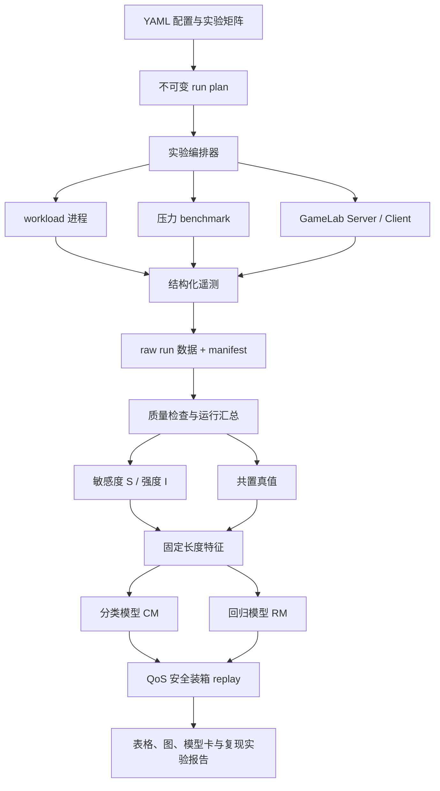

# GameLab-GAugur-Lite

基于 [GameLab](ai-testbed/README.md) 对南开大学—百度联合实验室论文 GAugur 进行轻量级、可重复的本地再实现，并进一步研究编码、WebRTC 传输与客户端显示进入系统后，共置干扰对端到端云游戏 QoS 的影响。

> 仓库目录仍沿用早期名称 `GameLab-RLCG`，但当前主线是 **GameLab-GAugur-Lite**。GAugur 使用的是监督学习分类/回归，并非强化学习；强化学习调度器只作为远期扩展，不属于首版交付范围。

## 项目状态

| 模块               | 状态   | 产物                                                    |
| ------------------ | ------ | ------------------------------------------------------- |
| 原论文归档         | 已完成 | [GAugur_HPDC_2019.pdf](docs/papers/GAugur_HPDC_2019.pdf) |
| 论文中文解读       | 已完成 | [GAugur 详细中文解读](docs/papers/GAugur_中文解读.md)    |
| GameLab 底座核对   | 已完成 | [ai-testbed](ai-testbed/README.md)                       |
| GAugur-Lite 代码   | 待实现 | 计划放在`gaugur_lite/`                                |
| 实验数据与模型     | 待采集 | 计划放在`data/` 与 `artifacts/`                     |
| 调度 replay 与报告 | 待实现 | 计划放在`artifacts/reports/`                          |

本文档是后续开发的实现规格与逐步操作手册。所有标有“计划命令”的 CLI 在相应阶段完成前尚不可执行，不能把文档中的目标状态误认为当前代码已经实现。

## 1. 项目目标

### 1.1 核心研究问题

> 在 GameLab 的云游戏管线中，使用目标 workload 的资源敏感度曲线与邻居 workload 的干扰强度，能否比“只看共置数量”“直接相加强度”或“只看资源利用率”的方法，更准确地预测共置后的性能保留率与 FPS QoS？

### 1.2 GameLab 扩展问题

> 当屏幕采集、视频编码、WebRTC 发送、客户端解码与显示被纳入实验后，GAugur 式特征能否同时解释服务端渲染性能和端到端管线 QoS？

### 1.3 首版必须交付

1. 一套可重复启动、停止和健康检查的 workload 接口；
2. 独占、压力 profiling、二/三实例共置的自动实验编排；
3. 至少 3 个可校准的代理压力维度；
4. 敏感度、强度、邻居聚合特征的计算；
5. GAugur-Lite 分类模型 CM 与回归模型 RM；
6. Count-only、VBP-like、Linear-additive 三类基线；
7. 不发生同次共置样本泄漏的分组训练/测试；
8. QoS 安全装箱和固定服务器数最大化 FPS 的离线 replay；
9. 一键生成误差、CDF、混淆矩阵、消融与调度收益报告；
10. 完整记录配置、随机种子、环境、失败运行和原始数据。

### 1.4 首版不做

- 不宣称数值级复现原论文 100 款商业游戏和 700 个组合；
- 不实现生产级多租户隔离、计费、容灾或真实云集群；
- 不把普通 GPU 综合负载伪装成严格隔离的 GPU-CE/GPU-L2/GPU-BW benchmark；
- 不使用游戏 ID 作为模型捷径；
- 不以模型预测值充当调度 replay 的真实标签；
- 不在首版引入强化学习；只有监督学习和确定性贪心调度稳定后才考虑 RL。

## 2. 与原论文的对应关系

论文：Yusen Li et al., **GAugur: Quantifying Performance Interference of Colocated Games for Improving Resource Utilization in Cloud Gaming**, HPDC 2019，[DOI](https://doi.org/10.1145/3307681.3325409)。

原论文的主链路为：

```text
可调压力 benchmark
→ 单游戏敏感度 S 与强度 I
→ 少量真实共置数据
→ 分类模型 CM / 回归模型 RM
→ 干扰感知装箱与调度
```

Lite 版保留：

- 敏感度和强度分离；
- 多压力点曲线，而非只取最大压力点；
- 邻居数量 + 每资源强度均值/方差；
- CM/RM 两类预测目标；
- 按组合大小分析误差；
- Sigmoid/SMiTe/VBP 思路的简化基线；
- 两个干扰感知调度任务。

Lite 版缩减或扩展：

| 项目       | 原论文                     | GameLab-GAugur-Lite                             |
| ---------- | -------------------------- | ----------------------------------------------- |
| 游戏数     | 100                        | MVP 4 个，推荐 6–10 个可重复 workload          |
| 共置规模   | 2、3、4 游戏               | 首先 2，稳定后增加 3，资源允许再增加 4          |
| 资源维度   | 7 类精细 CPU/GPU benchmark | MVP 3 个代理维度，逐步扩展到 4–7 个            |
| 系统指标   | 主要是游戏平均 FPS         | render/capture/client FPS、码率、可选端到端延迟 |
| 编码与网络 | 未纳入主要实验             | 作为 GameLab 特色扩展                           |
| 调度环境   | 大规模请求仿真             | 基于实测组合表的小规模离线 replay               |

详细论文方法、公式、八个关键观察与结果解释见 [中文解读](docs/papers/GAugur_中文解读.md)。

## 3. 指标与术语约定

### 3.1 性能保留率

原论文把下式称为 performance degradation，但它实际上越大越好：

$$
\delta_{A\mid G}=\frac{FPS_{A,\,colocated\ with\ G}}{FPS_{A,\,solo}}
$$

本项目统一使用：

```text
retention_ratio = colocated_fps / solo_fps
loss_ratio      = 1 - retention_ratio
```

所有 CSV、模型和图表必须明确使用哪个字段，不允许只写含糊的 `degradation`。

### 3.2 三种 FPS 不能混用

GameLab 当前 `Server/server.py` 中的 `Server FPS` 是 `VideoStreamTrack.recv()` 产生/采集帧的速率；它可能受 WebRTC 时钟限制，并不必然等于游戏引擎真实渲染 FPS。`Client FPS` 是客户端消费和显示帧的速率，也不是服务端渲染 FPS。

本项目必须分开记录：

| 字段            | 含义                                   | 用途                 |
| --------------- | -------------------------------------- | -------------------- |
| `render_fps`  | workload/游戏引擎实际呈现或渲染速率    | 对齐原论文的主标签   |
| `capture_fps` | GameLab 服务端抓取并送入编码管线的速率 | 服务端云游戏管线吞吐 |
| `client_fps`  | 客户端成功接收、解码并消费的帧率       | 端到端 QoS           |
| `present_fps` | 若能获得，客户端真正显示到屏幕的速率   | 更严格的用户侧体验   |

如果某个 workload 无法可靠提供 `render_fps`，必须在结果中将目标称为“管线帧率预测”，不能声称复现了论文的游戏渲染 FPS。

### 3.3 QoS 标签

对目标 $A$、邻居集合 $G$ 和阈值 $Q$：

$$
y_{qos}=\mathbb{1}[FPS_{A\mid G}\ge Q]
$$

首版同时产生两种标签：

- `qos_mean_satisfied`：正式采样窗口平均 FPS 不低于 $Q$；
- `qos_p05_satisfied`：5% 分位 FPS 不低于 $Q$。

主结果对齐论文时使用平均 FPS，p05 作为“短时 QoS 违约”扩展。

## 4. 总体架构



### 4.1 两种运行模式

#### Paper-aligned 模式

- 目标：尽可能对齐原论文的渲染 FPS 干扰预测；
- 服务端运行 workload 与压力 benchmark；
- 客户端最好位于另一台机器，或暂时关闭端到端扩展；
- 标签优先使用 workload 自身的 `render_fps`；
- 禁止客户端 GPU 显示进程污染被测服务端 GPU。

#### GameLab-E2E 模式

- 目标：研究完整云游戏管线；
- 启用采集、编码、WebRTC、解码、客户端显示；
- 记录 capture/client FPS、码率与可选帧延迟；
- 如果客户端与服务端在同一台机器，必须在实验报告中标注“single-host E2E”，因为客户端解码和 `cudacanvas` 显示也会竞争 GPU。

两个模式的数据不得不加区分地混合训练。

## 5. 计划目录结构

```text
GameLab-RLCG/
├─ README.md
├─ ai-testbed/                     # GameLab 上游底座，固定 commit
├─ docs/
│  └─ papers/
│     ├─ GAugur_HPDC_2019.pdf
│     └─ GAugur_中文解读.md
├─ gaugur_lite/
│  ├─ __init__.py
│  ├─ __main__.py                  # python -m gaugur_lite
│  ├─ cli.py                       # 所有阶段的统一 CLI
│  ├─ config.py                    # YAML 加载、校验和配置哈希
│  ├─ schema.py                    # Run/Metrics/Profile/Sample 数据模型
│  ├─ integration/
│  │  ├─ gamelab_server.py         # 启动与监控 GameLab server
│  │  └─ gamelab_client.py         # 启动与监控 GameLab client
│  ├─ workloads/
│  │  ├─ base.py                   # WorkloadDriver 接口
│  │  ├─ dummy.py                  # CI/烟雾测试用合成 renderer
│  │  ├─ process.py                # 普通进程 workload
│  │  └─ registry.py               # workload ID → driver
│  ├─ benchmarks/
│  │  ├─ base.py                   # PressureDriver 接口
│  │  ├─ duty_cycle.py             # 占空比控制器
│  │  ├─ cpu_ce.py
│  │  ├─ mem_bw.py
│  │  ├─ gpu_compute.py
│  │  ├─ gpu_bw.py
│  │  └─ calibration.py
│  ├─ telemetry/
│  │  ├─ writer.py                 # JSONL/CSV 原子写入
│  │  ├─ system.py                 # CPU/GPU/内存/温度/频率采样
│  │  ├─ qr.py                     # 可选 QR 解码与帧关联
│  │  └─ summarize.py              # 预热剔除、mean/p05/min
│  ├─ orchestration/
│  │  ├─ plan.py                   # 生成不可变实验计划
│  │  ├─ ports.py                  # 信令端口与 session namespace
│  │  ├─ lifecycle.py              # 进程组启动、超时、清理
│  │  └─ runner.py                 # solo/profile/colocation 状态机
│  ├─ features/
│  │  ├─ sensitivity.py
│  │  ├─ intensity.py
│  │  ├─ aggregate.py
│  │  └─ dataset.py
│  ├─ models/
│  │  ├─ split.py                  # Group split，防数据泄漏
│  │  ├─ classification.py
│  │  ├─ regression.py
│  │  ├─ baselines.py
│  │  └─ evaluate.py
│  ├─ scheduler/
│  │  ├─ feasible.py
│  │  ├─ pack.py                   # 论文 Algorithm 1
│  │  ├─ maximize_fps.py
│  │  └─ replay.py
│  └─ reporting/
│     ├─ plots.py
│     └─ report.py
├─ configs/
│  ├─ local.example.yaml
│  ├─ workloads.example.yaml
│  ├─ experiments/
│  │  ├─ smoke.yaml
│  │  ├─ mvp.yaml
│  │  ├─ full.yaml
│  │  └─ ablations.yaml
│  └─ requests/
│     └─ synthetic-5000.yaml
├─ tests/
│  ├─ unit/
│  ├─ integration/
│  └─ fixtures/
├─ data/
│  ├─ raw/                         # 每个 run 的不可变原始数据
│  ├─ interim/                     # 运行汇总、profile
│  └─ processed/                   # 模型样本
├─ artifacts/
│  ├─ calibration/
│  ├─ environment/
│  ├─ models/
│  ├─ reports/
│  └─ plans/
├─ requirements-lite.txt
└─ pyproject.toml
```

`data/raw/`、大模型文件和逐帧图像默认不提交 Git；只提交小型样例、schema、配置、汇总结果和生成脚本。

## 6. 环境与硬件方案

### 6.1 推荐环境

- Ubuntu 22.04/24.04 或等价 Linux 裸机；
- NVIDIA 独立 GPU；
- 驱动与 PyTorch CUDA 版本匹配；
- Python 3.10，与 GameLab 当前说明一致；
- 至少 16 GB 内存，磁盘预留 30 GB 以上；
- 最好有独立客户端机器；单机也可完成 Lite，但必须标记干扰来源。

GameLab 的 C++ 键鼠输入模块依赖 X11，`server.sh`/`client.sh` 也使用 Bash。当前 Windows 工作区适合编写、训练和分析代码；真实 GameLab 实验优先放到 Linux 主机。若 workload 是完全脚本化的，首版可以不启动 C++ 输入模块。

### 6.2 GameLab 基础环境

现有 GameLab 使用自定义 `aiortc` fork，并通过 SSH Git URL 安装。执行下列命令前需要确认本机 GitHub SSH 权限：

```bash
conda create -n gaugur-lite python=3.10 -y
conda activate gaugur-lite
conda install -y -c conda-forge libffi cffi cryptography pyopenssl
python -m pip install -r ai-testbed/requirements.txt
```

### 6.3 Lite 新增依赖

计划在 `requirements-lite.txt` 中加入：

```text
pandas
pyarrow
scikit-learn
scipy
psutil
nvidia-ml-py
PyYAML
pydantic
typer
joblib
matplotlib
seaborn
pytest
```

首次环境验收通过后生成锁定清单：

```bash
python -m pip freeze > artifacts/environment/pip-freeze.txt
nvidia-smi > artifacts/environment/nvidia-smi.txt
python --version > artifacts/environment/python-version.txt
```

正式实验还应记录 CPU 型号、内存、内核、GPU 驱动、显示服务器、电源模式和 GameLab commit。

### 6.4 GameLab 版本管理

`ai-testbed/` 直接作为根仓库中的普通源码目录管理，不使用嵌套 Git 仓库或 submodule。导入时的上游仓库、commit 和提交时间记录在 [ai-testbed/UPSTREAM.md](ai-testbed/UPSTREAM.md)。

后续修改 GameLab 遥测、多 session 和捕获逻辑时，改动与 `gaugur_lite/` 一起提交到本仓库。若要同步新的上游版本，应先比较当前记录的导入 commit 与目标 commit，审查差异后再合入，不能直接覆盖本项目修改。

正式实验仍需在 `artifacts/environment/source-lock.json` 中记录根仓库 commit；由于 `ai-testbed/` 已由根仓库直接跟踪，不再单独记录嵌套仓库 HEAD。

## 7. 配置设计

### 7.1 主机配置示例

计划文件：`configs/local.example.yaml`

```yaml
schema_version: 1
project_root: "."

host:
  id: "local-gpu-01"
  mode: "single_host_e2e"      # paper_aligned | split_host_e2e | single_host_e2e
  gpu_index: 0
  cpu_affinity: [0, 1, 2, 3]
  cooldown_s: 30
  max_gpu_temp_c: 82

gamelab:
  root: "ai-testbed"
  signaling_host: "127.0.0.1"
  base_signaling_port: 18080
  capture_monitor: 1
  codec: "h264"
  enable_evca: false
  enable_quality_qr: false
  client_display: false

measurement:
  warmup_s: 30
  duration_s: 90
  sample_interval_s: 1.0
  repeats: 3
  qos_fps: [30, 50, 60]
  random_seed: 20260811

paths:
  raw: "data/raw"
  interim: "data/interim"
  processed: "data/processed"
  artifacts: "artifacts"
```

### 7.2 Workload 配置示例

计划文件：`configs/workloads.example.yaml`

```yaml
schema_version: 1
workloads:
  - id: "wl_light"
    driver: "process"
    command: ["python", "-m", "gaugur_lite.workloads.dummy", "--seed", "{seed}"]
    ready_probe:
      type: "log_regex"
      pattern: "READY"
      timeout_s: 60
    fps_source:
      type: "jsonl"
      path: "{run_dir}/render_metrics.jsonl"
      field: "render_fps"
    window:
      x: 0
      y: 0
      width: 1280
      height: 720
    resolutions:
      - [1280, 720]
      - [1920, 1080]
```

Workload 命令中的变量只能来自通过 schema 校验的白名单，不能直接拼接未经验证的 shell 字符串。编排器应使用参数数组启动子进程。

### 7.3 实验配置示例

计划文件：`configs/experiments/mvp.yaml`

```yaml
schema_version: 1
name: "mvp-v1"
workload_ids: ["wl_light", "wl_cpu", "wl_gpu", "wl_mixed"]
resolutions: [[1280, 720], [1920, 1080]]
colocation_sizes: [2, 3]
pressure_types: ["cpu_ce_proxy", "mem_bw_proxy", "gpu_compute_proxy"]
pressure_levels: [0.0, 0.25, 0.5, 0.75, 1.0]
repeats: 3
randomize_order: true
```

配置加载后应计算 SHA-256，并把展开后的不可变配置复制到每个 run 目录中。后续修改 YAML 不得改变既有 run 的含义。

## 8. 数据契约

### 8.1 Run manifest

每次运行目录：

```text
data/raw/<experiment_id>/<run_id>/
├─ manifest.json
├─ server_metrics.jsonl
├─ client_metrics.jsonl
├─ workload_metrics.jsonl
├─ benchmark_metrics.jsonl
├─ system_metrics.jsonl
├─ stdout.log
├─ stderr.log
└─ status.json
```

`manifest.json` 至少包含：

```json
{
  "schema_version": 1,
  "run_id": "mvp-v1__profile__wl_gpu__gpu_compute_proxy__p050__r01",
  "experiment_id": "mvp-v1",
  "mode": "pressure_profile",
  "target_id": "wl_gpu",
  "neighbor_ids": [],
  "resolution": [1280, 720],
  "pressure_type": "gpu_compute_proxy",
  "pressure_level_requested": 0.5,
  "repeat": 1,
  "seed": 20260811,
  "warmup_s": 30,
  "duration_s": 90,
  "host_id": "local-gpu-01",
  "config_sha256": "...",
  "source_commits": {"root": "...", "ai_testbed": "..."}
}
```

### 8.2 时序指标

JSONL 每行一个时间点，公共字段为：

```text
schema_version,run_id,session_id,source,wall_time_ns,monotonic_time_ns
```

服务端：

```text
capture_fps,frame_id,send_width,send_height,evca_sc,
sender_bitrate_bps,gcc_bitrate_bps,encode_queue_ms
```

客户端：

```text
client_fps,present_fps,received_frames,dropped_frames,
receiver_bitrate_bps,decoded_frame_id,source_wall_time_ns,e2e_frame_ms
```

workload：

```text
render_fps,frame_time_ms,scene_id,workload_progress
```

系统：

```text
cpu_util_pct,cpu_freq_mhz,ram_used_bytes,
gpu_util_pct,gpu_mem_util_pct,gpu_mem_used_bytes,
gpu_clock_mhz,gpu_power_w,gpu_temp_c
```

benchmark：

```text
pressure_requested,pressure_observed,iterations,iteration_time_ms,
throughput,benchmark_alive
```

### 8.3 运行汇总

`data/interim/run_summary.parquet` 每个 run 一行：

```text
run_id,experiment_id,mode,target_id,neighbor_ids,resolution,
render_fps_mean,render_fps_p05,render_fps_min,
capture_fps_mean,capture_fps_p05,
client_fps_mean,client_fps_p05,
sender_bitrate_mean,receiver_bitrate_mean,e2e_frame_ms_p95,
pressure_requested,pressure_observed,
valid,invalid_reason
```

### 8.4 Profile 表

`data/interim/profiles.parquet`：

```text
workload_id,resolution,resource,pressure_level,
solo_fps,fps_under_pressure,retention_ratio,
benchmark_time_solo,benchmark_time_colocated,intensity_slowdown,
repeat_count,retention_std,intensity_std
```

### 8.5 模型样本

为避免多个 QoS 阈值让 RM 样本被意外重复，处理结果分为三个文件：

```text
data/processed/<experiment_id>/
├─ base_samples.parquet      # 每个“目标 workload × 共置 run”一行
├─ rm_samples.parquet        # 与 base 一一对应，标签为 retention_ratio
├─ cm_samples.parquet        # 每个 base 样本按 QoS 阈值展开
└─ feature_manifest.json     # 特征列、顺序、profile/config hash
```

公共字段为：

```text
colocation_id,run_id,target_id,resolution,
solo_fps,neighbor_count,
sensitivity_<resource>_p000 ... sensitivity_<resource>_p100,
intensity_mean_<resource>,intensity_var_<resource>,
retention_ratio,loss_ratio
```

`cm_samples.parquet` 额外包含 `qos_threshold,qos_satisfied`。`rm_samples.parquet` 不含 QoS 展开副本。

`target_id` 只用于分组、审计和误差分析，默认不进入模型特征。

## 9. 关键接口设计

### 9.1 WorkloadDriver

```python
class WorkloadDriver(Protocol):
    def prepare(self, run: RunSpec) -> None: ...
    def start(self, run: RunSpec) -> ProcessHandle: ...
    def wait_ready(self, handle: ProcessHandle, timeout_s: float) -> None: ...
    def sample(self, handle: ProcessHandle) -> WorkloadMetrics: ...
    def stop(self, handle: ProcessHandle, grace_s: float) -> None: ...
```

约束：

- 相同配置和 seed 必须进入同一场景；
- 启动成功不等于 ready，必须有健康探针；
- `stop` 必须先温和终止，超时后只清理本次 run 启动的已验证进程组；
- workload 应输出真实 `render_fps` 或明确声明不支持；
- 崩溃、卡死、窗口丢失必须使 run 标记无效，不能静默生成 0 FPS 标签。

### 9.2 PressureDriver

```python
class PressureDriver(Protocol):
    resource_name: str
    def calibrate(self, host: HostSpec) -> CalibrationCurve: ...
    def start(self, level: float, run: RunSpec) -> ProcessHandle: ...
    def observe(self, handle: ProcessHandle) -> PressureMetrics: ...
    def stop(self, handle: ProcessHandle, grace_s: float) -> None: ...
```

`level=0.5` 表示校准曲线上的 50% 相对压力，不等于盲目 sleep 50% 时间。实际压力 `pressure_observed` 必须被记录。

### 9.3 MetricsWriter

```python
class MetricsWriter:
    def write(self, event: MetricEvent) -> None: ...
    def flush(self) -> None: ...
    def close(self, status: RunStatus) -> None: ...
```

要求：

- JSONL 追加写，不在内存中积累整场实验；
- 每行有 schema 版本、run/session ID 和时间戳；
- 间隔 flush，异常退出时尽量保留已有记录；
- 写临时状态后原子替换 `status.json`；
- 人类可读日志与机器可读指标分离，禁止后续用正则解析 `logging.info` 作为主数据源。

## 10. 逐步实现过程

以下步骤按依赖顺序执行。任何阶段未通过验收时，不进入后续大规模采集。

### Step 0：冻结基线与建立可追溯环境

#### 要做什么

1. 记录根仓库与 `ai-testbed` remote/commit；
2. 决定 GameLab 采用 fork submodule 还是独立 pinned 仓库；
3. 创建 Python 3.10 环境并安装 GameLab；
4. 禁用 object detection、upsampling、保存逐帧 PNG 和 EVCA 码率控制，先跑最小 WebRTC；
5. 记录 GPU 驱动、CUDA/PyTorch、CPU、内存与显示系统；
6. 用固定画面运行 5 分钟，确认服务端和客户端无异常退出。

#### 基础烟雾命令

服务端：

```bash
cd ai-testbed/Server
python server.py offer \
  --width 1280 --height 720 --monitor 1 --downsample 1 \
  --signaling tcp-socket \
  --signaling-host 127.0.0.1 \
  --signaling-port 18080
```

客户端：

```bash
cd ai-testbed/Client
python client.py answer \
  --signaling tcp-socket \
  --signaling-host 127.0.0.1 \
  --signaling-port 18080
```

脚本化 workload 不需要键鼠输入，因此先不运行依赖 X11 的 C++ 输入模块。

#### 验收

- 连续运行 5 分钟无崩溃；
- 服务端与客户端均能输出 FPS/bitrate 日志；
- 分辨率与发送画面正确；
- 记录 `source-lock.json` 与环境清单；
- 明确当前 `Server FPS` 只是 capture FPS，不将其当成 render FPS。

### Step 1：建立 Python 包、schema 与统一 CLI

#### 新建文件

```text
pyproject.toml
requirements-lite.txt
gaugur_lite/__init__.py
gaugur_lite/__main__.py
gaugur_lite/cli.py
gaugur_lite/config.py
gaugur_lite/schema.py
tests/unit/test_config.py
tests/unit/test_schema.py
```

#### 实现顺序

1. 用 Pydantic 定义 `HostSpec`、`RunSpec`、`MetricEvent`、`RunStatus`；
2. 对分辨率、压力范围、端口、路径和重复次数做强校验；
3. 规范生成 `experiment_id`、`run_id`、`session_id`；
4. 对展开后的配置做稳定 JSON 序列化并计算 SHA-256；
5. 创建 Typer CLI，所有命令先支持 `--help` 和 `--dry-run`；
6. 实现 `doctor`：只读检查环境、GPU、路径、端口和依赖，不修改系统。

#### 计划命令

```bash
python -m gaugur_lite --help
python -m gaugur_lite doctor --config configs/local.example.yaml
python -m gaugur_lite doctor --config configs/local.example.yaml --json
```

#### 验收

- 非法压力值、重复 run ID、越界端口和不存在路径会明确报错；
- 相同配置产生相同哈希；
- `doctor` 不启动实验；
- 单元测试无需 GPU 即可运行。

### Step 2：把 GameLab 日志改成结构化遥测

#### GameLab 服务端改动

为 `Server/server.py` 增加参数：

```text
--run-id
--session-id
--metrics-jsonl
--capture-left
--capture-top
--metrics-interval
--shm-prefix
```

实现内容：

1. `CaptureScreen` 支持显式 `left/top/width/height`，不再只能居中抓屏；
2. 每秒写 `capture_fps`，同时保留原日志；
3. sender bitrate、EVCA 与帧 ID 写入同一 session 的结构化事件；
4. `bitrate_shm` 与 `bitrate_send_shm` 加 `session_id` 前缀，避免多服务端实例互相覆盖；
5. 同时使用 wall-clock 与 monotonic 时间戳；
6. 正常退出和异常退出均关闭 writer 与 shared memory handle。

#### GameLab 客户端改动

为 `Client/client.py` 增加参数：

```text
--run-id
--session-id
--metrics-jsonl
--metrics-interval
--no-display
--decode-qr
```

实现内容：

1. 每秒写 client FPS、receiver bitrate、收帧/丢帧计数；
2. `--no-display` 跳过 `cudacanvas.im_show`，用于避免本机客户端显示污染 GPU；
3. `--decode-qr` 只在端到端延迟实验启用；
4. QR 解析得到 source frame ID、发送前时间戳和分辨率；
5. 跨主机延迟实验先检查 NTP/PTP 时钟偏差，否则只报告单机或相对指标。

#### 测试

- writer 在异常中断后仍生成合法 JSONL；
- 两个 session 的 shared memory 名称不冲突；
- crop 越界会在启动前失败；
- `--no-display` 不调用 GPU 显示路径；
- 10 秒 smoke run 的 server/client 指标都能按 `run_id` 关联。

#### 验收

```bash
python -m pytest tests/unit/test_telemetry.py -q
python -m pytest tests/integration/test_gamelab_smoke.py -q
```

生成的 JSONL 必须能直接解析，且采样数量与运行时间基本一致。

### Step 3：实现可重复 workload 驱动

#### 选择原则

- 有明确许可，可随项目分发或可公开获取；
- 支持固定随机种子与固定场景；
- 能无人工操作启动；
- 能输出真实 render FPS 或稳定 frame time；
- 能锁定分辨率和画质；
- 至少覆盖轻 GPU、重 GPU、偏 CPU、混合型四类行为。

#### 实现内容

1. 实现 `WorkloadDriver`；
2. 首先创建一个仓库内的 synthetic renderer/dummy workload，用于 CI；
3. 再接入真实图形 workload；
4. 为每个 workload 实现 ready probe、progress probe 与 FPS reader；
5. 记录场景 ID、种子和画质；
6. 工作负载退出后只清理本次 run 创建的进程组；
7. 如果没有 render FPS，schema 明确写 `render_fps_available=false`。

#### 计划命令

```bash
python -m gaugur_lite workload list --config configs/workloads.example.yaml
python -m gaugur_lite workload smoke wl_light \
  --resolution 1280x720 \
  --duration 30 \
  --seed 20260811
```

#### 验收

- 相同 seed 的场景轨迹一致；
- 连续三次独占运行平均 FPS 变异系数目标小于 5%；
- 超过 5% 不删除数据，而是标记不稳定并调查 shader cache、温度、后台任务和时钟频率；
- 崩溃或无进度不会生成有效样本。

### Step 4：实现系统采样与热稳定控制

#### 实现内容

1. `psutil` 采 CPU、内存和进程级指标；
2. NVML 采 GPU 利用率、显存、时钟、功耗与温度；
3. 运行前检查 GPU 温度是否低于阈值；
4. 每个 run 后冷却，或等待温度回落；
5. 检测显存不足、频率明显降档和系统休眠；
6. 把采样器本身开销纳入一次空载测量。

#### 计划命令

```bash
python -m gaugur_lite telemetry probe --duration 30
python -m gaugur_lite telemetry overhead --duration 120
```

#### 验收

- 采样器停止后没有遗留线程/进程；
- 120 秒记录没有时间戳倒退；
- 采样间隔 p95 偏差在配置容差内；
- 遥测开销不会让 dummy workload FPS 产生显著变化。

### Step 5：实现并校准压力 benchmark

#### MVP 压力维度

| 名称                  | 实现思路                                                   | 重要限制                              |
| --------------------- | ---------------------------------------------------------- | ------------------------------------- |
| `cpu_ce_proxy`      | 多进程计算 kernel + duty cycle；进程数与 CPU affinity 可控 | 也会影响缓存，不能声称严格隔离 CPU-CE |
| `mem_bw_proxy`      | 预分配数组上的顺序 copy/read/write                         | 可能同时影响 LLC；需报告实测带宽      |
| `gpu_compute_proxy` | PyTorch/CUDA 重复计算 kernel，轮次间 sleep                 | 可能同时使用显存带宽；必须称 proxy    |
| `gpu_bw_proxy`      | 大 tensor copy/streaming 操作                              | 可能使用缓存与 GPU-CE；放在推荐版     |

GPU 操作是异步的，计时与 duty cycle 前后必须执行正确的 CUDA event 或 synchronize，否则校准结果会虚高。

#### 校准流程

1. 空载运行 benchmark，测最大稳定吞吐或最短迭代时间；
2. 扫描 duty cycle/工作集/并发度；
3. 记录控制量到 observed pressure 的映射；
4. 对目标档位选择误差最小且稳定的控制量；
5. 重复三次并计算均值、标准差；
6. 保存硬件绑定的 `calibration.json`；
7. GPU 驱动、频率策略或硬件变化后强制重新校准。

#### 计划命令

```bash
python -m gaugur_lite benchmark calibrate \
  --config configs/local.example.yaml \
  --resources cpu_ce_proxy,mem_bw_proxy,gpu_compute_proxy \
  --levels 0,0.25,0.5,0.75,1.0 \
  --repeats 3

python -m gaugur_lite benchmark verify \
  --calibration artifacts/calibration/local-gpu-01.json
```

#### 验收

- 每个档位都有 requested 与 observed pressure；
- observed pressure 总体单调；
- 目标误差建议不超过绝对 0.05，超出时保留实际值并标记；
- benchmark 单独运行时不崩溃、不持续增长内存；
- 停止后 GPU/CPU 利用率能回到空载区间。

### Step 6：采集独占基线

#### 实现内容

1. 展开 workload × 分辨率 × repeat；
2. 随机化运行顺序；
3. 每个 run 执行 `prepare → start → ready → warmup → measure → stop → cooldown`；
4. 汇总 render/capture/client FPS；
5. 检查场景进度、温度、帧数和缺失率；
6. 计算独占均值与重复间置信区间；
7. 任何无效 run 进入重试队列，但最多重试配置次数必须有限。

#### 计划命令

```bash
python -m gaugur_lite plan \
  --experiment configs/experiments/smoke.yaml \
  --stage solo \
  --out artifacts/plans/smoke-solo.csv

python -m gaugur_lite run solo \
  --plan artifacts/plans/smoke-solo.csv \
  --resume

python -m gaugur_lite summarize \
  --experiment smoke \
  --stage solo
```

`--resume` 只能跳过 `status=completed && valid=true` 且配置哈希一致的 run；不能仅凭目录存在就跳过。

#### 验收

- 每个 workload/分辨率至少有 3 个有效重复；
- 独占基线没有 benchmark 或邻居进程；
- FPS 来源被明确标记；
- 无效原因可追踪；
- 数据重复汇总得到相同结果。

### Step 7：采集敏感度与强度 profile

#### 敏感度

对 workload $A$、资源 $r$、压力 $x$：

$$
S_A^r(x)=\frac{FPS_A^r(x)}{FPS_{A,solo}}
$$

完整曲线：

$$
S_A^r=[S_A^r(0),S_A^r(0.25),S_A^r(0.5),S_A^r(0.75),S_A^r(1)]
$$

推荐版改为原文的 11 档 $0,0.1,\dots,1$。

#### 强度

在同一次 workload + benchmark 共置中记录 benchmark slowdown：

$$
I_A^r=mean_x\left(\frac{T_{benchmark\mid A}^r(x)}{T_{benchmark,solo}^r(x)}\right)
$$

如果 benchmark 以吞吐而非耗时报告，先转换为等价 slowdown：

$$
slowdown=\frac{throughput_{solo}}{throughput_{colocated}}
$$

不能把 GPU utilization 直接当成论文的强度 $I$；利用率只能作为辅助特征或 VBP-like 基线。

#### 执行流程

1. 生成 workload × resource × pressure × repeat 计划；
2. 压力 0 仍执行完整流程，用于验证与 solo 一致；
3. 先启动 workload 并预热，再启动 benchmark；
4. benchmark ready 后开始正式计时；
5. 同时记录 workload FPS 和 benchmark throughput；
6. 随机化压力顺序；
7. 汇总曲线并报告置信区间；
8. 对 observed pressure 做插值或作为附加特征，不隐藏校准偏差。

#### 计划命令

```bash
python -m gaugur_lite plan \
  --experiment configs/experiments/mvp.yaml \
  --stage profile \
  --out artifacts/plans/mvp-profile.csv

python -m gaugur_lite run profile \
  --plan artifacts/plans/mvp-profile.csv \
  --resume

python -m gaugur_lite features build-profiles \
  --experiment mvp-v1 \
  --out data/interim/profiles.parquet
```

#### 验收

- 压力 0 的保留率接近 1；
- 每条曲线覆盖全部计划档位或明确标记缺失；
- 误差条可显示；
- 强度和敏感度分别存储；
- 至少画出一张不同 workload/资源的曲线比较图；
- 对“非线性”“敏感度与强度不相关”至少完成一项统计检查。

### Step 8：实现多实例共置编排

#### GameLab 当前必须解决的问题

1. `CaptureScreen` 默认从显示器中央抓取，不能区分平铺窗口；
2. 每个 server/client session 需要唯一 signaling port；
3. 当前 shared memory 名称是全局常量，多 server 会冲突；
4. 多客户端都调用 `cudacanvas` 会额外占用同一 GPU；
5. C++ 输入模块使用硬编码网络地址，不适合自动生成多 session；
6. 共置进程必须有独立日志、run ID 和可控生命周期。

#### 解决方案

- 为每个实例分配显式 capture rectangle；
- `base_port + session_index` 分配端口，启动前检查占用；
- shared memory 使用 `<run_id>_<session_id>_` 前缀；
- 核心实验使用 `--no-display`，或把客户端移到另一台机器；
- 脚本化 workload 不启动 C++ 输入模块；
- 编排器为所有子进程创建本次 run 专属进程组；
- 任一目标崩溃则停止整组并标记 run 无效；
- 所有实例 ready 后通过 barrier 同时进入 warmup/measurement。

#### 共置计划生成

组合使用无序稳定 ID：

```text
colocation_id = sorted(workload_ids) + resolution policy + seed + repeat
```

每次 $k$ 实例共置会在数据构建阶段生成 $k$ 条目标样本，但它们共享同一个 `colocation_id`。

#### 计划命令

```bash
python -m gaugur_lite plan \
  --experiment configs/experiments/mvp.yaml \
  --stage colocation \
  --sizes 2,3 \
  --out artifacts/plans/mvp-colocation.csv

python -m gaugur_lite run colocation \
  --plan artifacts/plans/mvp-colocation.csv \
  --resume
```

#### 验收

- 两实例 10 分钟 smoke run 无端口和 shared memory 冲突；
- 每个实例抓取区域正确；
- 所有 session 的时间窗口重叠达到要求；
- 一次共置内任一实例失败会使整次运行无效；
- 退出后没有本项目遗留的 workload、benchmark、server 或 client 进程；
- 不使用宽泛的系统进程清理命令。

### Step 9：构建固定维度模型数据集

#### 邻居聚合

目标 $A$ 的邻居集合为 $G$。对每个资源 $r$：

$$
mean_r^G=\frac{1}{|G|}\sum_{g\in G}I_r^g
$$

$$
var_r^G=\frac{1}{|G|}\sum_{g\in G}(I_r^g-mean_r^G)^2
$$

聚合向量：

$$
I^G=[|G|,(mean_1^G,var_1^G),\dots,(mean_R^G,var_R^G)]
$$

当没有邻居时，`neighbor_count=0`，均值/方差置零。

#### 数据构建过程

1. 校验所有共置目标都有匹配的独占基线；
2. 以 resolution、画质、workload 版本精确匹配 solo FPS；
3. 计算 retention/loss ratio；
4. 加入目标敏感度曲线；
5. 加入邻居强度均值、方差和数量；
6. 对每个 QoS 阈值展开一条 CM 样本，RM 样本不重复；
7. 保存 feature manifest，记录列顺序和 profile 版本；
8. 对 NaN、无穷、负 FPS 和异常 retention 做显式处理；
9. 不自动裁掉性能提升样本。共置可能因频率、缓存或噪声出现 $\delta>1$，应保留并分析。

#### 计划命令

```bash
python -m gaugur_lite features build-dataset \
  --experiment mvp-v1 \
  --profiles data/interim/profiles.parquet \
  --out-dir data/processed/mvp-v1

python -m gaugur_lite features audit \
  --dataset-dir data/processed/mvp-v1
```

#### 验收

- 一次 $k$ 实例共置恰好生成 $k$ 条 RM 目标样本；
- CM 样本数再乘 QoS 阈值数；
- 没有重复主键；
- 没有同次运行信息泄漏到特征；
- feature manifest 与模型输入顺序一致；
- 数据审计报告列出样本量、缺失值、标签比例和组合大小分布。

### Step 10：实现 CM、RM 与基线

#### 数据切分

主切分：

```python
GroupShuffleSplit(groups=colocation_id)
```

保证同一次共置拆出的多条目标样本不会跨训练集和测试集。

补充切分：

```python
GroupKFold(groups=target_id)
```

用于观察对训练中未出现的目标 workload 的泛化。主切分和按 workload 留出结果分别报告。

任何标准化、缺失填充或特征选择都必须放在 sklearn Pipeline 内，只在训练折拟合。

#### CM

候选：

- DecisionTreeClassifier；
- RandomForestClassifier；
- GradientBoostingClassifier；
- SVC。

主要指标：Accuracy、Precision、Recall、F1、false-positive rate、混淆矩阵。云游戏 admission control 优先关注 false positive，因为它意味着实际 QoS 违约。

#### RM

候选：

- DecisionTreeRegressor；
- RandomForestRegressor；
- GradientBoostingRegressor；
- SVR。

主要指标：

$$
MAPE_\delta=mean\left(\frac{|\widehat\delta-\delta|}{max(|\delta|,\epsilon)}\right)
$$

同时报告 retention MAE、FPS MAE、R²、误差 CDF，并按二/三/四实例分别统计。

#### 基线

1. `sigmoid_count`：按原论文思路，只根据共置数量拟合每个 workload 的 Sigmoid FPS 曲线；
2. `vbp_like`：CPU/GPU/内存利用率和，先做容量约束；
3. `linear_additive`：最大压力敏感度 × 邻居强度之和的线性模型；
4. `solo_only`：只用 solo FPS、分辨率和 QoS；
5. `no_profile_tree`：树模型只用常规利用率，检验 profile 是否带来增益。

Sigmoid baseline 对 workload $A$ 拟合：

$$
\widehat{FPS}_A(n)=\frac{\alpha_{A,1}}{1+\exp(-\alpha_{A,2}n+\alpha_{A,3})}
$$

其中 $n$ 为同机实例数量。参数只能使用训练组合中包含 $A$ 的样本拟合；按 workload 留出评估时，未见 workload 无法拟合独立参数，应标为该 baseline 不适用，而不是读取测试标签。

Linear-additive baseline 对多邻居使用：

$$
\widehat\delta_{A\mid G}=c_0+\sum_{r=1}^{R}c_r\,S_A^r(1)\left(\sum_{g\in G}I_g^r\right)
$$

它有意保留“最大压力敏感度 + 强度可加 + 线性关系”假设，用于验证完整曲线与均值/方差聚合是否必要。

#### 超参数策略

- MVP 使用小范围、预注册的参数网格；
- 内层 GroupKFold 调参，外层测试集只评估一次；
- 固定随机种子；
- 不因测试集表现临时扩大搜索空间；
- 保存完整训练配置、列清单、模型、版本与指标。

#### 计划命令

```bash
python -m gaugur_lite train \
  --dataset-dir data/processed/mvp-v1 \
  --task both \
  --group colocation_id \
  --seed 20260811 \
  --out artifacts/models/mvp-v1

python -m gaugur_lite evaluate \
  --model-dir artifacts/models/mvp-v1 \
  --split main \
  --out artifacts/reports/mvp-v1/evaluation
```

#### 验收

- 单元测试证明 group split 无交叉；
- 模型加载后预测与保存前一致；
- 主模型和所有基线使用完全相同的测试样本；
- 指标有 bootstrap 置信区间；
- 输出总体、按组合大小、按 workload 和按分辨率的误差；
- 结果不及基线时也生成完整报告，不删改失败实验。

### Step 11：实现消融实验

必须包含：

1. 去掉敏感度；
2. 去掉强度；
3. 用邻居强度求和替换均值/方差；
4. 用最大压力点替换完整敏感度曲线；
5. 去掉分辨率/像素数；
6. mean FPS 与 p05 FPS 标签对比；
7. Paper-aligned 与 GameLab-E2E 指标对比；
8. 可选：加入/去掉 EVCA 场景复杂度。

计划命令：

```bash
python -m gaugur_lite ablate \
  --dataset-dir data/processed/mvp-v1 \
  --spec configs/experiments/ablations.yaml \
  --out artifacts/reports/mvp-v1/ablations
```

验收标准不是“每个消融都变差”，而是每个结论都有同一切分、同一指标和不确定性范围支持。

### Step 12：实现 QoS 安全装箱 replay

#### 可行组合

对组合 $C$ 中每个目标 $A$：

1. 把 $C\setminus\{A\}$ 作为邻居；
2. CM 预测 $A$ 是否满足 QoS；
3. 组合内全部目标为 1 才判为可行；
4. 内存容量等硬约束先过滤；
5. 可选安全阈值使用校准后的概率，而不是默认 0.5。

#### 论文 Algorithm 1 的 Lite 实现

```text
F = 模型预测的可行组合集合
while 仍有未分配请求:
    c = F 中规模最大的组合
    if c 中每类 workload 都还有请求:
        新建服务器并各分配一个请求
    else:
        从 F 移除 c
```

必须加入无法找到可行组合时的单实例 fallback，避免死循环。

#### 评价

- 使用服务器数；
- 平均实例数/服务器；
- 实测 QoS 违约率；
- 组合 precision/recall；
- 与 no-colocation、count-only、VBP-like、linear-additive 比较。

#### Ground truth

调度 replay 只使用已有实测组合表作为结果查找表。未实测组合有三种处理：

1. 从 replay 请求空间排除；
2. 安排补测；
3. 单独做“模型模拟”实验并明确不视为真实验证。

#### 计划命令

```bash
python -m gaugur_lite replay pack \
  --model artifacts/models/mvp-v1/cm.joblib \
  --requests configs/requests/synthetic-5000.yaml \
  --ground-truth data/interim/colocation_truth.parquet \
  --qos 60 \
  --out artifacts/reports/mvp-v1/packing
```

### Step 13：实现固定服务器数最大化 FPS replay

逐请求算法：

1. 枚举把当前请求放入每台服务器后的候选状态；
2. RM 分别预测候选服务器中每个实例的 retention；
3. 转换为预测 FPS；
4. 过滤硬容量约束；
5. 选择预测平均 FPS 最高的服务器；
6. 无可行服务器时按实验策略拒绝请求或开启新服务器；
7. 最终使用实测组合表回放实际 FPS。

计划命令：

```bash
python -m gaugur_lite replay maximize-fps \
  --model artifacts/models/mvp-v1/rm.joblib \
  --requests configs/requests/synthetic-5000.yaml \
  --servers 20,30,40 \
  --ground-truth data/interim/colocation_truth.parquet \
  --out artifacts/reports/mvp-v1/maximize-fps
```

输出平均 FPS、p05 FPS、FPS CDF、拒绝率、服务器利用率，并与基线使用相同请求序列和随机种子。

### Step 14：生成复现实验报告

#### 必须生成的图

1. 各 workload 的敏感度曲线及误差条；
2. 敏感度与强度散点图；
3. 聚合强度实测值与个体强度之和比较；
4. CM 混淆矩阵；
5. CM 在不同训练样本数下的准确率；
6. RM 在不同训练样本数下的误差；
7. RM 误差 CDF；
8. 按共置大小分解的误差；
9. 基线与消融对比；
10. 服务器数—QoS 违约率；
11. 固定服务器数—平均 FPS；
12. Paper-aligned 与 GameLab-E2E 指标差异。

#### 报告结构

```text
artifacts/reports/<experiment_id>/
├─ report.md
├─ tables/
├─ figures/
├─ run_quality.json
├─ dataset_card.md
├─ cm_model_card.md
├─ rm_model_card.md
└─ reproduction_manifest.json
```

#### 计划命令

```bash
python -m gaugur_lite report \
  --experiment mvp-v1 \
  --model-dir artifacts/models/mvp-v1 \
  --out artifacts/reports/mvp-v1

python -m gaugur_lite verify \
  --report artifacts/reports/mvp-v1/report.md
```

`verify` 检查配置、源 commit、数据哈希、模型哈希、图表输入和报告链接是否完整。

## 11. 实验矩阵与预计开销

### 11.1 MVP

建议：

- workload $W=4$；
- 分辨率 $D=2$；
- 代理资源 $R=3$；
- 压力档位 $P=5$；
- 重复 $K=3$；
- 共置大小 2 和 3。

大致 run 数：

```text
solo    = W × D × K                         = 24
profile = W × R × P × K                     = 180
pairs   = C(W,2) × D × K                    = 36
triples = C(W,3) × D × K                    = 24
total                                         264
```

profile 首版只在一个参考分辨率测敏感度，其他分辨率用于验证或在研究强度—像素数线性关系时再扩展。若每个 run 包含 30 秒预热、90 秒采样、30 秒冷却，264 个 run 的纯运行时间约 11 小时；实际加启动、失败重试和校准，建议预留 15–20 小时。

### 11.2 推荐版

- workload 6–10 个；
- 压力档位增加为 11；
- 至少 5 次重复；
- 加入 GPU-BW proxy；
- 加入部分四实例组合；
- Paper-aligned 与 GameLab-E2E 各跑一组核心矩阵。

推荐版不要一次生成全矩阵。先根据 MVP 方差和模型学习曲线做功效分析，再决定增加 workload、重复次数还是组合数量。

## 12. 实验运行顺序

正式执行时遵循以下顺序：

```text
doctor
→ GameLab smoke
→ workload stability
→ telemetry overhead
→ benchmark calibration
→ solo baselines
→ pressure profiles
→ pair colocation smoke
→ all pair colocations
→ selected triple colocations
→ data audit
→ grouped training/evaluation
→ ablations
→ scheduler replay
→ report + verify
```

不能跳过 solo 和 calibration 直接采集共置数据，因为 retention 和 intensity 都依赖对应基线。

## 13. 一键流程的最终目标

当所有阶段实现后，完整流程应可以由以下命令重建：

```bash
python -m gaugur_lite doctor --config configs/local.yaml

python -m gaugur_lite benchmark calibrate \
  --config configs/local.yaml \
  --experiment configs/experiments/mvp.yaml

python -m gaugur_lite plan \
  --experiment configs/experiments/mvp.yaml \
  --stage all \
  --out artifacts/plans/mvp-all.csv

python -m gaugur_lite run all \
  --plan artifacts/plans/mvp-all.csv \
  --resume

python -m gaugur_lite summarize --experiment mvp-v1
python -m gaugur_lite features build-profiles --experiment mvp-v1
python -m gaugur_lite features build-dataset --experiment mvp-v1
python -m gaugur_lite features audit --dataset-dir data/processed/mvp-v1
python -m gaugur_lite train --dataset-dir data/processed/mvp-v1 --task both
python -m gaugur_lite evaluate --model-dir artifacts/models/mvp-v1
python -m gaugur_lite ablate --dataset-dir data/processed/mvp-v1
python -m gaugur_lite replay all --experiment mvp-v1
python -m gaugur_lite report --experiment mvp-v1
python -m gaugur_lite verify --report artifacts/reports/mvp-v1/report.md
```

所有命令必须幂等或支持安全 `--resume`；不得覆盖配置哈希不一致的既有数据。

## 14. 测试策略

### 14.1 无 GPU 单元测试

- 配置与 schema 校验；
- run ID 和配置哈希稳定性；
- 敏感度、强度公式；
- 邻居均值/方差；
- 空邻居处理；
- CM/RM 样本数量；
- Group split 无交集；
- Algorithm 1 无死循环；
- 模型保存/加载一致；
- manifest 和 hash 验证。

### 14.2 有 GPU 集成测试

- 10 秒 GameLab server/client；
- 两个 session 的端口与 shared memory 隔离；
- dummy workload + 一个压力档位；
- 温度阈值与 cooldown；
- 一次 solo/profile/pair 的完整状态机；
- 异常进程退出后的局部清理。

### 14.3 合成数据端到端测试

构造一个已知关系的 synthetic dataset：

- 敏感度越高、邻居强度越大，retention 越低；
- 加入非线性和不可加项；
- 验证 GBDT/GBRT 能学习关系；
- 验证 linear-additive 在非线性样本上更差；
- 验证调度器不会选已知不可行组合。

该测试只验证代码正确性，不作为论文实验结果。

### 14.4 统一测试命令

```bash
python -m pytest tests/unit -q
python -m pytest tests/integration -q -m gpu
python -m pytest -q
```

## 15. 数据质量规则

一个 run 满足以下全部条件才可进入模型：

- 配置与 source commit 完整；
- 所有必需进程通过 ready barrier；
- 正式采样时长达到计划值的 95%；
- 目标 FPS 指标覆盖率达到 95%；
- benchmark observed pressure 存在；
- 无 OOM、进程崩溃或窗口丢失；
- GPU 温度未超过阈值或持续降频条件；
- 所有共置实例的有效采样窗口有足够重叠；
- solo 基线与共置 run 的 workload/分辨率/画质版本一致；
- 数据 schema 与配置哈希通过验证。

无效 run 永不物理删除，`status.json` 记录原因。默认训练排除无效 run，报告中列出失效率和原因分布。

## 16. 可重复性要求

每个最终数字都应能追溯：

```text
报告单元格/图中点
→ 模型预测或 replay 输出
→ processed 样本行
→ profile + colocation summary
→ raw run JSONL
→ manifest/config hash
→ 源码 commit + 环境清单
```

必须固定：

- Python、依赖、CUDA 和驱动版本；
- workload 版本、场景、seed、画质与分辨率；
- benchmark calibration 版本；
- 数据切分 seed 和 group 列；
- 模型特征列顺序；
- 请求序列与调度 seed。

推荐为 `data/raw` 和大模型生成 SHA-256 清单，而不是提交所有大文件。

## 17. 主要风险与处理方案

| 风险                          | 表现                       | 处理                                                   |
| ----------------------------- | -------------------------- | ------------------------------------------------------ |
| capture FPS 被误当 render FPS | 结果看似稳定在固定帧率     | 接入 workload FPS；无法接入则改称管线吞吐              |
| 单机客户端污染 GPU            | 开启客户端后服务端性能下降 | `--no-display`、独立客户端或单独报告 single-host E2E |
| 多 server shared memory 冲突  | 码率控制互相覆盖           | session 前缀；多实例测试                               |
| 压力维度不隔离                | CPU benchmark 同时打满内存 | 使用 proxy 命名；记录多维 observed 指标；做相关性分析  |
| GPU 异步计时错误              | benchmark 吞吐异常高       | CUDA event/synchronize；单元与校准验证                 |
| 热降频                        | 后运行配置 FPS 更低        | 随机顺序、温度阈值、cooldown、记录时钟/功耗            |
| shader/cache 预热不足         | 第一次运行显著更慢         | 固定预热；首轮可标记 warm-cache preparation            |
| 数据泄漏                      | 测试分数异常高             | 以 colocation ID 分组；测试 group 交集为零             |
| 小样本类别不平衡              | 高 accuracy、低 recall     | 同时报 precision/recall/F1；分层 group split           |
| 组合爆炸                      | 实验时间不可接受           | MVP 小矩阵；学习曲线；主动选择补测组合                 |
| 未实测组合缺 ground truth     | 调度收益只能来自模型自身   | 限制 replay 组合域或补测；模拟结果单独标注             |
| GameLab SSH 依赖不可安装      | 自定义 aiortc 拉取失败     | 确认权限；记录可访问 fork/commit；不静默换包           |
| Windows 与 X11 不兼容         | C++ 输入模块无法编译       | 脚本化 workload 绕过输入；真实实验迁移 Linux           |

## 18. 里程碑与完成定义

### M0：环境与 GameLab 基线

- [ ] 固定 GameLab commit；
- [ ] 环境清单完整；
- [ ] server/client 5 分钟 smoke 通过；
- [ ] 明确 render/capture/client FPS 来源。

### M1：可观测、可重复

- [ ] 结构化 JSONL 遥测；
- [ ] dummy workload 和至少 4 个真实/图形 workload；
- [ ] 三次 solo 重复；
- [ ] 运行质量审计。

### M2：GAugur 特征

- [ ] 3 个代理压力 benchmark；
- [ ] 校准曲线；
- [ ] 敏感度和强度 profile；
- [ ] 至少验证一个关键观察。

### M3：共置与模型

- [ ] 全部二实例组合；
- [ ] 选择性三实例组合；
- [ ] 无泄漏数据集；
- [ ] CM/RM + 五个基线；
- [ ] 误差 CDF 和按组合大小结果。

### M4：系统收益

- [ ] QoS 安全装箱 replay；
- [ ] 固定服务器数最大化 FPS replay；
- [ ] 服务器数、违约率、平均 FPS 对比；
- [ ] 至少一项 GameLab 端到端扩展。

### M5：最终交付

- [ ] 一键重建命令可运行；
- [ ] 单元/集成测试通过；
- [ ] 数据与模型卡完整；
- [ ] 报告中严格区分原论文结果、Lite 结果与扩展结果；
- [ ] 失败样本和局限公开；
- [ ] README 与实际 CLI 完全一致。

## 19. 研究成功标准

本项目不预设必须复现论文的 95% 分类准确率或 7.9% 回归误差，因为硬件、workload、规模和压力 benchmark 都不同。更合理的成功标准是：

1. 实验可重复，原始数据与配置可追溯；
2. 特征计算与数据切分没有实现性错误；
3. GAugur-Lite 与基线在完全相同测试集上比较；
4. 能解释完整敏感度曲线、强度聚合是否有效；
5. 至少一个调度目标上展示准确率—资源收益—QoS 风险之间的关系；
6. 如果主模型没有超过基线，能用消融、误差分组和系统测量解释原因；
7. GameLab 扩展形成一项明确的个人贡献，而不是简单复制论文数字。

## 20. 后续可选扩展

核心版本稳定后再考虑：

- 11 档压力与更多精细 GPU 资源 benchmark；
- 跨 GPU/服务器类型迁移学习；
- 在线漂移检测与周期性重新 profiling；
- 场景复杂度条件化模型；
- 端到端交互时延预测；
- 不确定性感知 admission control；
- 主动学习选择最有价值的待测组合；
- 在可靠预测器之上训练强化学习调度策略。

RL 扩展必须以相同实测 ground truth 和基线为前提；不能让 agent 在模型模拟器中获得高回报后直接宣称真实系统有效。

## 22. 参考资料

- [GAugur 原论文 PDF](docs/papers/GAugur_HPDC_2019.pdf)
- [GAugur 中文详细解读与复现设计](docs/papers/GAugur_中文解读.md)
- [GameLab README](ai-testbed/README.md)
- [GameLab 服务端说明](ai-testbed/Server/Readme.md)
- [GameLab 客户端说明](ai-testbed/Client/Readme.md)
