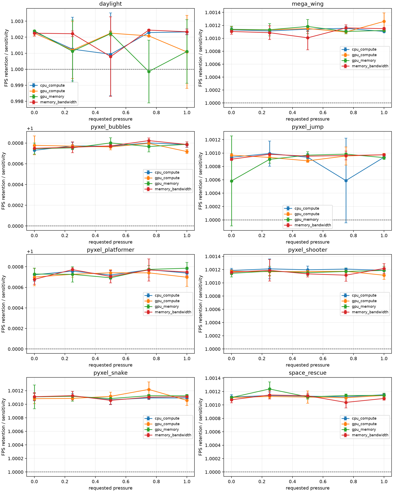
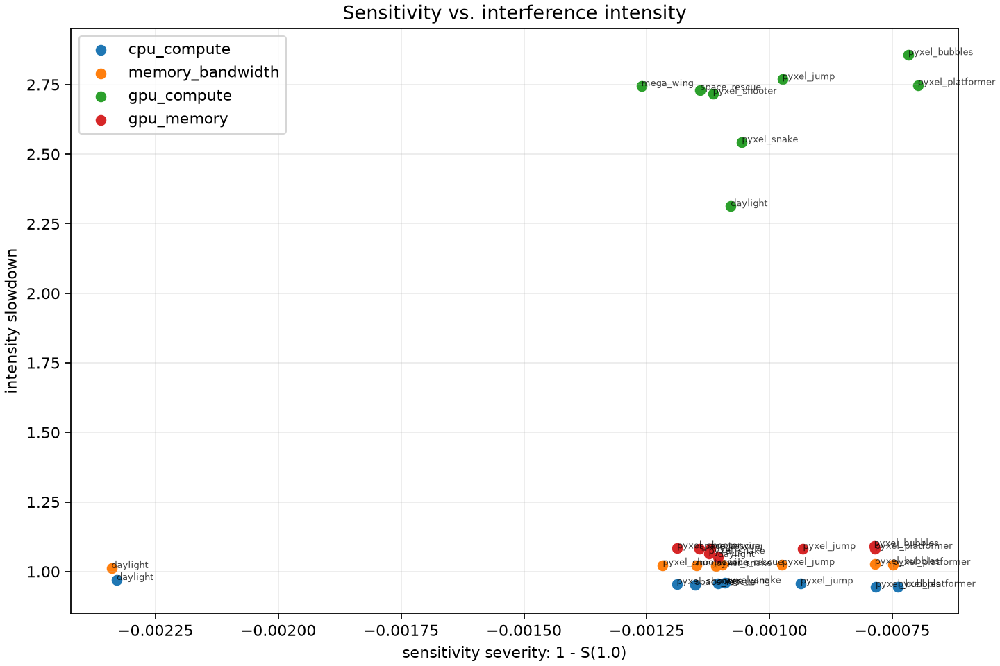
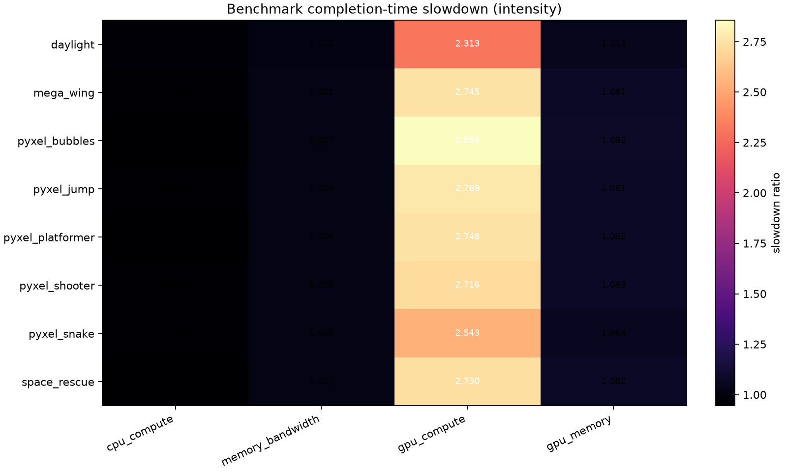
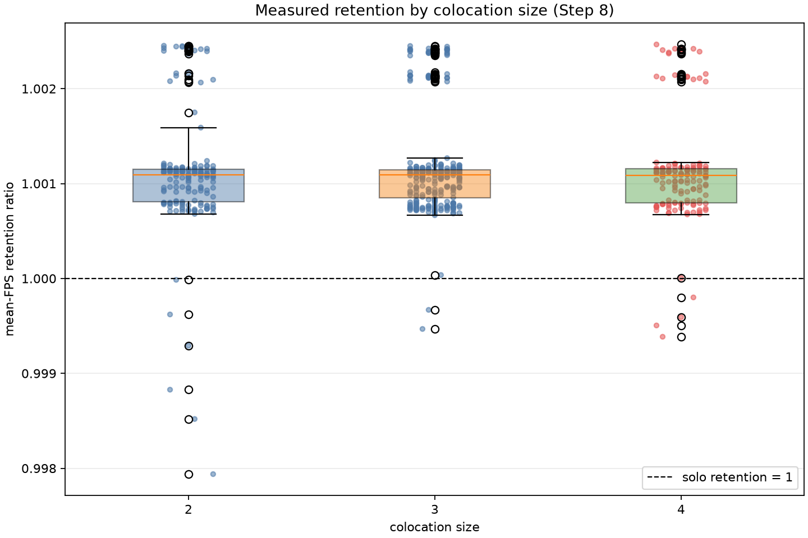
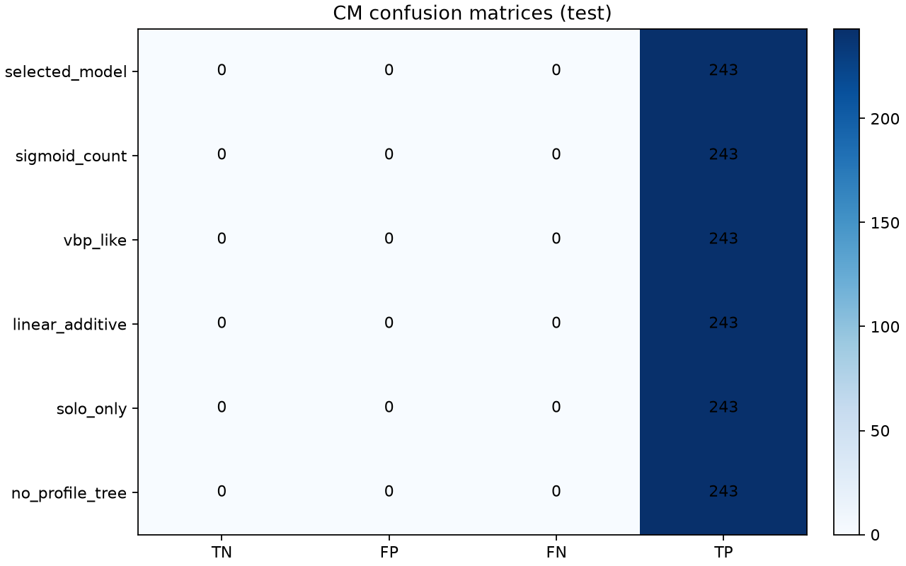
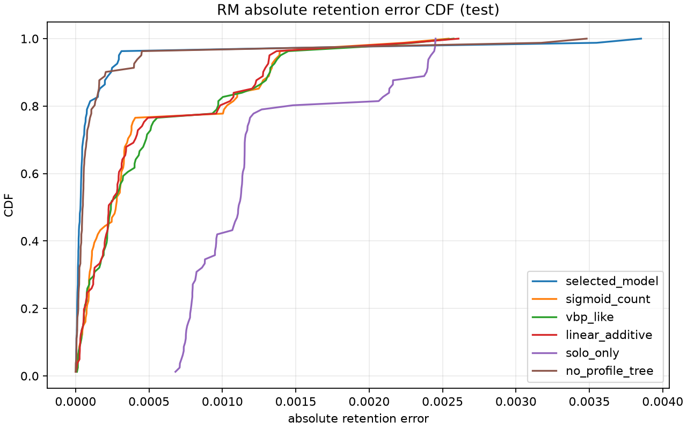
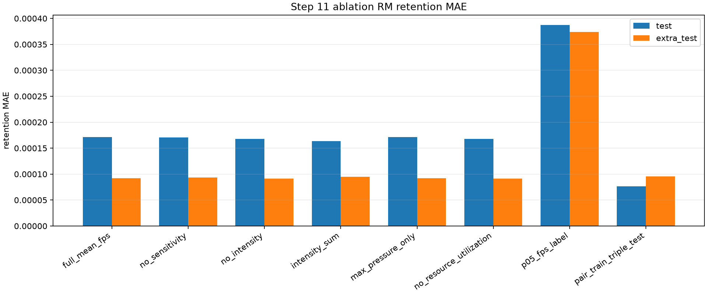
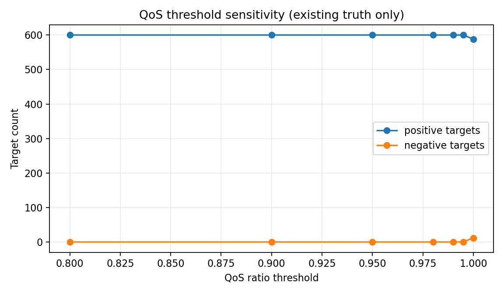
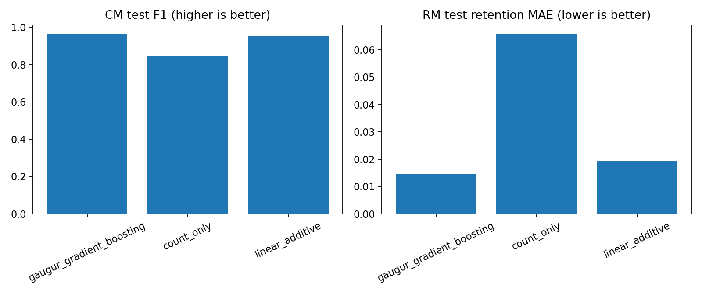

# GAugur Lite 复现报告

## 结论摘要

本项目完成了 GAugur 的轻量软件复现：真实 workload 注册、solo/profile 采集、资源敏感度/强度特征、共置 truth、CM/RM、基线、消融、QoS 装箱 replay 及自动验收链路均已实现并保留机器可读产物。

**真实方法有效性结论：未验证。** 历史 `formal-v1` 共置 truth 是工程控制数据；外部 benchmark、高 FPS、同核 affinity 三条真实 workload 修复路线均未产生非退化 QoS 标签。不能据此声称 CM 优于基线，也不能复现论文中的真实准确率/误差数字。

合成非线性交互验收通过，证明实现能够学习预先构造的非线性关系，但它不是云游戏实验证据。Step 13 固定槽位 FPS replay 因缺少有效真实标签而未执行。

## 1. Workloads、来源与许可证

八个 workload 均为仓库中冻结的 Pyxel 资源，许可证文件及哈希见 `tables/workloads-and-solo.csv`。独占 FPS、重复标准差和 CV 也在同表；重复次数为 3。

## 2. Profile 与共置观测

资源敏感度曲线、敏感度—强度关系、强度热图和按共置规模的 retention 图见：

## 3. CM/RM 与基线

模型评估图见 `figures/cm-confusion-matrices.png` 与 `figures/rm-error-cdf.png`。由于正式真实标签几乎全为正类，混淆矩阵和 QoS 指标不能解释为类别区分能力；Step 11 消融和主/额外测试原始结果仍保存在原报告目录。

## 4. Replay 与完整性

QoS 装箱 replay、槽位数和实测违约率见 `figures/packing-slots.png`。右侧全零是历史 truth 的真实分布，不是缺失值。

## 5. 有效性修复与标签敏感性

三条真实 workload pilot 的原始 JSON 在 `run_quality.json` 中逐字嵌入。阈值敏感性图显示，`qos_ratio` 从 0.80 到 0.995 都没有负类，只有把任何可测下降都视为失败的 1.0 阈值产生 12 个负类；该标准不作为论文 QoS 结论。

## 6. 合成算法验收

合成非线性交互数据的 CM F1 为 0.9654，RM retention MAE 为 0.01456，均优于 count-only 和 linear-additive 基线；该结果只验证算法实现。

## 7. 未执行项与限制

- Step 13 fixed-slot FPS replay：未执行，因为真实 QoS 标签门禁失败；对应状态图见 `figures/fixed-slot-fps-status.png`。
- 论文使用约 100 个商业游戏、七类资源和特定 Windows+i7-7700+GTX1060 环境；原始数据集未随论文公开。
- 当前八个 workload 同属 Pyxel 引擎且负载轻，不能外推到论文中的大型商业云游戏。
- 自动输入、窗口状态、deadline/失败现场均以原始 invocation JSON 和 Step 5–8 验收产物为准；本报告不把失败现场删除或改写。

## 8. 可复核入口

- 工程质量汇总：`run_quality.json`
- 数据卡：`dataset_card.md`
- CM/RM 模型卡：`cm_model_card.md`、`rm_model_card.md`
- 机器可读清单：`reproduction_manifest.json`

报告生成时间不参与哈希；所有输入源和复制图表均在 `reproduction_manifest.json` 中记录 SHA-256。
