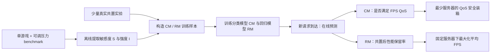

# GAugur 论文详细中文解读与 Windows 轻量复现设计

> 文档定位：这是对 GAugur 原论文的逐节中文解读，并讨论适合本科生完成的轻量复现边界。当前实施路线为 Windows Conda-only，不依赖 GameLab、WSL 或云游戏串流；活动实现规格以项目根目录 [README](../../README.md) 为准。

## 0. 论文与文件信息

- 论文标题：**GAugur: Quantifying Performance Interference of Colocated Games for Improving Resource Utilization in Cloud Gaming**
- 作者：Yusen Li、Chuxu Shan、Ruobing Chen、Xueyan Tang、Wentong Cai、Shanjiang Tang、Xiaoguang Liu、Gang Wang、Xiaoli Gong、Ying Zhang
- 会议：The 28th International Symposium on High-Performance Parallel and Distributed Computing（HPDC 2019）
- 页数：12 页
- DOI：[10.1145/3307681.3325409](https://doi.org/10.1145/3307681.3325409)
- 实验室来源：[南开大学—百度联合实验室官网 PDF](https://nbjl.nankai.edu.cn/_upload/article/files/b8/df/788a01c9442a8597ae8379cb37f1/2051df30-080f-4224-bdde-ceef114596e4.pdf)
- 本地原文：[GAugur_HPDC_2019.pdf](GAugur_HPDC_2019.pdf)
- 当前复现方案：[GAugur-Lite-Windows README](../../README.md)

## 1. 概括

GAugur 不直接穷举所有游戏组合，而是先用可控压力 benchmark 分别测出每个游戏对 CPU/GPU 各类共享资源的**敏感度**与**干扰强度**，再用机器学习预测任意共置组合能否满足 FPS QoS，以及共置后还能保留多少性能，最后用这些预测指导游戏装箱与服务器分配。

它试图解决的核心矛盾是：

- 一台服务器只运行一个游戏，QoS 容易保证，但资源利用率低；
- 一台服务器运行多个游戏，利用率提高，但共享 CPU/GPU 资源上的干扰可能让 FPS 跌破要求；
- 对所有游戏组合逐一实测的代价近似为 $O(2^N)$，无法随游戏库规模扩展；
- 新请求到达时必须立刻做调度决策，不能临时运行几分钟的共置测试。

GAugur 的回答是：把昂贵的单游戏特征分析和一部分组合测试放到离线阶段，把在线阶段压缩为一次模型推理。

## 2. 关于一个定义

原文把下式称为 performance degradation：

$$
\delta_{A\mid G}=\frac{FPS_{A,\,colocated\ with\ G}}{FPS_{A,\,solo}}
$$

但从数学意义看，它更接近**性能保留率**：

- $\delta=1$：共置后没有损失；
- $\delta=0.8$：保留 80% 独占性能，即损失 20%；
- $\delta$ 越大越好。

为了避免中文语境中“降幅越大损失越大”的歧义，`GAugur-Lite-Windows` 应同时记录：

```text
retention_ratio = colocated_fps / solo_fps
loss_ratio      = 1 - retention_ratio
```

本文后续在解释原公式时保留符号 $\delta$，但称其为“性能保留率”。

## 3. 为什么常见方法不够用

### 3.1 禁止共置

每个玩家独占一台服务器，干扰最少，却会造成严重的资源过度配置。论文对 100 款游戏的观察显示，不同游戏的 CPU、GPU 和内存需求差异很大，单独运行时往往无法同时用满各类资源。

### 3.2 向量装箱（VBP）

VBP 把每个游戏表示为 CPU、GPU、内存等资源需求向量，只要逐维资源之和不超过容量，就认为可以共置。它的问题是“容量未超限”不等于“性能无干扰”。论文给出的例子中，两款游戏的资源需求向量相加没有越界，但共置后其中一款游戏只有 42 FPS，低于 60 FPS QoS。

### 3.3 只按共置数量建模（Sigmoid）

这类模型假设性能只由同机游戏数量决定。它无法解释“同样是两个游戏，搭配 B 可以达到 105 FPS，搭配 C 却只有 57 FPS”，因为干扰取决于邻居是谁以及双方在什么资源维度上冲突。

### 3.4 线性敏感度与强度相加（SMiTe/Paragon 式假设）

既有方法常假设：

1. 性能对资源压力近似线性；
2. 多个邻居在同一资源上的干扰强度可以直接相加。

论文通过实验指出，这两个假设对游戏均可能不成立：敏感度曲线可以明显非线性，多游戏的聚合强度也可能与各自强度之和差异很大。

## 4. GAugur 的整体流程



论文将系统分为四步：

1. **Contention Feature Profiling**：为每个游戏测敏感度和强度；
2. **Prediction Model Building**：定义分类与回归问题以及固定维度特征；
3. **Model Training**：用一部分真实共置数据训练模型；
4. **Online Prediction**：请求到达时即时预测。

前三步离线完成且原则上只需做一次，第四步在线执行。论文认为单游戏 profiling 和训练开销随游戏数 $N$ 线性增长，在线推理开销可忽略。

## 5. 七类共享资源与 benchmark

论文选取七类对游戏重要的共享资源，记资源总数为 $R=7$：

| 缩写    | 资源               | 压力 benchmark 的核心思路                                                                |
| ------- | ------------------ | ---------------------------------------------------------------------------------------- |
| CPU-CE  | CPU 核执行能力     | 逐步提高 CPU 核忙碌程度；论文沿用既有 CPU benchmark 设计                                 |
| LLC     | CPU 最后一级缓存   | 控制工作集与访问模式，对 LLC 施加不同占用压力                                            |
| MEM-BW  | 主存带宽           | 通过流式内存访问逐步占用带宽                                                             |
| GPU-CE  | GPU 核执行能力     | 在各 GPU 核反复执行同一 kernel，在轮次间插入 sleep，将利用率调到目标压力$x$            |
| GPU-BW  | GPU 显存带宽       | 在 GPU 内存数组之间反复流式复制，通过 sleep 调节到目标带宽占用                           |
| GPU-L2  | GPU L2 缓存        | 构造大小为$x\times capacity$ 的数组并随机访问；相邻地址跨度超过 L1 容量，使访问落到 L2 |
| PCIe-BW | CPU–GPU PCIe 带宽 | 在 CPU 内存与 GPU 内存之间执行流式数据传输                                               |

论文没有把 CPU/GPU 内存容量本身作为预测维度。它的实验观察是：只要共置游戏的总内存需求未超过服务器容量，内存容量对 FPS 的影响很小。这个结论不等于可以忽略 OOM；容量约束仍应作为调度前的硬过滤条件。

### Benchmark 的两条设计原则

1. 压力必须能从无压力逐步增加到接近最大压力；
2. 压某一资源时，尽量不要显著干扰其他资源。

第二条是复现难点。普通的“CPU 压力工具”可能同时污染缓存和内存带宽，普通 GPU kernel 也可能同时消耗 GPU-CE、L2 和显存带宽。Lite 版如果不能证明压力是单资源隔离的，应把特征命名为“代理压力维度”，不能声称完全复现原文七类微基准。

## 6. 敏感度与强度如何测量

设游戏为 $A$，共享资源编号为 $r\in\{1,\dots,R\}$，压力采样粒度为 $k$。论文实验取 $k=10$，即使用 $0,0.1,\dots,1.0$ 共 11 个压力点。

### 6.1 敏感度曲线

把游戏 $A$ 与资源 $r$ 的 benchmark 共置。对每个压力 $x$，记录：

$$
\delta_A^r(x)=\frac{FPS_A^r(x)}{FPS_{A,solo}}
$$

由此得到：

$$
S_A^r=[\delta_A^r(0),\delta_A^r(1/k),\delta_A^r(2/k),\dots,\delta_A^r(1)]
$$

所有资源的曲线拼接成游戏 $A$ 的敏感度特征：

$$
S^A=[S_A^1,S_A^2,\dots,S_A^R]
$$

原文为每个压力点运行几分钟的代表性游戏场景，并取测试区间平均 FPS。选择固定、可重复且有代表性的场景，是复现能否成立的关键条件。

### 6.2 干扰强度

强度不是“游戏自己的 GPU 利用率”，而是游戏让 benchmark 变慢了多少。把 benchmark 与游戏 $A$ 共置，测 benchmark 完成固定迭代次数所需时间相对独占运行的 slowdown，并对各压力点的 slowdown 取平均，得到：

$$
I_A^r=\operatorname{mean}_{x}\left(\frac{T_{benchmark\mid A}(x)}{T_{benchmark,solo}(x)}\right)
$$

所有资源上的强度组成：

$$
I^A=[I_A^1,I_A^2,\dots,I_A^R]
$$

这一定义比直接读取利用率更有价值：利用率描述“硬件有多忙”，benchmark slowdown 更直接描述“另一个工作负载实际承受了多大压力”。

## 7. 论文的八个关键观察

### Observation 1：一个游戏可能同时对多种共享资源敏感

不能用单一 CPU 或 GPU 指标概括干扰。论文示例中 Far Cry 4 对七类资源均有敏感性，而且相同压力下不同资源造成的性能变化不同。

### Observation 2：同一资源上的敏感度与强度不一定相关

一个游戏可能非常怕 GPU 核竞争，但自身并不给 GPU 核造成很大压力。因而不能用“自己占用高，所以也容易受影响”来替代两类特征。

### Observation 3：不同游戏在同一资源上的敏感度和强度不同

特征必须逐游戏 profiling。论文示例中，最大 CPU-CE 压力下 The Elder Scrolls V 的性能损失约 70%，Far Cry 4 约 30%。

### Observation 4：敏感度对压力不一定线性

尤其在 GPU-CE、LLC 等资源上，曲线可能出现阈值、平台或弯折。这解释了为什么只取最大压力点再做线性回归的 SMiTe 式模型不够准确。

### Observation 5：多个游戏在同一资源上的强度不可简单相加

论文将 AirMech Strike 与 Hobo Tough Life 一起运行，比较了“实测聚合强度”与“两者单独强度之和”，部分资源上差异显著。因此 $I^B+I^C$ 不是可靠的多邻居表示。

### Observation 6：分辨率不影响敏感度曲线的形状

论文据此只在一个分辨率下 profiling 敏感度，再把曲线复用于其他分辨率。注意这是论文在其游戏与硬件上的经验观察，不是普适定律。

### Observation 7：分辨率对 CPU-CE、MEM-BW、LLC 强度影响不显著

这些维度可近似沿用已测强度。

### Observation 8：像素数与 GPU-CE、GPU-BW、GPU-L2、PCIe-BW 强度呈强线性关系

论文同时观察到独占 FPS 与像素数近似线性：

$$
FPS_A=-a_A\cdot N_{pixels}+b_A
$$

因此只测两个分辨率，便可通过两点拟合估算其他分辨率下的独占 FPS；GPU 相关强度也采用相同的两点线性估计思路。

## 8. 两类预测模型

### 8.1 分类模型 CM：这个组合安全吗

对目标游戏 $A$ 与邻居集合 $G=\{B,C,\dots\}$：

$$
\widetilde X_{A\mid G}=CM(Q,F_{solo}^A,S^A,I^B,I^C,\dots)
$$

- 输入：最低 FPS 要求 $Q$、目标游戏独占 FPS、目标游戏敏感度、所有邻居的强度；
- 输出：1 表示目标游戏共置后满足 QoS，0 表示不满足。

一个共置组合只有在其中每个游戏都被预测为 1 时，才是“安全组合”。CM 的用途是保证 QoS 前提下尽可能把更多请求装到同一服务器。

### 8.2 回归模型 RM：这个组合会保留多少性能

$$
\widetilde\delta_{A\mid G}=RM(S^A,I^B,I^C,\dots)
$$

- 输入：目标游戏敏感度与所有邻居的强度；
- 输出：目标游戏共置后的性能保留率。

RM 可以先预测保留率，再乘独占 FPS，间接判断是否满足 QoS；但论文保留独立 CM，因为直接分类比“先回归再阈值化”更准确。RM 更适合固定服务器数量下选择干扰较小的分配，使整体平均 FPS 最大。

### 8.3 可变邻居数量如何变成固定长度输入

机器学习模型要求固定维数，而邻居数可变。对邻居集合 $G$，论文在每个资源 $r$ 上计算个体强度的均值与方差：

$$
mean_r^G=\frac{1}{|G|}\sum_{g\in G}I_r^g
$$

$$
var_r^G=\frac{1}{|G|}\sum_{g\in G}(I_r^g-mean_r^G)^2
$$

再构造固定长度的聚合特征：

$$
I^G=[|G|,(mean_1^G,var_1^G),\dots,(mean_R^G,var_R^G)]
$$

当 $R=7$ 时，邻居聚合向量有 $2R+1=15$ 维。这里保留了邻居数量、每个资源强度的中心与离散程度，避免直接求和，同时让二、三、四游戏组合能进入同一个模型。

Lite 版应额外处理 $|G|=0$ 的独占样本：将 15 维聚合特征置零，并设置 `neighbor_count=0`，避免均值/方差除零。

## 9. 训练样本怎样从一次共置实验生成

论文示例：A、B、C 独占时均为 100 FPS，共置后分别为 40、50、60 FPS，QoS 为 60 FPS。

以 A 为目标，可得到：

$$
[60,100,S^A,I^B,I^C]\rightarrow 0 \quad \text{（CM）}
$$

$$
[S^A,I^B,I^C]\rightarrow 0.4 \quad \text{（RM）}
$$

同一次三游戏共置还可以分别把 B、C 当目标，再生成两组样本。因此一次含 $k$ 个游戏的共置实验可为每个模型产生 $k$ 个有监督样本。

论文比较的学习器包括：

- 决策树：DTC / DTR；
- 随机森林：RF；
- 梯度提升树：GBDT / GBRT；
- 支持向量模型：SVC / SVR。

最终报告结果所使用的是 1000 个训练样本下的 GBDT（分类）和 GBRT（回归）。这里的“1000 个样本”不是 1000 次共置实验，因为每次 $k$ 游戏共置会拆出 $k$ 个目标游戏样本。

## 10. 原论文实验设置

### 10.1 硬件与运行环境

| 项目             | 原论文设置                                                  |
| ---------------- | ----------------------------------------------------------- |
| 操作系统         | Windows 10                                                  |
| CPU              | 4 核 Intel i7-7700                                          |
| 内存             | 8 GB RAM                                                    |
| GPU              | NVIDIA GeForce GTX 1060                                     |
| 多游戏并发       | 多显示器 + ASTER Windows 多座席软件，每个显示器提供独立桌面 |
| 游戏规模         | 100 款真实热门游戏，覆盖多种类型                            |
| 单压力维度采样   | $k=10$，即 11 个压力点                                    |
| 分辨率 profiling | 每款游戏测两个分辨率                                        |

### 10.2 共置数据集

论文共实测 700 个组合：

| 组合大小 | 组合数量 |
| -------: | -------: |
| 2 个游戏 |      500 |
| 3 个游戏 |      100 |
| 4 个游戏 |      100 |
|     合计 |      700 |

游戏从 100 款游戏中随机选择，每个游戏的分辨率也随机选择。700 个组合中随机选 400 个组合生成训练集，其余 300 个组合生成测试集。论文不考虑五个及以上游戏的组合，因为在其服务器上，四个以上邻居会使大多数游戏 FPS 很低。

### 10.3 重要的验证方法问题

原文按“共置组合”切分训练/测试，这是正确方向；Lite 版也必须按 `run_id` 或 `colocation_id` 分组切分，不能把同一次共置拆出的 A/B/C 三条样本随机分散到训练集和测试集，否则会产生数据泄漏。

如果想检验“对未见过游戏能否泛化”，还需要做更严格的按游戏留出（如 `GroupKFold(game_id)`）。原论文主要验证的是：游戏已经完成离线 profiling 后，模型能否预测未测试过的组合；它不是零样本新游戏预测。

## 11. 论文结果

### 11.1 回归结果（Figure 7）

- 误差定义为 $|\widetilde\delta-\delta|/\delta$；
- 训练样本增多时，各模型误差总体下降；
- 1000 个训练样本时，DTR、GBRT、RF、SVR 的平均误差均低于 10%；
- GBRT 最优，平均误差为 **7.9%**；
- Sigmoid 平均误差 **22.5%**，SMiTe 平均误差 **23.6%**；
- 组合越大，所有方法误差都上升，但 GAugur 在四游戏组合上仍将平均误差控制在 10% 内。

这里的 7.9% 是相对于 $\delta$ 的平均相对误差，不是“FPS 只差 7.9 帧”，也不是所有单样本误差都低于 7.9%。

### 11.2 分类结果（Figure 8）

- 60 FPS QoS、1000 个训练样本时，GBDT 分类准确率达到 **95%**，即平均分类错误约 5%；
- 50 FPS QoS 下趋势相近；
- 直接使用 GAugur(CM) 比把 GAugur(RM) 的结果再阈值化更准确；
- Sigmoid 与 SMiTe 的分类准确率约为 80%。

论文摘要中“identify ... within an average error of 5%”对应的是约 95% 分类准确率，不能误写成“预测 FPS 的误差为 5%”。

## 12. 两个干扰感知调度应用

### 12.1 应用一：满足 QoS 时最少用多少台服务器

目标：给定一批游戏请求，在所有游戏达到指定 FPS 的前提下最小化服务器数。

论文先从 10 款随机游戏构造大小小于 5 的全部 385 个组合，并通过实测得到真实可行集合，再比较各方法判断出的可行集合。评价指标为：

- Accuracy：所有组合中判断正确的比例；
- Precision：模型认为可行的组合中，实际可行的比例；
- Recall：所有实际可行组合中，被模型找出的比例。

GAugur(CM) 在 60 FPS QoS 下达到 **94% precision** 和 **88% recall**。对云游戏调度而言 precision 尤其重要，因为 false positive 会把实际不安全的组合部署上线，直接造成 QoS 违约。

论文 Algorithm 1 的核心是一个贪心集合覆盖过程：

1. 建立模型识别的可行组合集合 $F$；
2. 每次选择 $F$ 中规模最大的组合；
3. 如果该组合内每款游戏还有待分配请求，就新开一台服务器并各放一个请求；
4. 否则移除该组合，继续搜索。

该算法对最大组合大小 $k$ 具有 $\ln(k)$ 近似比。论文明确说明装箱问题为 NP-hard，没有用高开销的最优算法。

在 10 款游戏上随机产生 5000 个请求时：

- GAugur(CM) 在 60/50 FPS QoS 下均使用最少的服务器；
- 相比 Sigmoid、SMiTe、VBP，服务器数优势为 **20%–40%**；
- 如果完全禁止共置，需要 5000 台服务器；相对此策略，GAugur 的资源利用率提升最高可达 **60%**。

### 12.2 应用二：固定服务器数时最大化总体性能

目标：服务器数固定时最大化所有游戏的平均 FPS。

GAugur(RM)、Sigmoid 和 SMiTe 都采用逐请求贪心：把当前请求放到“预测放入后平均 FPS 最高”的服务器。VBP 使用 worst-fit，即放入剩余资源容量最大的服务器。

在 5000 个请求、10 款游戏、不同服务器数设置下：

- 服务器越多，各方法的平均 FPS 越高；
- GAugur(RM) 平均 FPS 最好；
- 相比其他方法，提升最高 **15%**；
- 2000 台服务器时的 FPS 累积分布也整体优于基线。

## 13. 论文的贡献、局限与复现风险

### 13.1 主要贡献

1. 把 CPU 与 GPU 多维共享资源同时纳入游戏共置干扰预测；
2. 将“受压后的敏感度”与“对他人施压的强度”分离测量；
3. 用完整敏感度曲线表达非线性；
4. 用邻居数 + 每资源均值/方差支持可变大小组合，避免直接相加强度；
5. 给出 CM 与 RM 两条面向不同调度目标的路径；
6. 用真实游戏、大量共置组合和实际装箱问题展示系统价值。

### 13.2 原论文明确承认的局限

- 只在一种服务器配置上测试，跨硬件泛化未知；
- 假设每台服务器只有一个 CPU 和一个 GPU，多 CPU/GPU 会引入调度器问题；
- 只研究了分辨率，未系统研究抗锯齿、各向异性过滤、光照/阴影等图形设置；
- FPS 随游戏场景变化，均值 profiling 可能掩盖短时 QoS 违约；论文建议可用最低 FPS 或动态适应；
- 未预测交互时延，作者把它列为未来工作。

### 13.3 与真正端到端云游戏的缺口

原论文为了简化实验，**没有把视频编码和网络流传输纳入评估**。其理由是 NVIDIA GRID 等现代 GPU 的硬件编码器开销较小，并指出方法可扩展到编码/串流及服务端处理时延。

当前轻量复现与原论文保持相同边界，同样不实现编码和网络链路，而是集中验证敏感度、强度、CM/RM 与干扰感知调度。性能对象由真实商业游戏缩减为可控的类游戏合成 workload，因此必须称为“GAugur 思想的轻量再实现”，不能称为数值级完整复现。

GameLab 端到端扩展仍有研究价值，但已从当前实施范围移除。下文第 14–21 节保留的是早期 GameLab 扩展设想，仅作为归档备选，不代表当前开发计划；Windows-only 的目录、命令和验收标准以根 [README](../../README.md) 为准。

## 参考入口

1. Yusen Li et al., *GAugur: Quantifying Performance Interference of Colocated Games for Improving Resource Utilization in Cloud Gaming*, HPDC 2019：[DOI](https://doi.org/10.1145/3307681.3325409)
2. 南开大学—百度联合实验室托管原文：[官方 PDF](https://nbjl.nankai.edu.cn/_upload/article/files/b8/df/788a01c9442a8597ae8379cb37f1/2051df30-080f-4224-bdde-ceef114596e4.pdf)
3. 本项目当前实施规格：[GAugur-Lite-Windows README](../../README.md)
