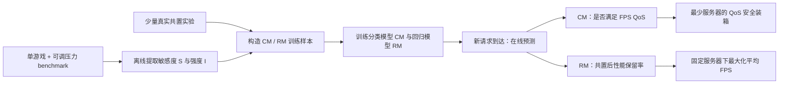

# GAugur 论文详细中文解读与 GameLab-GAugur-Lite 复现设计

> 文档定位：这是对 GAugur 原论文的逐节中文解读，同时给出一个适合本科生在本地完成的 `GameLab-GAugur-Lite` 复现边界。它不是论文的官方中文翻译，也不把计划中的 Lite 结果冒充原论文结果。

## 0. 论文与文件信息

- 论文标题：**GAugur: Quantifying Performance Interference of Colocated Games for Improving Resource Utilization in Cloud Gaming**
- 作者：Yusen Li、Chuxu Shan、Ruobing Chen、Xueyan Tang、Wentong Cai、Shanjiang Tang、Xiaoguang Liu、Gang Wang、Xiaoli Gong、Ying Zhang
- 会议：The 28th International Symposium on High-Performance Parallel and Distributed Computing（HPDC 2019）
- 页数：12 页
- DOI：[10.1145/3307681.3325409](https://doi.org/10.1145/3307681.3325409)
- 实验室来源：[南开大学—百度联合实验室官网 PDF](https://nbjl.nankai.edu.cn/_upload/article/files/b8/df/788a01c9442a8597ae8379cb37f1/2051df30-080f-4224-bdde-ceef114596e4.pdf)
- 本地原文：[GAugur_HPDC_2019.pdf](GAugur_HPDC_2019.pdf)
- 本地复现底座：[GameLab / ai-testbed](../../ai-testbed/README.md)

## 1. 概括

GAugur 不直接穷举所有游戏组合，而是先用可控压力 benchmark 分别测出每个游戏对 CPU/GPU 各类共享资源的**敏感度**与**干扰强度**，再用机器学习预测任意共置组合能否满足 FPS QoS，以及共置后还能保留多少性能，最后用这些预测指导游戏装箱与服务器分配。

它试图解决的核心矛盾是：

- 一台服务器只运行一个游戏，QoS 容易保证，但资源利用率低；
- 一台服务器运行多个游戏，利用率提高，但共享 CPU/GPU 资源上的干扰可能让 FPS 跌破要求；
- 对所有游戏组合逐一实测的代价近似为 $O(2^N)$，无法随游戏库规模扩展；
- 新请求到达时必须立刻做调度决策，不能临时运行几分钟的共置测试。

GAugur 的回答是：把昂贵的单游戏特征分析和一部分组合测试放到离线阶段，把在线阶段压缩为一次模型推理。

## 2. 关于一个定义

原文把下式称为 performance degradation：

$$
\delta_{A\mid G}=\frac{FPS_{A,\,colocated\ with\ G}}{FPS_{A,\,solo}}
$$

但从数学意义看，它更接近**性能保留率**：

- $\delta=1$：共置后没有损失；
- $\delta=0.8$：保留 80% 独占性能，即损失 20%；
- $\delta$ 越大越好。

为了避免中文语境中“降幅越大损失越大”的歧义，`GameLab-GAugur-Lite` 应同时记录：

```text
retention_ratio = colocated_fps / solo_fps
loss_ratio      = 1 - retention_ratio
```

本文后续在解释原公式时保留符号 $\delta$，但称其为“性能保留率”。

## 3. 为什么常见方法不够用

### 3.1 禁止共置

每个玩家独占一台服务器，干扰最少，却会造成严重的资源过度配置。论文对 100 款游戏的观察显示，不同游戏的 CPU、GPU 和内存需求差异很大，单独运行时往往无法同时用满各类资源。

### 3.2 向量装箱（VBP）

VBP 把每个游戏表示为 CPU、GPU、内存等资源需求向量，只要逐维资源之和不超过容量，就认为可以共置。它的问题是“容量未超限”不等于“性能无干扰”。论文给出的例子中，两款游戏的资源需求向量相加没有越界，但共置后其中一款游戏只有 42 FPS，低于 60 FPS QoS。

### 3.3 只按共置数量建模（Sigmoid）

这类模型假设性能只由同机游戏数量决定。它无法解释“同样是两个游戏，搭配 B 可以达到 105 FPS，搭配 C 却只有 57 FPS”，因为干扰取决于邻居是谁以及双方在什么资源维度上冲突。

### 3.4 线性敏感度与强度相加（SMiTe/Paragon 式假设）

既有方法常假设：

1. 性能对资源压力近似线性；
2. 多个邻居在同一资源上的干扰强度可以直接相加。

论文通过实验指出，这两个假设对游戏均可能不成立：敏感度曲线可以明显非线性，多游戏的聚合强度也可能与各自强度之和差异很大。

## 4. GAugur 的整体流程



论文将系统分为四步：

1. **Contention Feature Profiling**：为每个游戏测敏感度和强度；
2. **Prediction Model Building**：定义分类与回归问题以及固定维度特征；
3. **Model Training**：用一部分真实共置数据训练模型；
4. **Online Prediction**：请求到达时即时预测。

前三步离线完成且原则上只需做一次，第四步在线执行。论文认为单游戏 profiling 和训练开销随游戏数 $N$ 线性增长，在线推理开销可忽略。

## 5. 七类共享资源与 benchmark

论文选取七类对游戏重要的共享资源，记资源总数为 $R=7$：

| 缩写 | 资源 | 压力 benchmark 的核心思路 |
|---|---|---|
| CPU-CE | CPU 核执行能力 | 逐步提高 CPU 核忙碌程度；论文沿用既有 CPU benchmark 设计 |
| LLC | CPU 最后一级缓存 | 控制工作集与访问模式，对 LLC 施加不同占用压力 |
| MEM-BW | 主存带宽 | 通过流式内存访问逐步占用带宽 |
| GPU-CE | GPU 核执行能力 | 在各 GPU 核反复执行同一 kernel，在轮次间插入 sleep，将利用率调到目标压力 $x$ |
| GPU-BW | GPU 显存带宽 | 在 GPU 内存数组之间反复流式复制，通过 sleep 调节到目标带宽占用 |
| GPU-L2 | GPU L2 缓存 | 构造大小为 $x\times capacity$ 的数组并随机访问；相邻地址跨度超过 L1 容量，使访问落到 L2 |
| PCIe-BW | CPU–GPU PCIe 带宽 | 在 CPU 内存与 GPU 内存之间执行流式数据传输 |

论文没有把 CPU/GPU 内存容量本身作为预测维度。它的实验观察是：只要共置游戏的总内存需求未超过服务器容量，内存容量对 FPS 的影响很小。这个结论不等于可以忽略 OOM；容量约束仍应作为调度前的硬过滤条件。

### Benchmark 的两条设计原则

1. 压力必须能从无压力逐步增加到接近最大压力；
2. 压某一资源时，尽量不要显著干扰其他资源。

第二条是复现难点。普通的“CPU 压力工具”可能同时污染缓存和内存带宽，普通 GPU kernel 也可能同时消耗 GPU-CE、L2 和显存带宽。Lite 版如果不能证明压力是单资源隔离的，应把特征命名为“代理压力维度”，不能声称完全复现原文七类微基准。

## 6. 敏感度与强度如何测量

设游戏为 $A$，共享资源编号为 $r\in\{1,\dots,R\}$，压力采样粒度为 $k$。论文实验取 $k=10$，即使用 $0,0.1,\dots,1.0$ 共 11 个压力点。

### 6.1 敏感度曲线

把游戏 $A$ 与资源 $r$ 的 benchmark 共置。对每个压力 $x$，记录：

$$
\delta_A^r(x)=\frac{FPS_A^r(x)}{FPS_{A,solo}}
$$

由此得到：

$$
S_A^r=[\delta_A^r(0),\delta_A^r(1/k),\delta_A^r(2/k),\dots,\delta_A^r(1)]
$$

所有资源的曲线拼接成游戏 $A$ 的敏感度特征：

$$
S^A=[S_A^1,S_A^2,\dots,S_A^R]
$$

原文为每个压力点运行几分钟的代表性游戏场景，并取测试区间平均 FPS。选择固定、可重复且有代表性的场景，是复现能否成立的关键条件。

### 6.2 干扰强度

强度不是“游戏自己的 GPU 利用率”，而是游戏让 benchmark 变慢了多少。把 benchmark 与游戏 $A$ 共置，测 benchmark 完成固定迭代次数所需时间相对独占运行的 slowdown，并对各压力点的 slowdown 取平均，得到：

$$
I_A^r=\operatorname{mean}_{x}\left(\frac{T_{benchmark\mid A}(x)}{T_{benchmark,solo}(x)}\right)
$$

所有资源上的强度组成：

$$
I^A=[I_A^1,I_A^2,\dots,I_A^R]
$$

这一定义比直接读取利用率更有价值：利用率描述“硬件有多忙”，benchmark slowdown 更直接描述“另一个工作负载实际承受了多大压力”。

## 7. 论文的八个关键观察

### Observation 1：一个游戏可能同时对多种共享资源敏感

不能用单一 CPU 或 GPU 指标概括干扰。论文示例中 Far Cry 4 对七类资源均有敏感性，而且相同压力下不同资源造成的性能变化不同。

### Observation 2：同一资源上的敏感度与强度不一定相关

一个游戏可能非常怕 GPU 核竞争，但自身并不给 GPU 核造成很大压力。因而不能用“自己占用高，所以也容易受影响”来替代两类特征。

### Observation 3：不同游戏在同一资源上的敏感度和强度不同

特征必须逐游戏 profiling。论文示例中，最大 CPU-CE 压力下 The Elder Scrolls V 的性能损失约 70%，Far Cry 4 约 30%。

### Observation 4：敏感度对压力不一定线性

尤其在 GPU-CE、LLC 等资源上，曲线可能出现阈值、平台或弯折。这解释了为什么只取最大压力点再做线性回归的 SMiTe 式模型不够准确。

### Observation 5：多个游戏在同一资源上的强度不可简单相加

论文将 AirMech Strike 与 Hobo Tough Life 一起运行，比较了“实测聚合强度”与“两者单独强度之和”，部分资源上差异显著。因此 $I^B+I^C$ 不是可靠的多邻居表示。

### Observation 6：分辨率不影响敏感度曲线的形状

论文据此只在一个分辨率下 profiling 敏感度，再把曲线复用于其他分辨率。注意这是论文在其游戏与硬件上的经验观察，不是普适定律。

### Observation 7：分辨率对 CPU-CE、MEM-BW、LLC 强度影响不显著

这些维度可近似沿用已测强度。

### Observation 8：像素数与 GPU-CE、GPU-BW、GPU-L2、PCIe-BW 强度呈强线性关系

论文同时观察到独占 FPS 与像素数近似线性：

$$
FPS_A=-a_A\cdot N_{pixels}+b_A
$$

因此只测两个分辨率，便可通过两点拟合估算其他分辨率下的独占 FPS；GPU 相关强度也采用相同的两点线性估计思路。

## 8. 两类预测模型

### 8.1 分类模型 CM：这个组合安全吗

对目标游戏 $A$ 与邻居集合 $G=\{B,C,\dots\}$：

$$
\widetilde X_{A\mid G}=CM(Q,F_{solo}^A,S^A,I^B,I^C,\dots)
$$

- 输入：最低 FPS 要求 $Q$、目标游戏独占 FPS、目标游戏敏感度、所有邻居的强度；
- 输出：1 表示目标游戏共置后满足 QoS，0 表示不满足。

一个共置组合只有在其中每个游戏都被预测为 1 时，才是“安全组合”。CM 的用途是保证 QoS 前提下尽可能把更多请求装到同一服务器。

### 8.2 回归模型 RM：这个组合会保留多少性能

$$
\widetilde\delta_{A\mid G}=RM(S^A,I^B,I^C,\dots)
$$

- 输入：目标游戏敏感度与所有邻居的强度；
- 输出：目标游戏共置后的性能保留率。

RM 可以先预测保留率，再乘独占 FPS，间接判断是否满足 QoS；但论文保留独立 CM，因为直接分类比“先回归再阈值化”更准确。RM 更适合固定服务器数量下选择干扰较小的分配，使整体平均 FPS 最大。

### 8.3 可变邻居数量如何变成固定长度输入

机器学习模型要求固定维数，而邻居数可变。对邻居集合 $G$，论文在每个资源 $r$ 上计算个体强度的均值与方差：

$$
mean_r^G=\frac{1}{|G|}\sum_{g\in G}I_r^g
$$

$$
var_r^G=\frac{1}{|G|}\sum_{g\in G}(I_r^g-mean_r^G)^2
$$

再构造固定长度的聚合特征：

$$
I^G=[|G|,(mean_1^G,var_1^G),\dots,(mean_R^G,var_R^G)]
$$

当 $R=7$ 时，邻居聚合向量有 $2R+1=15$ 维。这里保留了邻居数量、每个资源强度的中心与离散程度，避免直接求和，同时让二、三、四游戏组合能进入同一个模型。

Lite 版应额外处理 $|G|=0$ 的独占样本：将 15 维聚合特征置零，并设置 `neighbor_count=0`，避免均值/方差除零。

## 9. 训练样本怎样从一次共置实验生成

论文示例：A、B、C 独占时均为 100 FPS，共置后分别为 40、50、60 FPS，QoS 为 60 FPS。

以 A 为目标，可得到：

$$
[60,100,S^A,I^B,I^C]\rightarrow 0 \quad \text{（CM）}
$$

$$
[S^A,I^B,I^C]\rightarrow 0.4 \quad \text{（RM）}
$$

同一次三游戏共置还可以分别把 B、C 当目标，再生成两组样本。因此一次含 $k$ 个游戏的共置实验可为每个模型产生 $k$ 个有监督样本。

论文比较的学习器包括：

- 决策树：DTC / DTR；
- 随机森林：RF；
- 梯度提升树：GBDT / GBRT；
- 支持向量模型：SVC / SVR。

最终报告结果所使用的是 1000 个训练样本下的 GBDT（分类）和 GBRT（回归）。这里的“1000 个样本”不是 1000 次共置实验，因为每次 $k$ 游戏共置会拆出 $k$ 个目标游戏样本。

## 10. 原论文实验设置

### 10.1 硬件与运行环境

| 项目 | 原论文设置 |
|---|---|
| 操作系统 | Windows 10 |
| CPU | 4 核 Intel i7-7700 |
| 内存 | 8 GB RAM |
| GPU | NVIDIA GeForce GTX 1060 |
| 多游戏并发 | 多显示器 + ASTER Windows 多座席软件，每个显示器提供独立桌面 |
| 游戏规模 | 100 款真实热门游戏，覆盖多种类型 |
| 单压力维度采样 | $k=10$，即 11 个压力点 |
| 分辨率 profiling | 每款游戏测两个分辨率 |

### 10.2 共置数据集

论文共实测 700 个组合：

| 组合大小 | 组合数量 |
|---:|---:|
| 2 个游戏 | 500 |
| 3 个游戏 | 100 |
| 4 个游戏 | 100 |
| 合计 | 700 |

游戏从 100 款游戏中随机选择，每个游戏的分辨率也随机选择。700 个组合中随机选 400 个组合生成训练集，其余 300 个组合生成测试集。论文不考虑五个及以上游戏的组合，因为在其服务器上，四个以上邻居会使大多数游戏 FPS 很低。

### 10.3 重要的验证方法问题

原文按“共置组合”切分训练/测试，这是正确方向；Lite 版也必须按 `run_id` 或 `colocation_id` 分组切分，不能把同一次共置拆出的 A/B/C 三条样本随机分散到训练集和测试集，否则会产生数据泄漏。

如果想检验“对未见过游戏能否泛化”，还需要做更严格的按游戏留出（如 `GroupKFold(game_id)`）。原论文主要验证的是：游戏已经完成离线 profiling 后，模型能否预测未测试过的组合；它不是零样本新游戏预测。

## 11. 论文结果

### 11.1 回归结果（Figure 7）

- 误差定义为 $|\widetilde\delta-\delta|/\delta$；
- 训练样本增多时，各模型误差总体下降；
- 1000 个训练样本时，DTR、GBRT、RF、SVR 的平均误差均低于 10%；
- GBRT 最优，平均误差为 **7.9%**；
- Sigmoid 平均误差 **22.5%**，SMiTe 平均误差 **23.6%**；
- 组合越大，所有方法误差都上升，但 GAugur 在四游戏组合上仍将平均误差控制在 10% 内。

这里的 7.9% 是相对于 $\delta$ 的平均相对误差，不是“FPS 只差 7.9 帧”，也不是所有单样本误差都低于 7.9%。

### 11.2 分类结果（Figure 8）

- 60 FPS QoS、1000 个训练样本时，GBDT 分类准确率达到 **95%**，即平均分类错误约 5%；
- 50 FPS QoS 下趋势相近；
- 直接使用 GAugur(CM) 比把 GAugur(RM) 的结果再阈值化更准确；
- Sigmoid 与 SMiTe 的分类准确率约为 80%。

论文摘要中“identify ... within an average error of 5%”对应的是约 95% 分类准确率，不能误写成“预测 FPS 的误差为 5%”。

## 12. 两个干扰感知调度应用

### 12.1 应用一：满足 QoS 时最少用多少台服务器

目标：给定一批游戏请求，在所有游戏达到指定 FPS 的前提下最小化服务器数。

论文先从 10 款随机游戏构造大小小于 5 的全部 385 个组合，并通过实测得到真实可行集合，再比较各方法判断出的可行集合。评价指标为：

- Accuracy：所有组合中判断正确的比例；
- Precision：模型认为可行的组合中，实际可行的比例；
- Recall：所有实际可行组合中，被模型找出的比例。

GAugur(CM) 在 60 FPS QoS 下达到 **94% precision** 和 **88% recall**。对云游戏调度而言 precision 尤其重要，因为 false positive 会把实际不安全的组合部署上线，直接造成 QoS 违约。

论文 Algorithm 1 的核心是一个贪心集合覆盖过程：

1. 建立模型识别的可行组合集合 $F$；
2. 每次选择 $F$ 中规模最大的组合；
3. 如果该组合内每款游戏还有待分配请求，就新开一台服务器并各放一个请求；
4. 否则移除该组合，继续搜索。

该算法对最大组合大小 $k$ 具有 $\ln(k)$ 近似比。论文明确说明装箱问题为 NP-hard，没有用高开销的最优算法。

在 10 款游戏上随机产生 5000 个请求时：

- GAugur(CM) 在 60/50 FPS QoS 下均使用最少的服务器；
- 相比 Sigmoid、SMiTe、VBP，服务器数优势为 **20%–40%**；
- 如果完全禁止共置，需要 5000 台服务器；相对此策略，GAugur 的资源利用率提升最高可达 **60%**。

### 12.2 应用二：固定服务器数时最大化总体性能

目标：服务器数固定时最大化所有游戏的平均 FPS。

GAugur(RM)、Sigmoid 和 SMiTe 都采用逐请求贪心：把当前请求放到“预测放入后平均 FPS 最高”的服务器。VBP 使用 worst-fit，即放入剩余资源容量最大的服务器。

在 5000 个请求、10 款游戏、不同服务器数设置下：

- 服务器越多，各方法的平均 FPS 越高；
- GAugur(RM) 平均 FPS 最好；
- 相比其他方法，提升最高 **15%**；
- 2000 台服务器时的 FPS 累积分布也整体优于基线。

## 13. 论文的贡献、局限与复现风险

### 13.1 主要贡献

1. 把 CPU 与 GPU 多维共享资源同时纳入游戏共置干扰预测；
2. 将“受压后的敏感度”与“对他人施压的强度”分离测量；
3. 用完整敏感度曲线表达非线性；
4. 用邻居数 + 每资源均值/方差支持可变大小组合，避免直接相加强度；
5. 给出 CM 与 RM 两条面向不同调度目标的路径；
6. 用真实游戏、大量共置组合和实际装箱问题展示系统价值。

### 13.2 原论文明确承认的局限

- 只在一种服务器配置上测试，跨硬件泛化未知；
- 假设每台服务器只有一个 CPU 和一个 GPU，多 CPU/GPU 会引入调度器问题；
- 只研究了分辨率，未系统研究抗锯齿、各向异性过滤、光照/阴影等图形设置；
- FPS 随游戏场景变化，均值 profiling 可能掩盖短时 QoS 违约；论文建议可用最低 FPS 或动态适应；
- 未预测交互时延，作者把它列为未来工作。

### 13.3 与真正端到端云游戏的缺口

原论文为了简化实验，**没有把视频编码和网络流传输纳入评估**。其理由是 NVIDIA GRID 等现代 GPU 的硬件编码器开销较小，并指出方法可扩展到编码/串流及服务端处理时延。

这是 GameLab 复现最有价值的切入点：GameLab 已包含屏幕采集、H.264/VP8 编码、WebRTC 发送、客户端解码显示、发送/传输码率与服务器/客户端 FPS 统计。因此 `GameLab-GAugur-Lite` 可以验证：在端到端流媒体链路存在时，共置干扰特征是否仍能预测渲染/传输 QoS。

需要诚实区分：

- **原论文复现目标**：FPS 共置干扰预测；
- **Lite 扩展目标**：在 GameLab 端到端管线中加入编码与传输指标；
- 如果无法构造原文七类隔离 benchmark，Lite 是“GAugur 思想的简化再实现”，不是数值级复现。

## 14. GameLab 现有能力与 GAugur 模块映射

| GAugur 所需能力 | GameLab 当前可用部分 | Lite 版需要补齐 |
|---|---|---|
| 固定游戏/场景运行 | 可采集服务器屏幕并通过 WebRTC 发送 | 可重复 workload 驱动、预热/采样窗口、运行元数据 |
| 独占 FPS | `Server/server.py` 已统计 Server FPS | 输出结构化 CSV/JSONL；区分采集 FPS、渲染 FPS 和编码后 FPS |
| 客户端 FPS | `Client/client.py` 已统计 Client FPS | 同步 `run_id`，写结构化日志 |
| 码率 | 服务端 sender bitrate、客户端 transport bitrate 已有日志 | 统一字段、稳定采样周期、缺失值处理 |
| 帧级关联 | 服务端可叠加 frame id、时间戳、分辨率 QR | 客户端尚未解 QR；补充解码或使用旁路元数据通道 |
| 可控分辨率 | 服务端支持 downsample/send resolution | 固定分辨率实验矩阵与像素数特征 |
| 编码复杂度 | 已有可选 EVCA 场景复杂度与码率阶梯 | 将复杂度作为可选协变量，不与 GAugur 强度概念混用 |
| CPU/GPU 压力 | 尚无 GAugur 式七类 benchmark | 实现/接入压力生成器并校准压力档位 |
| 多实例共置 | 当前主流程更接近单服务端/单客户端 | 多进程编排、端口/桌面/采集区域隔离、统一开始时间 |
| 训练与预测 | 尚无 GAugur 特征工程与模型 | 数据构建、Group split、GBDT/GBRT、基线与评估脚本 |
| 调度器 | 尚无干扰感知装箱 | Lite 阶段先做离线 replay 模拟，不立即搭建真实集群 |

### 当前平台限制

GameLab 的输入注入部分包含 X11 依赖，整体脚本也偏 Linux/Bash，而当前本地环境为 Windows。首版可采用固定视频/可脚本化渲染 workload，绕过交互输入；若要运行真实交互式游戏，应迁移到 Linux 主机，或为 Windows 实现等价输入与多实例隔离。

## 15. 建议的 GameLab-GAugur-Lite 复现边界

本科推免项目的关键不是把“100 款商业游戏、700 个组合”机械照搬，而是建立一条可验证、可重复、有对照组的最小研究闭环。

### 15.1 建议研究问题

> 在 GameLab 的端到端云游戏管线中，基于目标 workload 的敏感度曲线与邻居 workload 的干扰强度，能否比“只看共置数量”或“直接相加强度”的基线更准确地预测 FPS QoS 和性能保留率？

可选扩展问题：

> 加入编码复杂度、码率和客户端 FPS 后，模型能否预测端到端 QoS，而不只是服务器采集 FPS？

### 15.2 最小可行实验规模

| 维度 | 最小版本 | 推荐版本 |
|---|---:|---:|
| workload 数 | 4 | 6–10 |
| workload 类型 | 可重复 3D/视频/图形 demo | 轻/中/重 GPU 与不同 CPU/内存特征均覆盖 |
| 分辨率 | 720p、1080p | 720p、900p、1080p |
| 共置大小 | 2 | 2、3，资源允许时加入 4 |
| 每个配置重复 | 3 次 | 5 次 |
| 单次预热 | 30 s | 60 s |
| 单次正式采样 | 60 s | 120–180 s |
| 压力维度 | CPU、内存带宽、GPU 综合压力 | 尽可能拆分 CPU-CE、MEM-BW、GPU-CE、GPU-BW |
| 压力档位 | 0、0.25、0.5、0.75、1 | 0 到 1 共 11 档，对齐原文 $k=10$ |

如果只有一块普通消费级 GPU，多个真实游戏进程可能难以稳定捕获。可以先选可脚本化且许可明确的开源 benchmark/workload，保证可复现性优先于“游戏名气”。

### 15.3 两层目标，避免一次做得过大

**Level A：可完成的核心复现**

- 独占基线与二游戏共置；
- 2–4 个代理压力维度；
- 敏感度曲线、强度、邻居均值/方差；
- GBDT 分类与 GBRT 回归；
- Sigmoid、加和线性模型、资源利用率模型三个基线；
- 服务器 FPS 的 QoS/保留率预测；
- 离线调度 replay。

**Level B：GameLab 特色扩展**

- 三/四实例共置；
- 客户端 FPS、码率、帧延迟、丢帧率；
- QR 或元数据通道实现端到端帧关联；
- 编码器设置与场景复杂度特征；
- 真实在线 admission control。

## 16. 建议的数据格式

### 16.1 每次运行元数据 `runs.csv`

```text
run_id,mode,target_id,neighbor_ids,resolution,width,height,pixels,
pressure_type,pressure_level,repeat,seed,warmup_s,duration_s,
codec,target_bitrate_mbps,host_id,gpu_driver,started_at
```

其中：

- `mode ∈ {solo, pressure_profile, colocation}`；
- `neighbor_ids` 用排序后的稳定 JSON 字符串保存，避免 `A+B` 与 `B+A` 被当成不同组合；
- `seed`、驱动版本和时间必须保留，便于解释漂移。

### 16.2 时序测量 `metrics.csv`

```text
run_id,timestamp_s,server_fps,client_fps,sender_bitrate_mbps,
receiver_bitrate_mbps,cpu_util,gpu_util,gpu_mem_util,
frame_id,capture_ts_ms,receive_ts_ms
```

### 16.3 单次运行汇总 `run_summary.csv`

```text
run_id,server_fps_mean,server_fps_p05,server_fps_min,
client_fps_mean,client_fps_p05,bitrate_mean,
retention_ratio,loss_ratio,qos_threshold,qos_satisfied
```

除了均值，必须保存 p05 或最小 FPS。原论文已指出均值可能掩盖短时 QoS 违约，Lite 版可把这一局限转化为一个小的扩展实验。

### 16.4 模型样本 `model_samples.parquet`

每个“目标游戏 × 共置运行”生成一行：

```text
run_id,target_id,target_solo_fps,qos_threshold,
sensitivity_*,neighbor_count,intensity_mean_*,intensity_var_*,
retention_ratio,loss_ratio,qos_satisfied
```

不要把 `target_id` 直接作为数值标签输入主模型，否则模型可能记住具体游戏而非学习敏感度/强度关系。它应只用于分组、审计和误差分析。

## 17. 推荐实验协议

### 17.1 单次测量顺序

1. 关闭非必要后台任务并记录硬件、驱动、温度与电源模式；
2. 固定 workload、场景、随机种子、分辨率和画质；
3. 预热，使 shader 编译、缓存与频率进入稳定状态；
4. 先测 benchmark 独占时间或吞吐；
5. 测每个 workload 的独占 FPS；
6. 测 workload 与不同资源/压力档位的 profiling；
7. 随机化共置配置执行顺序，避免温度与时间趋势偏置；
8. 每个配置至少重复三次；
9. 每次运行后检查 FPS 方差、异常退出和日志完整性。

### 17.2 数据切分

主结果建议使用：

```text
GroupShuffleSplit(groups=colocation_id)
```

补充结果建议使用：

```text
GroupKFold(groups=target_id)
```

前者对应“已 profiling 的游戏，预测未测组合”；后者更严格，观察模型对未参与训练的目标 workload 是否泛化。两者不能混成同一个数字。

### 17.3 评价指标

分类：

- Accuracy；
- Precision；
- Recall；
- F1；
- 混淆矩阵；
- 特别报告 false positive rate，因为它对应 QoS 违约风险。

回归：

- 论文对齐指标：$MAPE_\delta=mean(|\hat\delta-\delta|/\delta)$；
- MAE of retention ratio；
- FPS MAE：$mean(|\widehat{FPS}-FPS|)$；
- 按二/三/四实例组合分别报告误差；
- 误差 CDF，与原文 Figure 7(c) 对齐。

稳定性：

- 同配置重复实验的变异系数；
- 不同运行时段/温度区间的误差；
- FPS mean 与 p05 两种 QoS 标签的差异。

## 18. 必须实现的基线与消融

只有一个复杂模型而没有基线，无法证明敏感度/强度设计有效。

### 18.1 基线

1. **No-colocation**：每实例独占；用于资源用量上界，不是预测模型；
2. **Count-only / Sigmoid**：只输入邻居数量；
3. **Utilization / VBP-like**：输入 CPU/GPU/内存利用率和，先做容量过滤；
4. **Linear-additive / SMiTe-like**：只取最大压力敏感度，并把邻居强度相加后线性回归；
5. **Solo-FPS only**：只看独占 FPS 和 QoS，验证 profiling 特征是否真正增益。

### 18.2 消融

- 去掉敏感度，仅保留邻居强度；
- 去掉强度，仅保留目标敏感度；
- 用强度求和替换均值/方差；
- 用单个最大压力点替换完整敏感度曲线；
- 去掉分辨率/像素数；
- 加入/去掉端到端编码与传输特征；
- mean FPS 标签与 p05 FPS 标签对比。

这些消融能逐一对应论文的 Observations 1–8，比单纯追求更高模型精度更有研究解释力。

## 19. 调度 replay 的最小实现

不必先搭建多机集群。可以基于收集到的请求分布与模型预测进行离线 replay：

### QoS 安全装箱

1. 枚举 Lite workload 的候选组合，限制最大组合大小；
2. 对组合内每个目标分别调用 CM；
3. 全部预测满足 QoS 才把组合加入可行集合；
4. 使用论文 Algorithm 1 的最大组合优先贪心装箱；
5. 报告服务器数、实际 QoS 违约率和平均利用率。

### 固定服务器最大化 FPS

1. 请求逐个到达；
2. 暂时放入每台服务器，使用 RM 预测该服务器内所有实例的 FPS；
3. 选择预测平均 FPS 最高且满足容量约束的服务器；
4. 用实测组合表回放“真实”结果；
5. 与 count-only、linear-additive、VBP-like 比较。

如果候选组合没有真实测量值，不应把模型预测再当作 ground truth。Lite 规模应优先覆盖调度评估涉及的组合，或只在有实测值的组合子集上 replay。

## 20. 预期目录结构

```text
GameLab-RLCG/
├─ ai-testbed/                  # 原始 GameLab 底座
├─ docs/
│  └─ papers/
│     ├─ GAugur_HPDC_2019.pdf
│     └─ GAugur_中文解读.md
├─ gaugur_lite/                 # 后续实现建议
│  ├─ benchmarks/              # 压力生成与校准
│  ├─ orchestration/           # 独占/共置实验编排
│  ├─ telemetry/               # GameLab 指标结构化采集
│  ├─ features/                # S、I 与聚合特征
│  ├─ models/                  # CM、RM、基线、切分
│  ├─ scheduler/               # 装箱与 replay
│  └─ configs/                 # workload/实验矩阵 YAML
├─ data/                       # 建议忽略原始大文件，仅提交 schema/小样例
└─ results/                    # 表格、图、模型卡与可复现报告
```

## 21. 分阶段里程碑

### M0：环境可运行

- GameLab 单服务端/客户端跑通；
- 结构化记录 server FPS、client FPS、码率；
- 固定 workload 可重复运行；
- 三次重复的 FPS 变异系数可接受。

### M1：独占与共置数据闭环

- 4 个 workload × 2 个分辨率独占测量；
- 完成所有二实例组合及重复；
- 生成 `retention_ratio`、QoS 标签和基础可视化。

### M2：GAugur 特征闭环

- 至少实现 CPU、内存带宽、GPU 三个代理压力维度；
- 画出每个 workload 的敏感度曲线；
- 测 benchmark slowdown 得到强度；
- 验证非线性、敏感度/强度不相关、强度不完全可加中的至少一项。

### M3：预测模型

- 实现 CM/RM；
- 按组合分组切分；
- 与 3 个基线比较；
- 输出总体误差、按组合大小误差、CDF、混淆矩阵和消融。

### M4：系统价值

- 离线调度 replay；
- 报告服务器数、QoS 违约率、平均 FPS；
- 加入 client FPS/码率或端到端延迟作为 GameLab 特色扩展。

## 22. 推免材料中建议怎样表述

### 可以如实写

> 基于南开大学—百度联合实验室 HPDC 2019 工作 GAugur，在 GameLab 端到端云游戏平台上实现轻量级共置干扰预测原型；复现其敏感度/强度特征、分类/回归模型与干扰感知装箱思想，并进一步评估编码与 WebRTC 传输存在时的客户端 QoS。

### 不应在没有证据时写

- “完整复现了原论文 100 款游戏与 700 个组合”；
- “复现误差达到论文 7.9%”，除非实验协议与结果确实支持；
- “使用了论文官方代码”，因为原文没有给出官方实现；
- “证明了方法可以泛化到任意游戏/硬件”；
- 把论文结果直接写成自己的实验结果。

### 更能体现研究能力的材料

- 一张原论文方法到 GameLab 模块的对应图；
- 一张敏感度曲线图，展示非线性或不同 workload 差异；
- 一张 GAugur-Lite 与三种基线的误差 CDF；
- 一张 QoS 安全装箱的服务器数—违约率权衡图；
- 一页失败案例分析：模型在哪类 workload、分辨率或温度状态下失效；
- 完整的配置、随机种子、环境清单与一键运行说明。

## 23. 复现验收清单

- [ ] 原始 PDF、DOI、来源和作者信息可追溯；
- [ ] 独占/共置 FPS 定义一致，$\delta$ 方向没有写反；
- [ ] 每个压力点有预热、固定时长和至少三次重复；
- [ ] benchmark 独占基线与共置 slowdown 均有记录；
- [ ] 分辨率、画质、场景、种子和驱动版本固定或被记录；
- [ ] 同一共置运行拆出的样本没有跨训练/测试集泄漏；
- [ ] 模型输入未直接包含可让模型“背答案”的游戏 ID；
- [ ] CM 同时报告 precision/recall 和 false positive；
- [ ] RM 按组合大小报告误差，并绘制误差 CDF；
- [ ] 至少有 count-only、linear-additive、VBP-like 三个基线；
- [ ] 调度 replay 的 ground truth 来自实测，而不是另一层模型预测；
- [ ] 清楚区分原论文结果、Lite 复现结果与 GameLab 扩展结果；
- [ ] 失败配置和负面结果也被保留并解释。

---

## 参考入口

1. Yusen Li et al., *GAugur: Quantifying Performance Interference of Colocated Games for Improving Resource Utilization in Cloud Gaming*, HPDC 2019：[DOI](https://doi.org/10.1145/3307681.3325409)
2. 南开大学—百度联合实验室托管原文：[官方 PDF](https://nbjl.nankai.edu.cn/_upload/article/files/b8/df/788a01c9442a8597ae8379cb37f1/2051df30-080f-4224-bdde-ceef114596e4.pdf)
3. 本项目 GameLab 底座：[ai-testbed README](../../ai-testbed/README.md)
